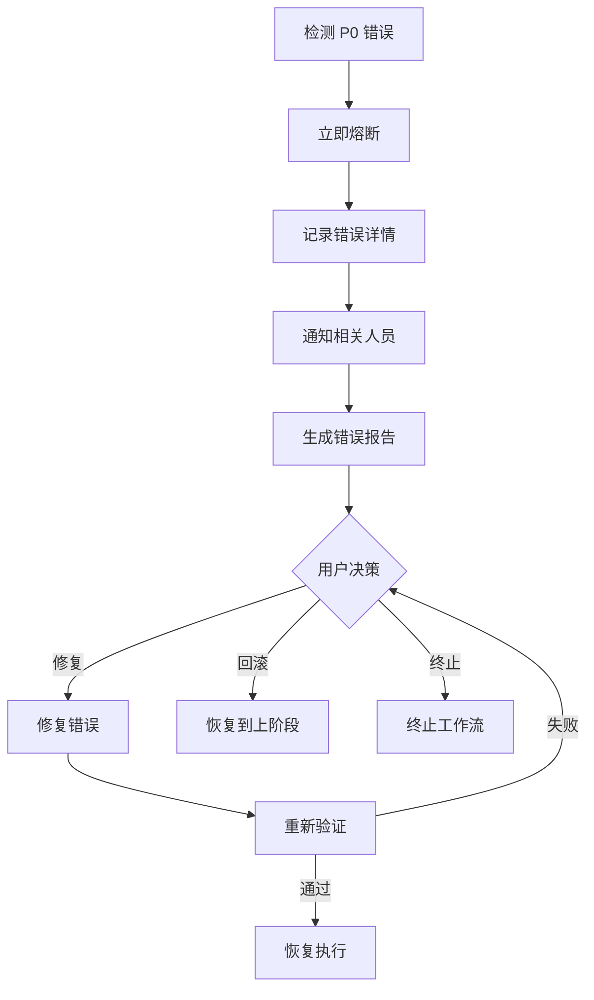
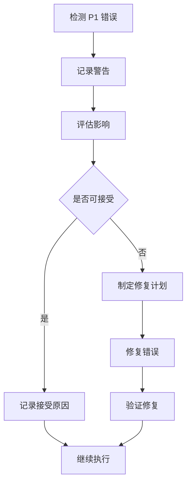
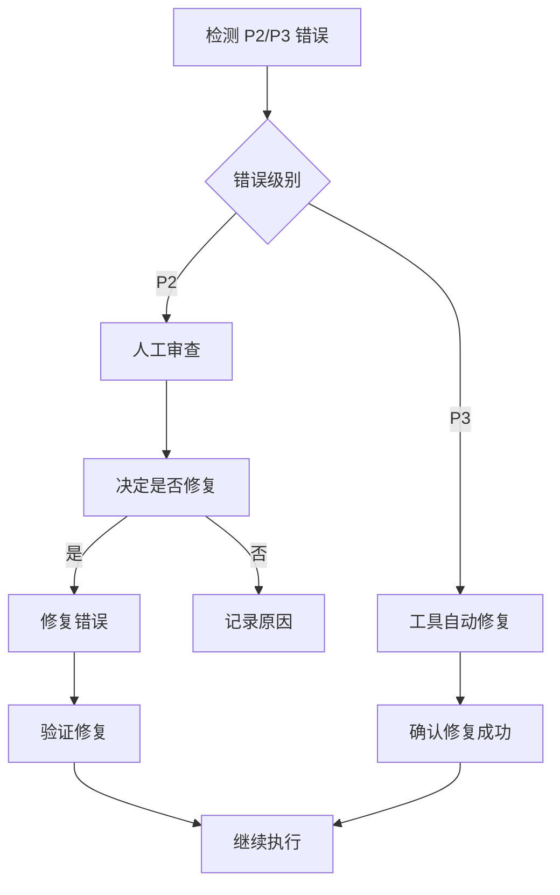

# SOP 系统错误码规范

## 错误码格式

```
SOP-{CATEGORY}-{LEVEL}-{SEQ}
```

### 字段说明

| 字段 | 说明 | 取值 |
|------|------|------|
| **CATEGORY** | 错误类别 | SEC \| QUAL \| ARCH \| COMP \| RUNTIME |
| **LEVEL** | 错误级别 | 0 \| 1 \| 2 \| 3（对应 P0-P3） |
| **SEQ** | 3 位数字序号 | 001-999 |

### 错误类别

| 类别代码 | 类别名称 | 说明 |
|----------|----------|------|
| **SEC** | 安全类错误 | 密钥泄露、未授权访问、网络违规等 |
| **QUAL** | 质量类错误 | 测试覆盖率不足、代码规范违反等 |
| **ARCH** | 架构类错误 | 循环依赖、跨层调用、模块边界违反等 |
| **COMP** | 合规类错误 | 数据隐私、许可证违规等 |
| **RUNTIME** | 运行时错误 | 工作流执行异常、Skill 调用失败等 |

### 错误级别

| 级别 | 对应规范 | 处理策略 | 示例 |
|------|----------|----------|------|
| **0** | P0 级 | 立即熔断，必须修复 | 硬编码密钥、循环依赖 |
| **1** | P1 级 | 警告，需评估接受或修复 | API 响应超时、依赖库版本 |
| **2** | P2 级 | 自动修复或人工审查 | 命名不规范、注释缺失 |
| **3** | P3 级 | 工具自动修复 | 代码格式问题 |

---

## 错误码定义

### 安全类错误 (SEC)

#### P0 级安全错误

| 错误码 | 错误名称 | 错误信息 | 处理措施 |
|--------|----------|----------|----------|
| SOP-SEC-001-001 | HARDCODED_SECRET | 检测到硬编码密钥：{key_name} | 立即移除，使用环境变量注入 |
| SOP-SEC-001-002 | SECRET_LEAK_LOG | 密钥泄露到日志：{log_path} | 清理日志，轮换密钥 |
| SOP-SEC-004-001 | NETWORK_ALLOWLIST_VIOLATION | 访问未授权 URL：{url} | 阻止访问，记录审计日志 |
| SOP-SEC-004-002 | NETWORK_REPEATED_VIOLATION | 连续{count}次网络违规 | 触发安全告警，暂停 Skill 执行 |
| SOP-SEC-005-001 | INSECURE_KEY_INJECTION | 密钥未通过安全注入 | 阻止操作，检查注入配置 |
| SOP-SEC-005-002 | UNAUTHORIZED_SKILL_SECRET | Skill 未授权使用密钥：{skill_name} | 撤销密钥访问权限 |

#### P1 级安全错误

| 错误码 | 错误名称 | 错误信息 | 处理措施 |
|--------|----------|----------|----------|
| SOP-SEC-002-001 | VULNERABLE_DEPENDENCY | 依赖库存在漏洞：{package}@{version} | 升级或替换依赖 |
| SOP-SEC-003-001 | DISABLED_SECURITY_CHECK | 安全校验被关闭：{check_name} | 启用安全校验，审查配置 |

---

### 质量类错误 (QUAL)

#### P0 级质量错误

| 错误码 | 错误名称 | 错误信息 | 处理措施 |
|--------|----------|----------|----------|
| SOP-QUAL-001-001 | LOW_TEST_COVERAGE | 核心模块覆盖率不足：{module} ({coverage}%) | 补充测试至 100% |
| SOP-QUAL-002-001 | FORCE_UNWRAP | 使用强制解包：unwrap()/expect() | 使用安全解包或?运算符 |
| SOP-QUAL-003-001 | IGNORED_ERROR | 忽略函数返回错误 | 处理错误或添加注释说明 |

#### P1 级质量错误

| 错误码 | 错误名称 | 错误信息 | 处理措施 |
|--------|----------|----------|----------|
| SOP-QUAL-001-002 | LOW_OVERALL_COVERAGE | 整体覆盖率不足：{coverage}% | 补充测试至阈值以上 |
| SOP-QUAL-002-002 | PERFORMANCE_CRITICAL_UNWRAP | 性能关键路径使用强制解包（已审批） | 记录审批文档，定期复审 |

#### P2 级质量错误

| 错误码 | 错误名称 | 错误信息 | 处理措施 |
|--------|----------|----------|----------|
| SOP-QUAL-003-002 | MISSING_ERROR_COMMENT | 忽略错误未添加注释说明 | 补充注释说明原因 |

---

### 架构类错误 (ARCH)

#### P0 级架构错误

| 错误码 | 错误名称 | 错误信息 | 处理措施 |
|--------|----------|----------|----------|
| SOP-ARCH-001-001 | CIRCULAR_DEPENDENCY | 检测到循环依赖：{module_a} ↔ {module_b} | 重构模块，引入接口层 |
| SOP-ARCH-001-002 | INDIRECT_CIRCULAR_DEPENDENCY | 检测到间接循环依赖：{path} | 重构依赖链路 |
| SOP-ARCH-002-001 | CROSS_LAYER_CALL | 跨层调用：{caller} → {callee} | 通过中间层调用 |

#### P1 级架构错误

| 错误码 | 错误名称 | 错误信息 | 处理措施 |
|--------|----------|----------|----------|
| SOP-ARCH-001-003 | TIGHT_COUPLING | 模块耦合度过高：{module} ({score}) | 引入抽象层，降低耦合 |
| SOP-ARCH-002-002 | LAYER_AMBIGUITY | 分层职责不清晰：{layer} | 重新定义层职责 |

---

### 合规类错误 (COMP)

#### P0 级合规错误

| 错误码 | 错误名称 | 错误信息 | 处理措施 |
|--------|----------|----------|----------|
| SOP-COMP-001-001 | GDPR_VIOLATION | 用户数据未符合 GDPR 要求：{data_field} | 立即修复，通知法务 |
| SOP-COMP-002-001 | LICENSE_VIOLATION | 依赖库许可证不合规：{package} ({license}) | 替换依赖或获取法务审批 |

---

### 运行时错误 (RUNTIME)

#### P0 级运行时错误

| 错误码 | 错误名称 | 错误信息 | 处理措施 |
|--------|----------|----------|----------|
| SOP-RUNTIME-001-001 | WORKFLOW_STAGE_SKIPPED | 阶段未执行：{stage_name} | 回滚到上阶段，重新执行 |
| SOP-RUNTIME-001-002 | QUALITY_GATE_FAILURE | 质量门控失败：{gate_name} | 修复问题，重新验证 |
| SOP-RUNTIME-001-003 | THREE_STRIKE_FAILURE | 连续三次失败：{skill_name} | 触发熔断，通知相关人员 |

#### P1 级运行时错误

| 错误码 | 错误名称 | 错误信息 | 处理措施 |
|--------|----------|----------|----------|
| SOP-RUNTIME-002-001 | SKILL_TIMEOUT | Skill 执行超时：{skill_name} ({timeout}s) | 检查阻塞原因，优化或重试 |
| SOP-RUNTIME-002-002 | RESOURCE_CONFLICT | 资源冲突：{resource_name} | 协调资源，串行执行 |
| SOP-RUNTIME-002-003 | COMPACTION_TRIGGERED | 上下文超过阈值，触发压缩 | 恢复 workflow-summary.json |

#### P2 级运行时错误

| 错误码 | 错误名称 | 错误信息 | 处理措施 |
|--------|----------|----------|----------|
| SOP-RUNTIME-003-001 | DOCUMENT_SYNC_DELAYED | 文档同步延迟：{document_path} | 检查文件锁定，重试同步 |
| SOP-RUNTIME-003-002 | ARTIFACT_INDEX_OUTDATED | 产物索引未更新：{artifact_id} | 重新注册产物到索引 |

---

## 错误处理流程

### P0 级错误处理流程



### P1 级错误处理流程



### P2/P3 级错误处理流程



---

## 错误日志格式

### 标准错误日志

```json
{
  "error_id": "ERR-{timestamp}-{seq}",
  "error_code": "SOP-{CATEGORY}-{LEVEL}-{SEQ}",
  "timestamp": "2026-03-01T10:00:00Z",
  "level": 0,
  "category": "SEC",
  "message": "检测到硬编码密钥：GITHUB_TOKEN",
  "location": {
    "file": "src/order/OrderService.ts",
    "line": 15,
    "column": 23
  },
  "context": {
    "skill": "sop-code-implementation",
    "workflow_id": "wf-20260301-001",
    "stage": "stage-2"
  },
  "stack_trace": "...",
  "suggested_action": "立即移除硬编码密钥，使用环境变量注入",
  "related_constraints": ["P0-SEC-001"]
}
```

### 错误汇总报告

```json
{
  "report_id": "ERR-REPORT-{timestamp}",
  "generated_at": "2026-03-01T10:00:00Z",
  "workflow_id": "wf-20260301-001",
  "summary": {
    "total_errors": 5,
    "by_level": {
      "p0": 1,
      "p1": 2,
      "p2": 2,
      "p3": 0
    },
    "by_category": {
      "sec": 1,
      "qual": 2,
      "arch": 1,
      "comp": 0,
      "runtime": 1
    }
  },
  "errors": [...],
  "actions_required": [
    {
      "priority": "高",
      "action": "修复 P0-SEC-001 违反",
      "deadline": "立即"
    },
    {
      "priority": "中",
      "action": "补充测试覆盖率",
      "deadline": "24 小时内"
    }
  ]
}
```

---

## 错误码扩展规则

### 新增错误码流程

1. **确定类别**：选择 SEC/QUAL/ARCH/COMP/RUNTIME
2. **确定级别**：根据规范层级确定 0/1/2/3
3. **分配序号**：从当前类别最大序号 +1
4. **文档更新**：更新本错误码规范文档
5. **工具配置**：更新检测工具配置

### 错误码废弃流程

1. **标记废弃**：在文档中标记为 Deprecated
2. **迁移指南**：提供迁移到新错误码的指南
3. **保留期**：保留至少 3 个月过渡期
4. **正式移除**：过渡期后移除

---

## 错误码速查表

### 按类别速查

| 类别 | P0 | P1 | P2 | P3 |
|------|-----|-----|-----|-----|
| **SEC** | 001-002 | 001-002 | - | - |
| **QUAL** | 001-003 | 001-002 | 001-002 | - |
| **ARCH** | 001-002 | 001-002 | - | - |
| **COMP** | 001-002 | - | - | - |
| **RUNTIME** | 001-003 | 001-003 | 001-002 | - |

### 按场景速查

| 场景 | 错误码 | 级别 |
|------|--------|------|
| 硬编码密钥 | SOP-SEC-001-001 | P0 |
| 网络违规 | SOP-SEC-004-001 | P0 |
| 测试覆盖率不足 | SOP-QUAL-001-001 | P0 |
| 强制解包 | SOP-QUAL-002-001 | P0 |
| 循环依赖 | SOP-ARCH-001-001 | P0 |
| 连续失败 | SOP-RUNTIME-001-003 | P0 |
| 依赖漏洞 | SOP-SEC-002-001 | P1 |
| API 超时 | SOP-RUNTIME-002-001 | P1 |

---

## 版本历史

| 版本 | 日期 | 变更说明 |
|------|------|----------|
| v5.0.0 | 2026-03-16 | 同步至约束资源目录 |
| v1.0.0 | 2026-03-01 | 初始版本，定义错误码格式和基础错误码 |
