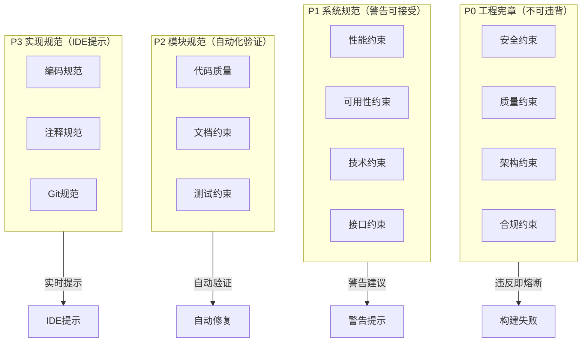
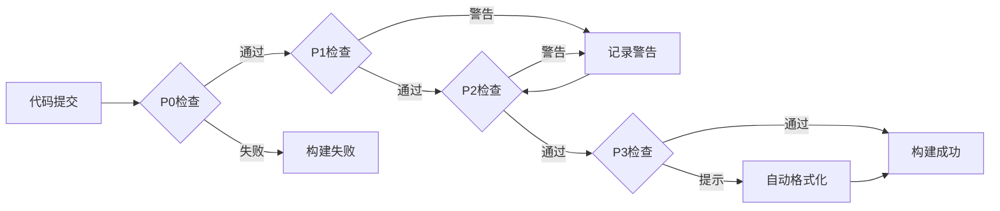
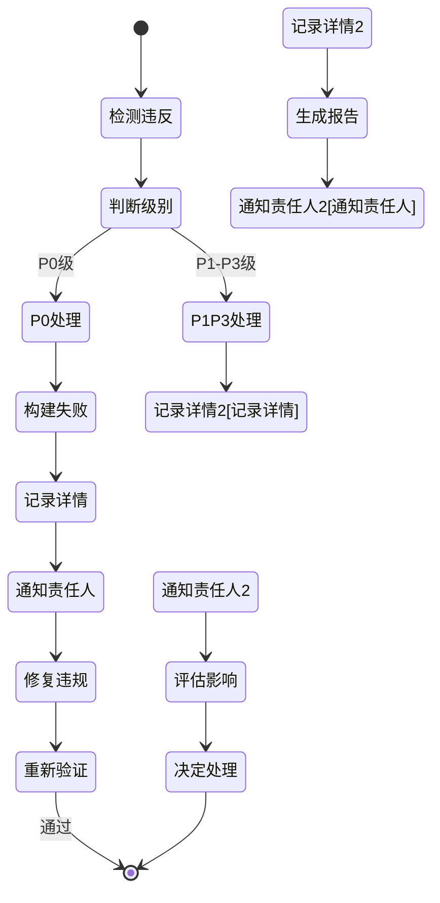

# 约束索引

core_principle: 分层约束，P0不可违背

## 约束层级架构



## 约束验证流程



## 约束层级定义

```yaml
P0:
  name: 工程宪章约束
  strength: 不可违背，违反即熔断
  content: [安全红线, 质量红线, 架构红线]
  approval: 技术委员会
  doc: p0-constraints.md

P1:
  name: 系统约束
  strength: 跨模块约束，警告可接受
  content: 系统级质量要求
  approval: 技术负责人
  doc: p1-constraints.md

P2:
  name: 模块约束
  strength: 单模块约束，自动化验证
  content: 模块级质量要求
  approval: 模块负责人
  doc: p2-constraints.md

P3:
  name: 实现约束
  strength: 实现细节，IDE实时提示
  content: [编码规范, 测试规范]
  approval: 自动化工具
  doc: p3-constraints.md
```

## 违反处理流程



## 目录结构

```yaml
files:
  - index.md: 本文件
  - p0-constraints.md: P0级约束
  - p1-constraints.md: P1级约束
  - p2-constraints.md: P2级约束
  - p3-constraints.md: P3级约束
  - state-dictionary.md: 状态字典
  - command-dictionary.md: 命令字典
```

## 相关文档

- ../constitution/: P0级规范
- ../workflow/: 5阶段流程
- ../../index.md: Skill索引
