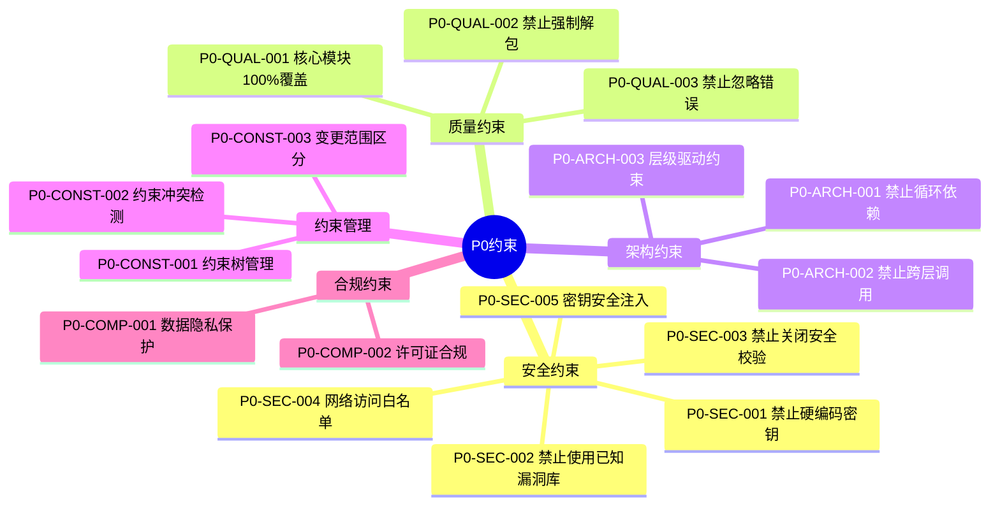
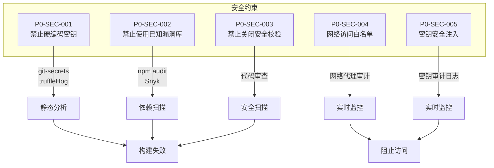
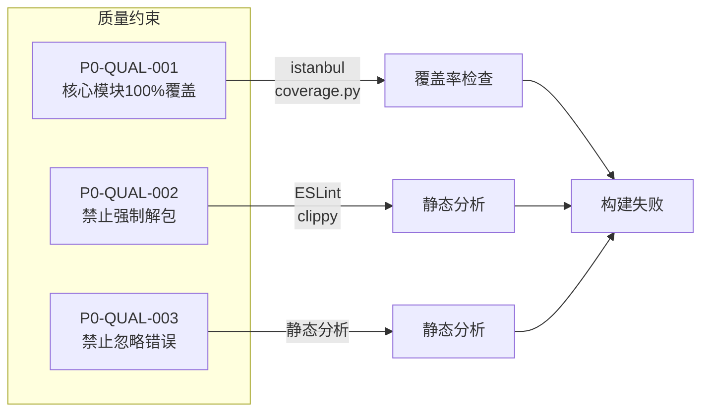
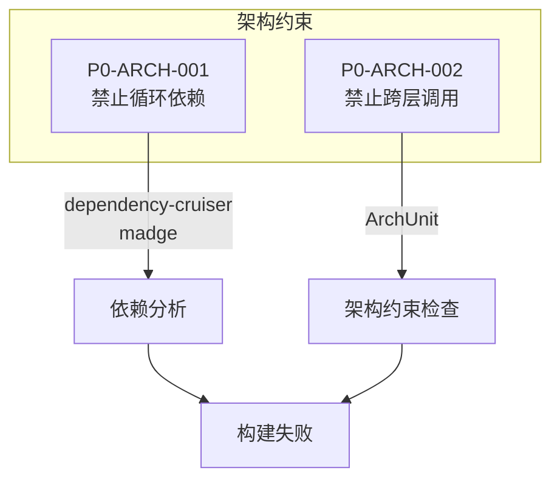
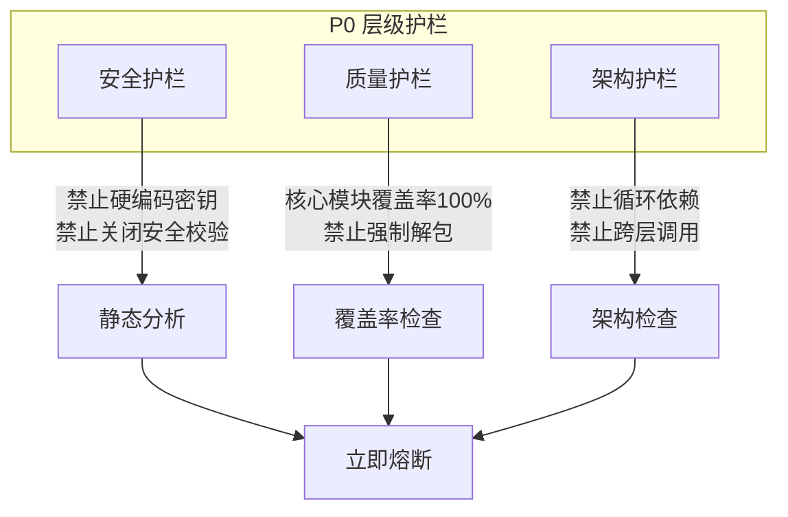
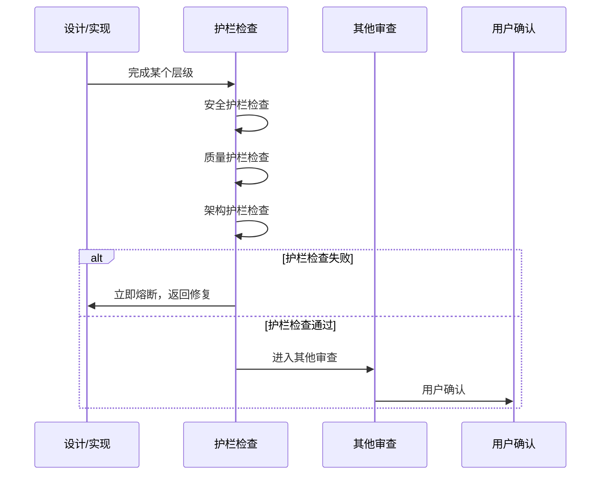
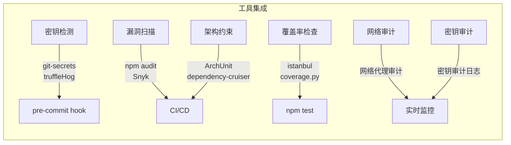

# P0级约束

constraint_strength: 不可违背，违反即熔断

## P0约束架构



## 安全约束



### 安全约束详情

```yaml
P0-SEC-001:
  name: 禁止硬编码密钥
  desc: 禁止在代码中硬编码密钥、密码、Token等敏感信息
  verify: 静态分析工具(git-secrets, truffleHog)
  handle: 构建失败，必须立即修复
  exception: 无例外

P0-SEC-002:
  name: 禁止使用已知漏洞库
  desc: 禁止使用存在已知安全漏洞的第三方库
  verify: 依赖扫描工具(npm audit, Snyk)
  handle: 构建失败，必须升级或替换
  exception: 无替代方案时需技术委员会审批

P0-SEC-003:
  name: 禁止关闭安全校验
  desc: 禁止在生产环境关闭身份验证、授权检查、输入验证
  verify: 代码审查 + 安全扫描
  handle: 构建失败，必须修复
  exception: 无例外

P0-SEC-004:
  name: 网络访问白名单
  desc: Agent网络访问必须受allowlist限制
  verify: 网络代理审计
  handle: 阻止访问，触发安全告警
  exception: 无例外
  allowlist:
    - "*.github.com"
    - "*.npmjs.com"
    - "pypi.org"
    - "*.crates.io"

P0-SEC-005:
  name: 密钥安全注入
  desc: 密钥必须通过安全注入机制传递，模型不得接触明文密钥
  verify: 密钥审计日志
  handle: 阻止操作，触发安全告警
  exception: 无例外
  injection:
    method: environment_variable
    pattern: "SECRET_${DOMAIN}_${KEY_NAME}"
```

## 质量约束



### 质量约束详情

```yaml
P0-QUAL-001:
  name: 核心模块测试覆盖率100%
  desc: 核心业务逻辑模块单元测试覆盖率必须达到100%
  verify: 覆盖率工具(istanbul, coverage.py, jacoco)
  handle: 构建失败，必须补充测试
  exception: 无例外
  core_modules:
    - 业务逻辑层(Service层)
    - 数据访问层(Repository层)
    - 领域模型层(Domain层)

P0-QUAL-002:
  name: 禁止强制解包
  desc: 禁止使用unwrap(), expect()等强制解包操作
  verify: 静态分析工具(ESLint, clippy)
  handle: 构建失败，必须使用安全解包
  exception: 性能关键路径且已证明安全时可例外(需审批)

P0-QUAL-003:
  name: 禁止忽略错误
  desc: 禁止忽略函数返回的错误(如 _ = func())
  verify: 静态分析工具
  handle: 构建失败，必须处理错误
  exception: 明确不需要处理时需注释说明
```

## 架构约束



### 架构约束详情

```yaml
P0-ARCH-001:
  name: 禁止循环依赖
  desc: 模块间禁止存在循环依赖
  verify: 依赖分析工具(dependency-cruiser, madge)
  handle: 构建失败，必须重构
  exception: 无例外

P0-ARCH-002:
  name: 禁止跨层调用
  desc: 禁止跳过中间层直接调用(如Controller直接调用Repository)
  verify: 架构约束工具(ArchUnit)
  handle: 构建失败，必须修复
  exception: 无例外

P0-ARCH-003:
  name: 层级驱动约束
  desc: |
    SOP 基于约束树执行，必须遵循层级驱动原则：
    - 设计从根开始：P0→P1→P2→P3
    - 实现从叶子开始：临时子节点→P3→P2→P1→P0
    - 禁止跳过任何层级
  verify: 工作流状态检查
  handle: 立即熔断，必须按层级顺序执行
  exception: 无例外
```

## P0 层级护栏

> **参照 TDD 思路**：设计或实现完成某个层级后，首先进行护栏限制的检查



### P0 层级护栏详情

```yaml
P0-GUARD-SEC:
  name: 安全护栏
  desc: P0 级安全约束检查
  checks:
    - 禁止硬编码密钥
    - 禁止关闭安全校验
    - 网络访问白名单
  verify: 静态分析工具(git-secrets, truffleHog)
  handle: 立即熔断
  exception: 无例外

P0-GUARD-QUAL:
  name: 质量护栏
  desc: P0 级质量约束检查
  checks:
    - 核心模块覆盖率100%
    - 禁止强制解包
    - 禁止忽略错误
  verify: 覆盖率工具(istanbul, coverage.py)
  handle: 立即熔断
  exception: 无例外

P0-GUARD-ARCH:
  name: 架构护栏
  desc: P0 级架构约束检查
  checks:
    - 禁止循环依赖
    - 禁止跨层调用
    - 层级驱动约束
  verify: 架构约束工具(ArchUnit, dependency-cruiser)
  handle: 立即熔断
  exception: 无例外
```

### 护栏优先检查流程



## 约束管理约束

```yaml
P0-CONST-001:
  name: 约束树管理
  desc: |
    约束以多叉树形态管理：
    - 根节点（P0）不可违背
    - 子约束不得违反父约束
    - 父约束变更必须评估对子约束的影响
  verify: 约束检查工具
  handle: 立即熔断
  exception: 无例外
  rules:
    - 约束树结构完整性
    - 约束继承关系正确性
    - 约束从属关系明确性

P0-CONST-002:
  name: 约束冲突检测
  desc: |
    设计完成后必须检测：
    - 约束冲突：是否存在相互矛盾的约束
    - 约束缺漏：是否存在缺失的约束节点
    - 约束树完整性：约束树结构是否完整
  verify: 约束检查工具
  handle: 暂停执行，询问用户决策
  exception: 无例外
  conflict_handling:
    - 暂停执行
    - 提供冲突详细说明
    - 提供可能的解决方案
    - 提供各方案的利弊分析
    - 提供推荐方案及理由
    - 记录用户决策

P0-CONST-003:
  name: 变更范围严格区分
  desc: |
    变更必须明确影响的约束节点层级：
    - P3 变更：仅影响实现规范
    - P2 变更：影响模块规范
    - P1 变更：影响系统规范
    - P0 变更：影响工程宪章
  verify: 变更审查
  handle: 暂停执行，询问用户决策
  exception: 无例外
  ambiguity_handling:
    - 暂停执行
    - 提供可能的变更范围分析
    - 提供各范围的影响评估
    - 提供推荐的范围及理由
    - 记录用户决策
```

## 用户决策记录要求

```yaml
decision_record:
  required_fields:
    - decision_id: 决策唯一标识
    - timestamp: 决策时间
    - context: 决策上下文
    - options: 可选方案列表
    - selected: 选择的方案
    - reason: 决策理由
    - impact: 影响范围
    - constraints_affected: 受影响的约束节点
  
  storage:
    path: "contracts/decisions/"
    format: "yaml"
    retention: "永久保留"
  
  usage:
    - 约束冲突处理记录
    - 变更范围暧昧处理记录
    - 约束缺漏处理记录
```

## 合规约束

```yaml
P0-COMP-001:
  name: 数据隐私保护
  desc: 用户数据必须符合GDPR/个人信息保护法要求
  verify: 合规审计、代码审查
  handle: 构建失败，必须修复
  exception: 无例外

P0-COMP-002:
  name: 许可证合规
  desc: 第三方库许可证必须符合项目合规要求
  verify: 许可证扫描工具
  handle: 构建失败，必须替换
  exception: 法务审批
```

## 验证工具矩阵



## 验证工具配置

```yaml
tools:
  - type: 密钥检测
    names: [git-secrets, truffleHog]
    integration: pre-commit hook
  - type: 漏洞扫描
    names: [npm audit, Snyk]
    integration: CI/CD
  - type: 覆盖率检查
    names: [istanbul, coverage.py]
    integration: npm test
  - type: 架构约束
    names: [ArchUnit, dependency-cruiser]
    integration: CI/CD
  - type: 网络审计
    names: [网络代理审计]
    integration: 实时监控
  - type: 密钥审计
    names: [密钥审计日志]
    integration: 实时监控
```
