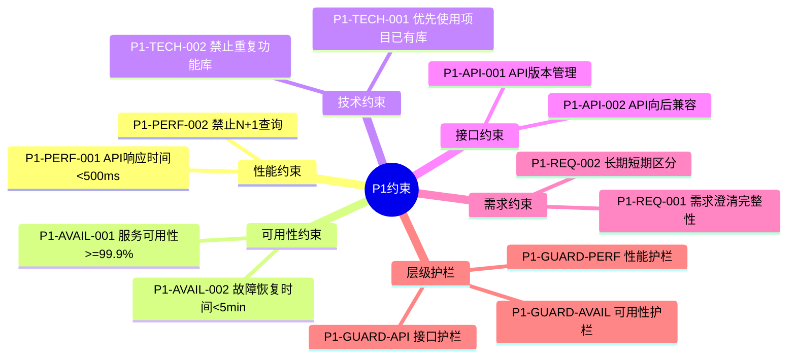
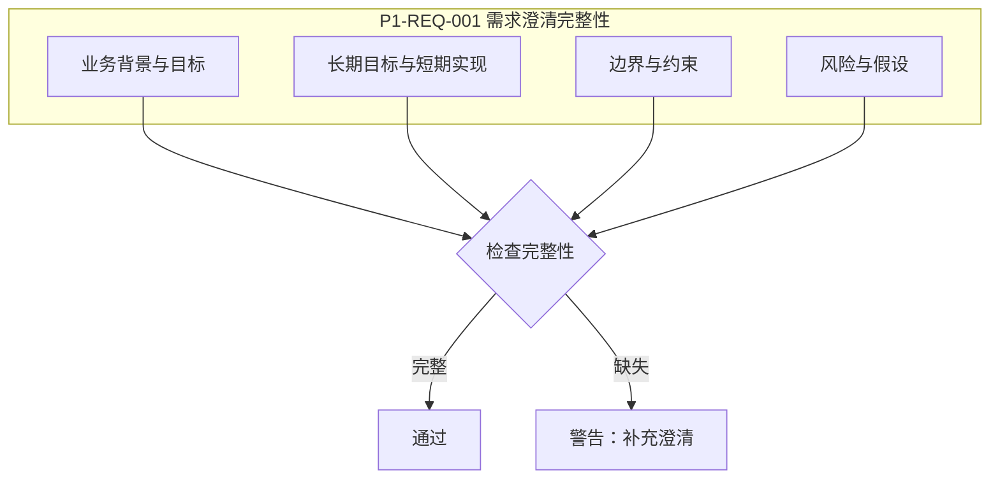
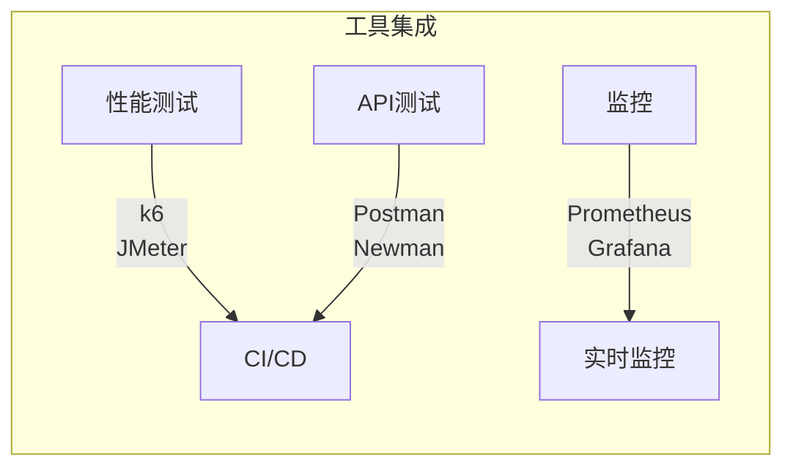
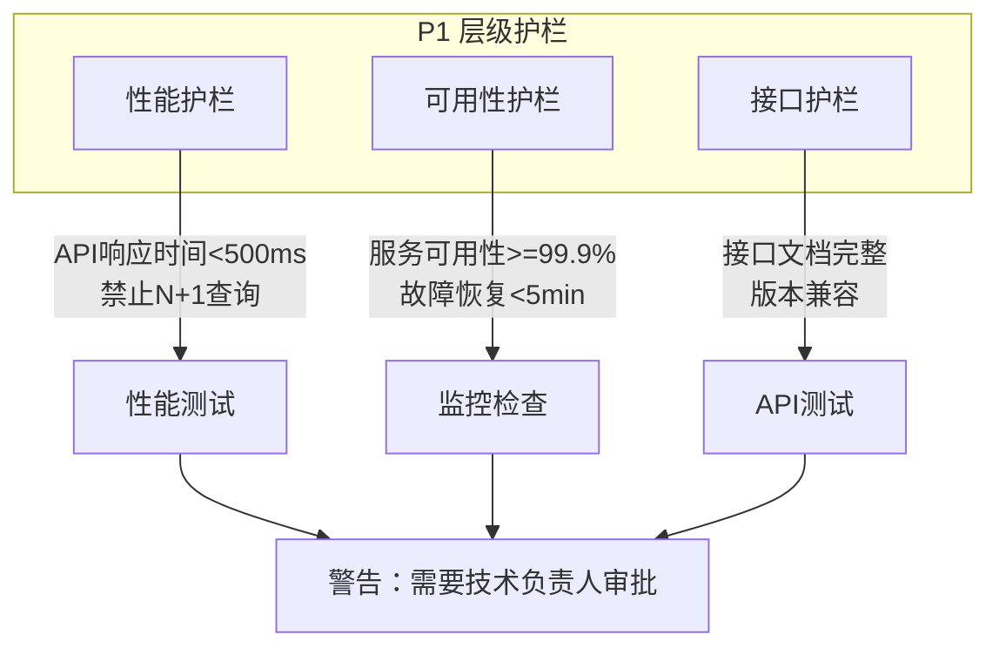
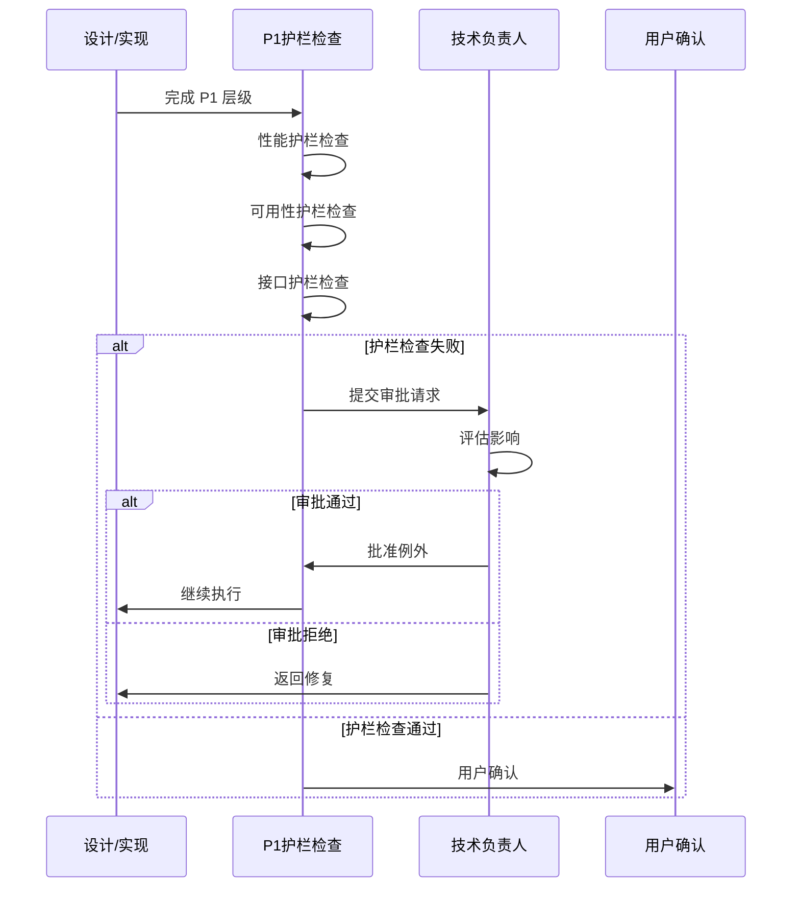

# P1级约束

constraint_strength: 跨模块约束，警告可接受

## P1约束架构



## 性能约束

```yaml
P1-PERF-001:
  name: API响应时间
  desc: API响应时间必须<500ms(P95)
  verify: 性能测试(k6, JMeter)
  handle: 警告，建议优化
  exception: 复杂查询可放宽至2s(需审批)

P1-PERF-002:
  name: 数据库查询优化
  desc: 禁止N+1查询问题
  verify: 慢查询日志、APM工具
  handle: 警告，建议优化
  exception: 批量操作可例外(需审批)
```

## 可用性约束

```yaml
P1-AVAIL-001:
  name: 服务可用性
  desc: 服务可用性必须>=99.9%
  verify: 监控系统(Prometheus, Grafana)
  handle: 警告，需要改进
  exception: 计划维护期间可例外

P1-AVAIL-002:
  name: 故障恢复时间
  desc: 故障恢复时间必须<5min
  verify: 故障演练(Chaos Engineering)
  handle: 警告，需要改进
  exception: 重大故障可放宽(需审批)
```

## 技术约束

```yaml
P1-TECH-001:
  name: 优先使用项目已有库
  desc: 新功能优先使用项目已有技术栈
  verify: 依赖审查
  handle: 警告，建议复用
  exception: 无替代方案时可引入(需ADR)

P1-TECH-002:
  name: 禁止重复功能库
  desc: 禁止引入功能重复的库
  verify: 功能对比审查
  handle: 警告，建议移除
  exception: 性能优势明显时可例外(需审批)
```

## 接口约束

```yaml
P1-API-001:
  name: API版本管理
  desc: API必须有版本号，遵循SemVer
  verify: API文档审查
  handle: 警告，建议添加版本号
  exception: 内部API可例外(需审批)

P1-API-002:
  name: API向后兼容
  desc: API变更必须保持向后兼容
  verify: API契约测试
  handle: 警告，建议兼容处理
  exception: 主版本升级时可例外(需审批)
```

## 需求约束



```yaml
P1-REQ-001:
  name: 需求澄清完整性
  desc: 阶段1必须完成多轮次多维度提问，记录用户真实意图
  verify: 检查specs/{name}-clarification.md文档完整性
  handle: 警告，建议补充澄清
  exception: 快速路径可跳过(需审批)
  required_dimensions:
    - 业务背景与目标
    - 长期目标与短期实现
    - 边界与约束
    - 风险与假设

P1-REQ-002:
  name: 长期短期区分
  desc: 需求必须明确区分长期目标与短期实现
  verify: 检查澄清记录中是否包含"长期愿景"和"短期目标"
  handle: 警告，建议补充区分
  exception: 简单需求可例外(需审批)
```

## 验证工具



```yaml
tools:
  - type: 性能测试
    names: [k6, JMeter]
    integration: CI/CD
  - type: 监控
    names: [Prometheus, Grafana]
    integration: 实时监控
  - type: API测试
    names: [Postman, Newman]
    integration: CI/CD
```

## P1 层级护栏

> **参照 TDD 思路**：设计或实现完成 P1 层级后，首先进行护栏限制的检查



### P1 层级护栏详情

```yaml
P1-GUARD-PERF:
  name: 性能护栏
  desc: P1 级性能约束检查
  checks:
    - API响应时间 < 500ms (P95)
    - 禁止 N+1 查询问题
    - 数据库查询优化
  verify: 性能测试工具(k6, JMeter)
  handle: 警告，需要技术负责人审批
  exception: 复杂查询可放宽至2s(需审批)

P1-GUARD-AVAIL:
  name: 可用性护栏
  desc: P1 级可用性约束检查
  checks:
    - 服务可用性 >= 99.9%
    - 故障恢复时间 < 5min
    - 健康检查端点可用
  verify: 监控系统(Prometheus, Grafana)
  handle: 警告，需要技术负责人审批
  exception: 计划维护期间可例外

P1-GUARD-API:
  name: 接口护栏
  desc: P1 级接口约束检查
  checks:
    - API 文档完整
    - 版本管理规范
    - 向后兼容性
  verify: API契约测试(Postman, Newman)
  handle: 警告，需要技术负责人审批
  exception: 内部API可例外(需审批)
```

### 护栏检查失败处理流程


