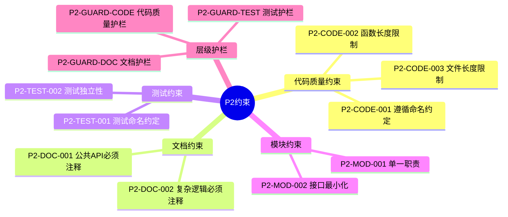
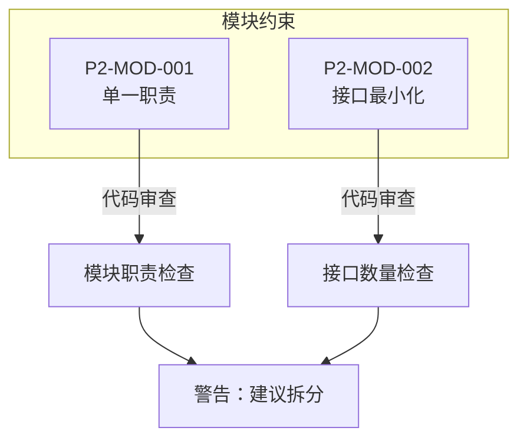
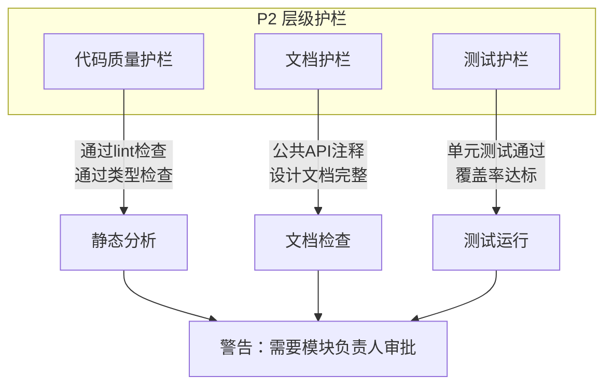
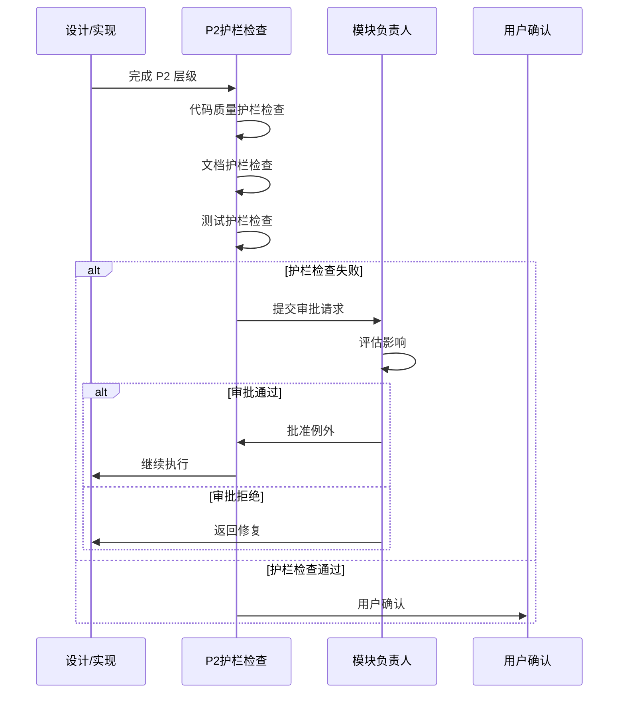

# P2级约束

constraint_strength: 单模块约束，自动化验证

## P2约束架构



## 代码质量约束

```yaml
P2-CODE-001:
  name: 遵循命名约定
  desc: 代码必须遵循项目命名约定
  verify: 代码风格检查(ESLint, Pylint)
  handle: 警告，建议修复
  exception: 遗留代码可暂时例外
  conventions:
    class: PascalCase
    function: camelCase
    constant: UPPER_SNAKE_CASE
    file: kebab-case

P2-CODE-002:
  name: 函数长度限制
  desc: 函数长度不应超过50行
  verify: 代码风格检查
  handle: 警告，建议拆分
  exception: 复杂算法可例外(需注释说明)

P2-CODE-003:
  name: 文件长度限制
  desc: 文件长度不应超过500行
  verify: 代码风格检查
  handle: 警告，建议拆分
  exception: 数据模型文件可例外
```

## 文档约束

```yaml
P2-DOC-001:
  name: 公共API必须注释
  desc: 公共API必须有文档注释
  verify: 文档检查工具
  handle: 警告，建议添加注释
  exception: 内部API可例外

P2-DOC-002:
  name: 复杂逻辑必须注释
  desc: 复杂逻辑必须有解释性注释
  verify: 代码审查
  handle: 警告，建议添加注释
  exception: 自解释代码可例外
```

## 测试约束

```yaml
P2-TEST-001:
  name: 测试命名约定
  desc: 测试函数名应描述测试场景
  verify: 代码风格检查
  handle: 警告，建议重命名
  exception: 无例外
  format: test_<功能>_<场景>_<预期结果>

P2-TEST-002:
  name: 测试独立性
  desc: 测试必须独立，不依赖其他测试
  verify: 测试运行顺序随机化
  handle: 警告，建议重构
  exception: 集成测试可例外(需标记)
```

## 模块约束



```yaml
P2-MOD-001:
  name: 单一职责
  desc: 每个模块只负责一个功能领域
  verify: 代码审查
  handle: 警告，建议拆分
  exception: 过渡期可暂时例外

P2-MOD-002:
  name: 接口最小化
  desc: 模块公开接口应最小化
  verify: 代码审查
  handle: 警告，建议减少公开接口
  exception: 工具类可例外
```

## 验证工具

```yaml
tools:
  - type: 代码风格
    names: [ESLint, Pylint]
    integration: pre-commit hook
  - type: 文档检查
    names: [JSDoc, Sphinx]
    integration: CI/CD
  - type: 测试检查
    names: [Jest, pytest]
    integration: npm test
```

## P2 层级护栏

> **参照 TDD 思路**：设计或实现完成 P2 层级后，首先进行护栏限制的检查



### P2 层级护栏详情

```yaml
P2-GUARD-CODE:
  name: 代码质量护栏
  desc: P2 级代码质量约束检查
  checks:
    - 通过 lint 检查
    - 通过类型检查
    - 遵循命名约定
    - 函数/文件长度限制
  verify: 静态分析工具(ESLint, Pylint, TypeScript)
  handle: 警告，需要模块负责人审批
  exception: 遗留代码可暂时例外

P2-GUARD-DOC:
  name: 文档护栏
  desc: P2 级文档约束检查
  checks:
    - 公共 API 必须注释
    - 设计文档完整
    - 复杂逻辑必须注释
  verify: 文档检查工具(JSDoc, Sphinx)
  handle: 警告，需要模块负责人审批
  exception: 内部API可例外

P2-GUARD-TEST:
  name: 测试护栏
  desc: P2 级测试约束检查
  checks:
    - 单元测试通过
    - 测试覆盖率达标
    - 测试命名规范
    - 测试独立性
  verify: 测试工具(Jest, pytest)
  handle: 警告，需要模块负责人审批
  exception: 集成测试可例外(需标记)
```

### 护栏检查失败处理流程


