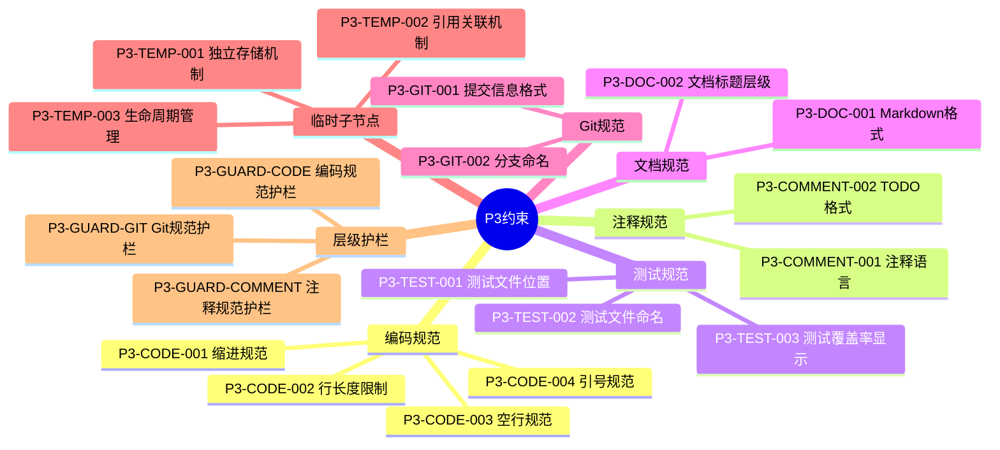
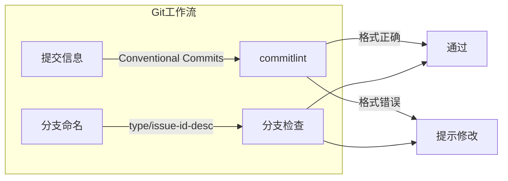
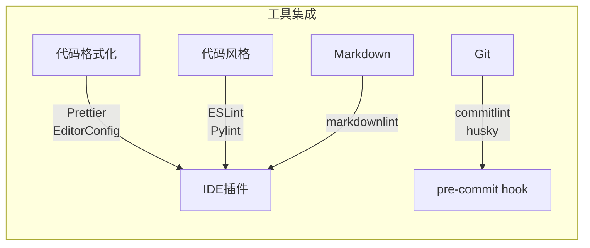
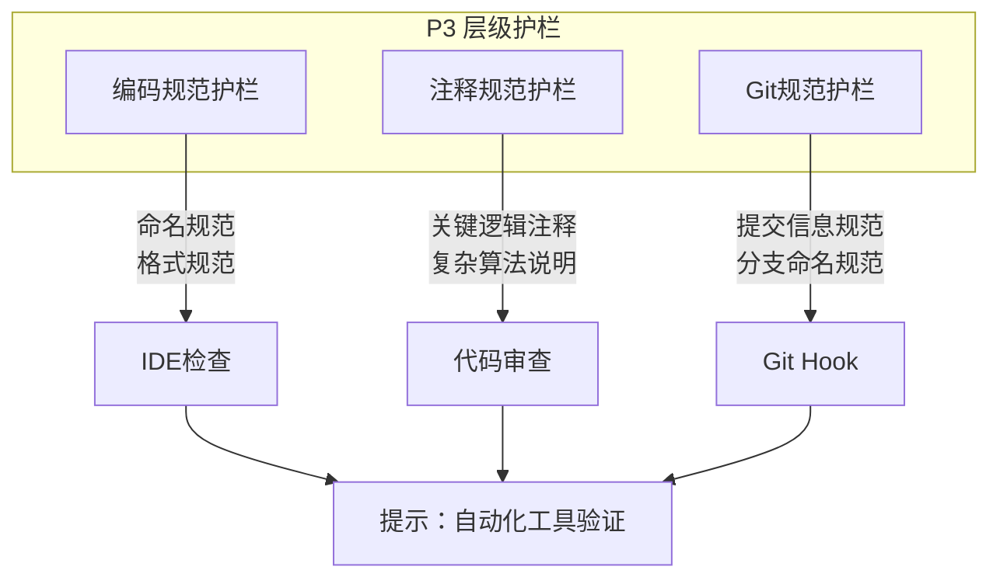
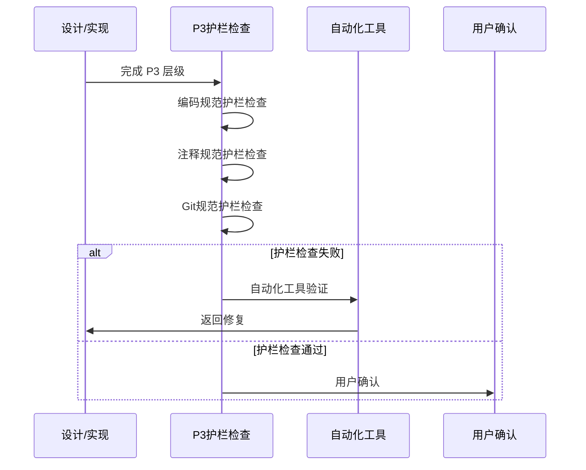

# P3级约束

constraint_strength: 实现细节，IDE实时提示

## P3约束架构



## 编码规范

```yaml
P3-CODE-001:
  name: 缩进规范
  desc: 使用2空格缩进(或项目配置)
  verify: IDE插件(Prettier, EditorConfig)
  handle: 自动格式化
  exception: 无例外

P3-CODE-002:
  name: 行长度限制
  desc: 每行不超过100字符
  verify: IDE插件
  handle: 自动换行
  exception: URL可例外

P3-CODE-003:
  name: 空行规范
  desc: 函数之间空一行，类之间空两行
  verify: IDE插件
  handle: 自动格式化
  exception: 无例外

P3-CODE-004:
  name: 引号规范
  desc: 优先使用单引号
  verify: IDE插件
  handle: 自动格式化
  exception: 字符串包含单引号时可使用双引号
```

## 注释规范

```yaml
P3-COMMENT-001:
  name: 注释语言
  desc: 注释使用中文(或项目配置)
  verify: 代码审查
  handle: 提示，建议修改
  exception: 引用外部文档时可使用英文

P3-COMMENT-002:
  name: TODO格式
  desc: TODO注释应包含负责人和日期
  verify: 代码风格检查
  handle: 提示，建议补充
  exception: 无例外
  format: // TODO(负责人): 描述 - YYYY-MM-DD
```

## 测试规范

```yaml
P3-TEST-001:
  name: 测试文件位置
  desc: 测试文件与源文件同目录或tests/目录
  verify: 文件结构检查
  handle: 提示，建议移动
  exception: 无例外

P3-TEST-002:
  name: 测试文件命名
  desc: 测试文件名为{源文件名}.test.{ext}或{源文件名}_test.{ext}
  verify: 文件结构检查
  handle: 提示，建议重命名
  exception: 无例外

P3-TEST-003:
  name: 测试覆盖率显示
  desc: 测试运行后显示覆盖率报告
  verify: 测试工具配置
  handle: 提示，建议配置
  exception: 无例外
```

## 文档规范

```yaml
P3-DOC-001:
  name: Markdown格式
  desc: Markdown文件使用标准格式
  verify: Markdown linter
  handle: 自动格式化
  exception: 无例外

P3-DOC-002:
  name: 文档标题层级
  desc: 文档标题层级不超过4级
  verify: Markdown linter
  handle: 提示，建议重构
  exception: 复杂文档可例外
```

## Git规范



```yaml
P3-GIT-001:
  name: 提交信息格式
  desc: 提交信息遵循Conventional Commits
  verify: commitlint
  handle: 提示，建议修改
  exception: 无例外
  format: type(scope): 描述

P3-GIT-002:
  name: 分支命名
  desc: 分支名遵循{type}/{issue-id}-{description}
  verify: 分支命名检查
  handle: 提示，建议重命名
  exception: 无例外
```

## 验证工具



```yaml
tools:
  - type: 代码格式化
    names: [Prettier, EditorConfig]
    integration: IDE插件
  - type: 代码风格
    names: [ESLint, Pylint]
    integration: IDE插件
  - type: Markdown
    names: [markdownlint]
    integration: IDE插件
  - type: Git
    names: [commitlint, husky]
    integration: pre-commit hook
```

## 临时子节点机制

> **核心机制**：临时子节点独立存储，通过引用关联到 P3 节点

### 临时子节点独立存储

```yaml
P3-TEMP-001:
  name: 临时子节点独立存储
  desc: |
    临时子节点独立存储，不物理存储在约束树中：
    - 存储位置：.trae/specs/{change-id}/
    - 包含文件：spec.md, tasks.md, checklist.md
    - 元数据：引用的 P3 节点 ID
  verify: 文件结构检查
  handle: 提示，建议按规范存储
  exception: 无例外
  storage:
    path: ".trae/specs/{change-id}/"
    files:
      - spec.md: 任务规范文档，定义临时约束
      - tasks.md: 任务列表，定义执行步骤
      - checklist.md: 检查清单，定义验证标准
    metadata:
      - referenced_p3_node: 引用的 P3 节点 ID
      - created_at: 创建时间
      - status: 任务状态

P3-TEMP-002:
  name: 引用关联机制
  desc: |
    临时子节点通过引用关联到 P3 节点：
    - 元数据中记录引用的 P3 节点 ID
    - 继承 P3 及其祖先节点的约束
    - 不得违反引用的 P3 节点约束
  verify: 元数据检查
  handle: 提示，建议补充引用信息
  exception: 无例外

P3-TEMP-003:
  name: 生命周期管理
  desc: |
    临时子节点生命周期：
    1. 创建：独立存储，引用 P3 节点
    2. 执行：继承 P3 及其祖先节点的约束
    3. 完成：归档，解除引用关系
  verify: 生命周期状态检查
  handle: 提示，建议按流程执行
  exception: 无例外
```

### 临时子节点存储结构

```
.trae/specs/{change-id}/
├── spec.md        # 任务规范文档
│   ├── Why        # 问题/机会描述
│   ├── What       # 变更内容
│   ├── Impact     # 影响范围
│   └── Requirements # 需求定义
├── tasks.md       # 任务列表
│   ├── Tasks      # 任务清单
│   └── Dependencies # 依赖关系
├── checklist.md   # 检查清单
│   └── Checkpoints # 检查点
└── .meta.yaml     # 元数据
    ├── referenced_p3_node: "P3-IMPL-XXX"
    ├── created_at: "2026-03-15T10:00:00Z"
    ├── status: "in_progress"
    └── archived_at: null
```

## P3 层级护栏

> **参照 TDD 思路**：设计或实现完成 P3 层级后，首先进行护栏限制的检查



### P3 层级护栏详情

```yaml
P3-GUARD-CODE:
  name: 编码规范护栏
  desc: P3 级编码规范约束检查
  checks:
    - 缩进规范（2空格或项目配置）
    - 行长度限制（100字符）
    - 空行规范
    - 引号规范（优先单引号）
  verify: IDE插件(Prettier, EditorConfig)
  handle: 自动格式化
  exception: 无例外

P3-GUARD-COMMENT:
  name: 注释规范护栏
  desc: P3 级注释规范约束检查
  checks:
    - 注释语言（中文或项目配置）
    - TODO 格式规范
    - 关键逻辑注释
    - 复杂算法说明
  verify: 代码审查
  handle: 提示，建议修改
  exception: 引用外部文档时可使用英文

P3-GUARD-GIT:
  name: Git规范护栏
  desc: P3 级 Git 规范约束检查
  checks:
    - 提交信息格式（Conventional Commits）
    - 分支命名规范（type/issue-id-desc）
    - 禁止直接提交到主分支
  verify: Git Hook(commitlint, husky)
  handle: 提示，建议修改
  exception: 无例外
```

### 临时子节点护栏

```yaml
P3-GUARD-TEMP:
  name: 临时子节点护栏
  desc: 临时子节点约束检查
  checks:
    - 任务范围护栏：不超出定义的任务范围
    - 约束一致性护栏：不违反引用的 P3 节点约束
    - 完成标准护栏：tasks.md 和 checklist.md 全部完成
  verify: 任务状态检查
  handle: 必须修复或询问用户决策
  exception: 无例外
```

### 护栏检查流程


