# 工作流规范

core_principle: 约束树驱动，设计从根开始，实现从叶子开始

## 5阶段工作流架构

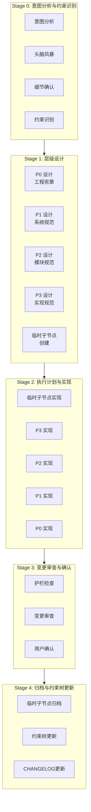

## 标准工作流（21 步骤）

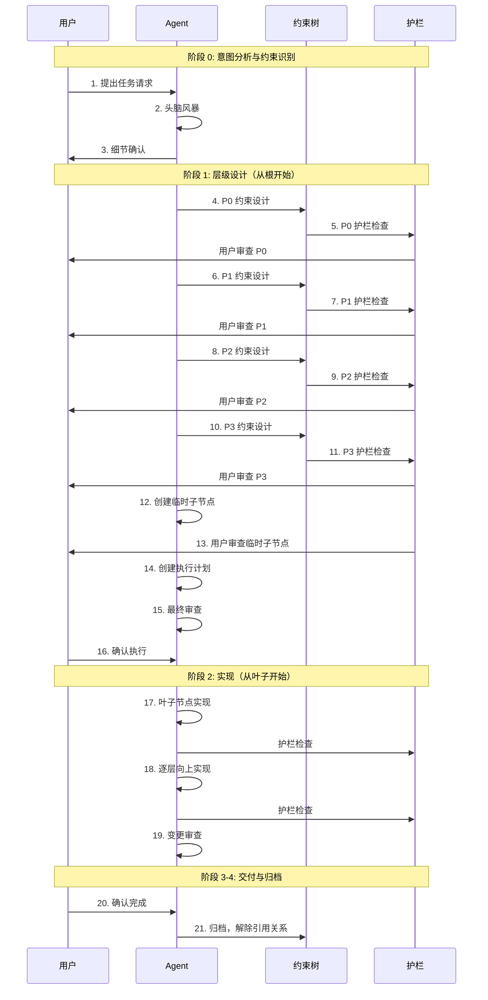

## 约束树结构

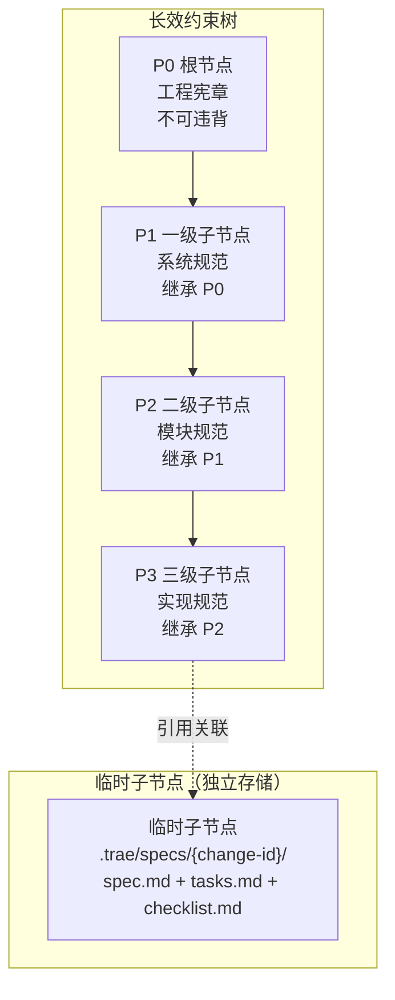

## 临时子节点独立存储架构

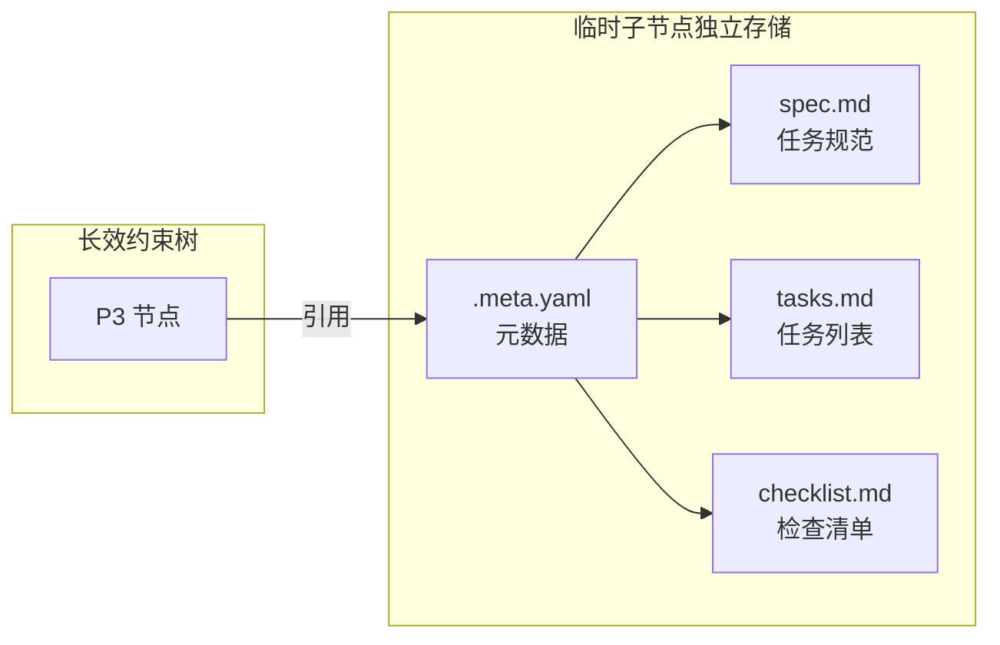

## 设计从根开始的流程

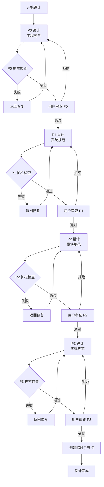

## 实现从叶子开始的流程

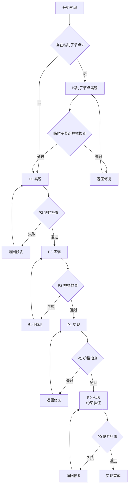

## 层级护栏机制

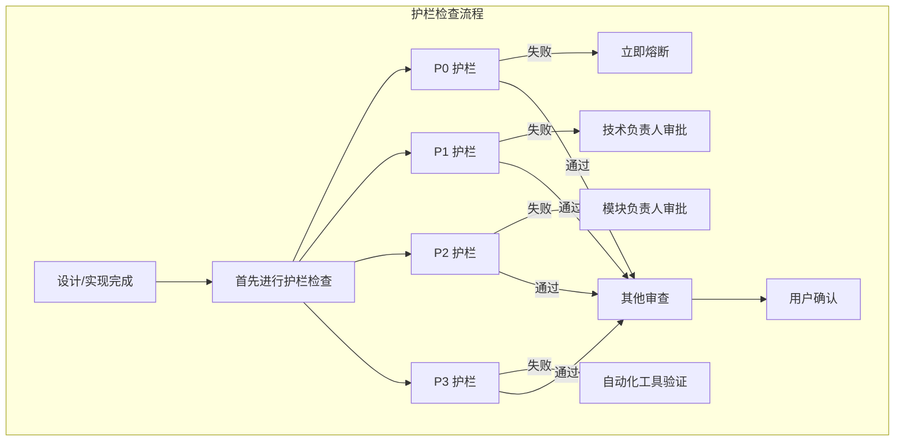

## 护栏优先检查流程

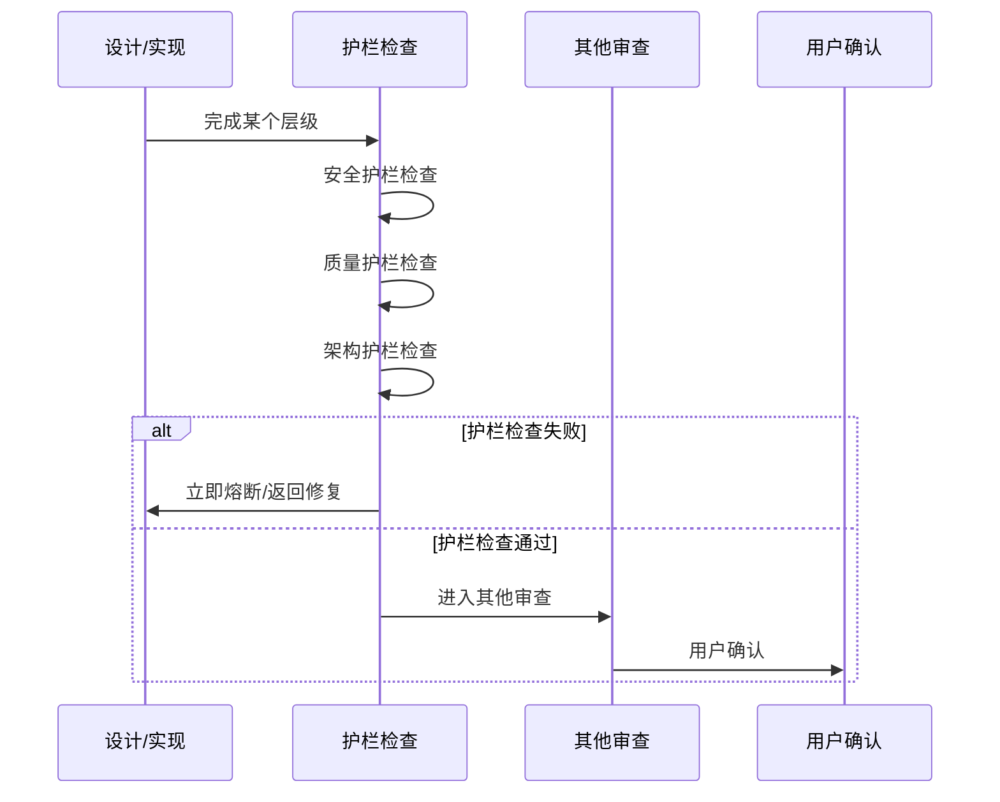

## 变更范围区分

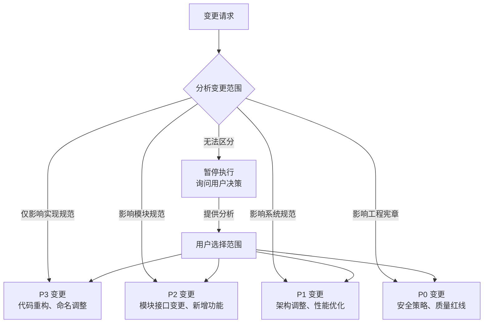

## 质量门控

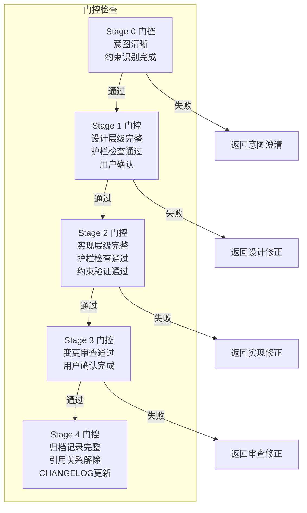

## 契约式协作

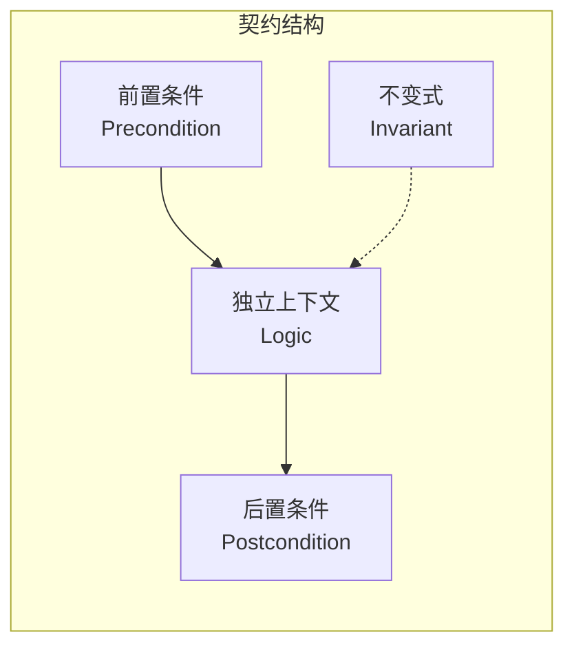

**契约原则**：
- 各环节独立上下文
- 仅通过契约传递（JSON/YAML文件）
- 禁止共享内存/状态/缓存
- 禁止隐式依赖
- 上下文版本化

## 阶段详情

### Stage 0: 意图分析与约束识别

```yaml
actions:
  - 意图分析：理解用户任务目标
  - 头脑风暴：探索可能的方案和约束
  - 细节确认：询问用户确认细节
  - 约束识别：识别约束树中的相关节点
output: 
  - 意图分析记录
  - 约束识别结果
contract: contracts/stage-0-contract.yaml
```

### Stage 1: 层级设计

```yaml
actions:
  - P0 设计：工程宪章设计（根节点）
  - P1 设计：系统架构设计（一级子节点）
  - P2 设计：模块设计（二级子节点）
  - P3 设计：实现设计（三级子节点）
  - 临时子节点创建：spec.md + tasks.md + checklist.md
output:
  - 各层级设计文档
  - 临时子节点文件
  - 护栏检查结果
contract: contracts/stage-1-contract.yaml
```

### Stage 2: 执行计划与实现

```yaml
actions:
  - 临时子节点实现（如果存在）
  - P3 实现：实现规范层
  - P2 实现：模块规范层
  - P1 实现：系统规范层
  - P0 实现：工程宪章层（约束验证）
output:
  - 代码变更
  - 护栏检查结果
  - 审查报告
contract: contracts/stage-2-contract.yaml
```

### Stage 3: 变更审查与确认

```yaml
actions:
  - 护栏检查：所有层级护栏检查
  - 变更审查：审查变更结果
  - 用户确认：用户确认任务完成
output:
  - 审查报告
  - 用户确认记录
contract: contracts/stage-3-contract.yaml
```

### Stage 4: 归档与约束树更新

```yaml
actions:
  - 临时子节点归档：归档到上级节点
  - 引用关系解除：解除临时子节点与 P3 的引用
  - 约束树更新：更新长效约束（如有变更）
  - CHANGELOG 更新
output:
  - 归档记录
  - CHANGELOG
contract: contracts/stage-4-contract.yaml
```

## 契约模板索引

> 契约定义使用持久化约束，详见 `sop/contracts/` 目录

```yaml
contract_templates:
  - stage: 0
    file: ../contracts/stage-0-contract.yaml
    desc: 意图分析与约束识别契约
  - stage: 1
    file: ../contracts/stage-1-contract.yaml
    desc: 层级设计输出契约
  - stage: 2
    file: ../contracts/stage-2-contract.yaml
    desc: 执行计划与实现输出契约
  - stage: 3
    file: ../contracts/stage-3-contract.yaml
    desc: 变更审查与确认输出契约
  - stage: 4
    file: ../contracts/stage-4-contract.yaml
    desc: 归档与约束树更新输出契约
```

## 相关文档

- ../constitution/: P0级规范
- ../specifications/: P1-P2级规范
- ../constraints/: P0-P3约束
- ../../index.md: Skill索引
