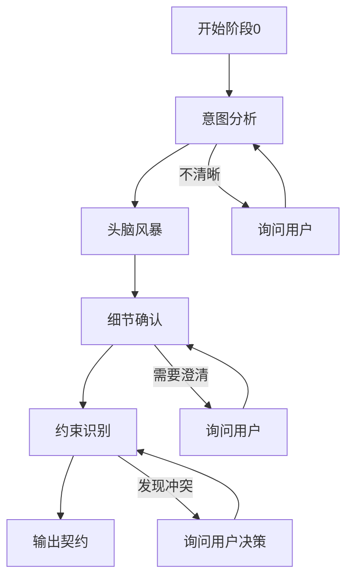
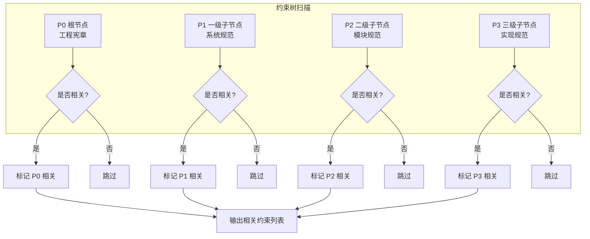

# 阶段0: 意图分析与约束识别

goal: 分析用户意图，识别约束树中的相关节点，为层级设计做准备

## 输入契约

```yaml
requirement_description:
  type: text
  validation: 长度>=10字符
```

## 处理流程



### 步骤详情

```yaml
steps:
  - id: 1
    name: 意图分析
    actions:
      - 解析用户任务请求
      - 理解任务目标
      - 识别任务类型（新功能/Bug修复/重构/优化）
      - 分析任务背景和上下文
    output:
      - 任务目标描述
      - 任务类型分类
      - 背景上下文记录

  - id: 2
    name: 头脑风暴
    actions:
      - 探索可能的实现方案
      - 识别潜在的技术约束
      - 识别潜在的业务约束
      - 评估方案可行性
    output:
      - 候选方案列表
      - 约束初步识别
      - 风险评估

  - id: 3
    name: 细节确认
    actions:
      - 询问用户确认任务细节
      - 澄清模糊的需求点
      - 确认优先级和截止日期
      - 确认验收标准
    output:
      - 需求澄清记录
      - 优先级确认
      - 验收标准

  - id: 4
    name: 约束识别
    actions:
      - 扫描约束树，识别相关节点
      - 标记可能受影响的约束
      - 检测潜在的约束冲突
      - 标记未完成的约束
    output:
      - 相关约束节点列表
      - 约束冲突检测结果
      - 未完成约束标记
```

## 约束识别规则

```yaml
constraint_identification:
  scan_rules:
    - 从 P0 根节点开始扫描
    - 检查每个约束节点是否与任务相关
    - 标记直接相关的约束
    - 标记间接影响的约束
  
  conflict_detection:
    - 检查新任务是否与现有约束冲突
    - 检查新任务是否需要修改现有约束
    - 检查新任务是否引入新的约束
  
  conflict_handling:
    - 发现冲突时暂停执行
    - 提供冲突详细说明
    - 提供可能的解决方案
    - 询问用户决策
    - 记录用户决策
```

## 约束树节点识别



## 输出契约

```yaml
stage_id: stage-0-intent-analysis
version: "2.0.0"

intent_analysis:
  task_goal: 任务目标描述
  task_type: 新功能|Bug修复|重构|优化
  background: 背景上下文

brainstorm:
  candidate_solutions:
    - solution: 方案描述
      feasibility: 可行性评估
      risks: 风险列表
  constraints_identified:
    - constraint_id: 约束ID
      level: P0|P1|P2|P3
      impact: 影响描述

detail_confirmation:
  clarifications:
    - question: 问题
      answer: 答案
  priority: 高|中|低
  acceptance_criteria:
    - 验收标准1
    - 验收标准2

constraint_identification:
  related_constraints:
    - node_id: P0-XXX
      reason: 相关原因
      impact: 影响程度
    - node_id: P1-XXX
      reason: 相关原因
      impact: 影响程度
  conflict_detection:
    has_conflict: true|false
    conflicts:
      - constraint_a: 约束A
        constraint_b: 约束B
        conflict_desc: 冲突描述
  uncompleted_constraints:
    - constraint_id: 约束ID
      reason: 未完成原因

required_documents:
  - name: 文档名称
    required: true|false
    priority: P0|P1|P2|P3

estimated_effort:
  development: X人天
  testing: X人天
  documentation: X人天

next_stage: stage-1-design
```

## 质量门控

```yaml
quality_gates:
  - check: 意图清晰
    pass: 任务目标明确，无歧义
    fail: 返回意图澄清
  - check: 细节确认完成
    pass: 所有问题已澄清
    fail: 返回细节确认
  - check: 约束识别完成
    pass: 相关约束已标记
    fail: 返回约束识别
  - check: 约束冲突处理
    pass: 无冲突或冲突已解决
    fail: 暂停执行，询问用户决策
```

## 状态定义

```yaml
states:
  STAGE_0_STARTED:
    trigger: 工作流入口
    action: 执行意图分析
  STAGE_0_INTENT_ANALYZING:
    trigger: 意图分析中
    action: 等待分析完成
  STAGE_0_BRAINSTORMING:
    trigger: 头脑风暴中
    action: 探索方案和约束
  STAGE_0_DETAIL_CONFIRMING:
    trigger: 细节确认中
    action: 等待用户确认
  STAGE_0_CONSTRAINT_IDENTIFYING:
    trigger: 约束识别中
    action: 扫描约束树
  STAGE_0_CONFLICT_HANDLING:
    trigger: 发现约束冲突
    action: 等待用户决策
  STAGE_0_WAITING_CONFIRM:
    trigger: 评估完成
    action: 用户确认后进入阶段1
  STAGE_0_PASSED:
    trigger: 用户确认
    action: 进入阶段1
```

## 相关文档

- index.md: 工作流入口
- stage-1-design.md: 阶段1层级设计
- contracts/stage-0-contract.yaml: 契约模板
- ../constraints/p0-constraints.md: P0 约束定义
