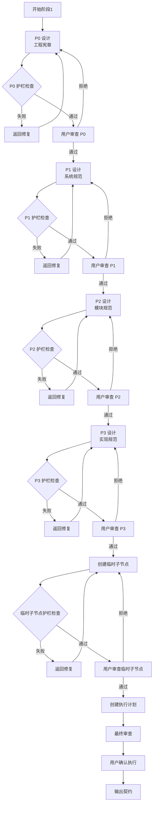
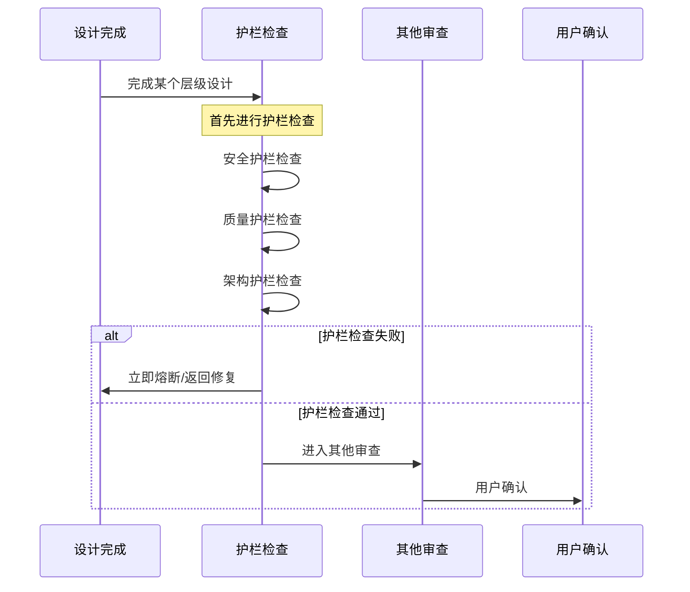

# 阶段1: 层级设计

goal: 从约束树根节点开始设计，逐层向下，每层用户审查确认

## 输入契约

```yaml
preconditions:
  required_inputs:
    - name: stage_0_contract
      type: yaml
      path: contracts/stage-0-contract.yaml
      validation: 阶段0必须通过
    - name: constraint_identification
      type: yaml
      validation: 相关约束节点已标记
  constraints:
    - 阶段0必须通过质量门控
    - 相关约束节点已识别
```

## 处理流程



### 步骤详情

```yaml
steps:
  - id: 1
    name: P0 设计（工程宪章设计）
    actions:
      - 从约束树根节点开始
      - 参考 P0 级约束
      - 设计工程宪章层面的变更
      - 进行 P0 层级护栏检查
    output:
      - P0 设计文档
      - P0 护栏检查结果
    user_confirm: 必须用户审查确认

  - id: 2
    name: P1 设计（系统架构设计）
    actions:
      - 参考 P1 级约束
      - 参考 P0 设计结果
      - 设计系统架构层面的变更
      - 进行 P1 层级护栏检查
    output:
      - P1 设计文档
      - P1 护栏检查结果
    user_confirm: 必须用户审查确认

  - id: 3
    name: P2 设计（模块设计）
    actions:
      - 参考 P2 级约束
      - 参考 P1 设计结果
      - 设计模块层面的变更
      - 进行 P2 层级护栏检查
    output:
      - P2 设计文档
      - P2 护栏检查结果
    user_confirm: 必须用户审查确认

  - id: 4
    name: P3 设计（实现设计）
    actions:
      - 参考 P3 级约束
      - 参考 P2 设计结果
      - 设计实现层面的变更
      - 进行 P3 层级护栏检查
    output:
      - P3 设计文档
      - P3 护栏检查结果
    user_confirm: 必须用户审查确认

  - id: 5
    name: 临时子节点创建
    actions:
      - 创建独立存储目录：.trae/specs/{change-id}/
      - 创建 spec.md：任务规范文档
      - 创建 tasks.md：任务列表
      - 创建 checklist.md：检查清单
      - 创建 .meta.yaml：元数据（引用 P3 节点）
      - 进行临时子节点护栏检查
    output:
      - 临时子节点文件
      - 临时子节点护栏检查结果
    user_confirm: 必须用户审查确认

  - id: 6
    name: 执行计划创建
    actions:
      - 根据 tasks.md 创建详细执行计划
      - 明确实现层级顺序（临时子节点→P3→P2→P1→P0）
      - 明确每个层级的验收标准
    output:
      - 执行计划文档

  - id: 7
    name: 最终审查
    actions:
      - 审查整体设计一致性
      - 审查约束冲突
      - 审查约束缺漏
      - 审查约束树完整性
    output:
      - 最终审查报告
    user_confirm: 用户确认后开始执行
```

## 约束树参考步骤

```yaml
constraint_reference:
  P0_design:
    - 参考 P0 级约束（安全、质量、架构）
    - 确保设计不违反 P0 约束
    - 如需修改 P0 约束，必须用户确认
  
  P1_design:
    - 参考 P1 级约束（性能、可用性、接口）
    - 参考 P0 设计结果
    - 确保设计不违反 P0、P1 约束
  
  P2_design:
    - 参考 P2 级约束（代码质量、文档、测试）
    - 参考 P1 设计结果
    - 确保设计不违反 P0、P1、P2 约束
  
  P3_design:
    - 参考 P3 级约束（编码规范、注释、Git）
    - 参考 P2 设计结果
    - 确保设计不违反 P0、P1、P2、P3 约束
  
  temp_node:
    - 引用 P3 节点
    - 继承 P3 及其祖先节点的约束
    - 确保临时约束不违反长效约束
```

## 护栏优先检查步骤



## 约束冲突检测步骤

```yaml
conflict_detection:
  timing: 每个层级设计完成后
  checks:
    - 约束冲突：是否存在相互矛盾的约束
    - 约束缺漏：是否存在缺失的约束节点
    - 约束树完整性：约束树结构是否完整
  
  conflict_handling:
    - 暂停执行
    - 提供冲突详细说明
    - 提供约束树中的位置关系
    - 提供可能的解决方案
    - 提供各方案的利弊分析
    - 提供推荐方案及理由
    - 询问用户决策
    - 记录用户决策
```

## 临时子节点创建步骤

```yaml
temp_node_creation:
  storage:
    path: ".trae/specs/{change-id}/"
    files:
      - spec.md:
          content: 任务规范文档
          sections:
            - Why: 问题/机会描述
            - What: 变更内容
            - Impact: 影响范围
            - Requirements: 需求定义
      - tasks.md:
          content: 任务列表
          sections:
            - Tasks: 任务清单
            - Dependencies: 依赖关系
      - checklist.md:
          content: 检查清单
          sections:
            - Checkpoints: 检查点
      - .meta.yaml:
          content: 元数据
          fields:
            - referenced_p3_node: 引用的 P3 节点 ID
            - created_at: 创建时间
            - status: 任务状态
  
  reference:
    - 在 .meta.yaml 中记录引用的 P3 节点 ID
    - 临时子节点继承 P3 及其祖先节点的约束
```

## 输出契约

```yaml
stage_id: stage-1-layer-design
version: "2.0.0"

postconditions:
  required_outputs:
    - name: design_documents
      type: files
      path: src/{module}/design.md 或相关路径
      format:
        - P0 设计文档
        - P1 设计文档
        - P2 设计文档
        - P3 设计文档
    - name: temp_node
      type: directory
      path: .trae/specs/{change-id}/
      format:
        - spec.md
        - tasks.md
        - checklist.md
        - .meta.yaml
    - name: guard_check_results
      type: json
      path: contracts/stage-1-guard-check.json
      format:
        P0_guard: passed|failed
        P1_guard: passed|failed
        P2_guard: passed|failed
        P3_guard: passed|failed
        temp_guard: passed|failed
    - name: execution_plan
      type: file
      path: .trae/specs/{change-id}/execution-plan.md
      format: 执行计划文档
    - name: final_review
      type: json
      path: contracts/stage-1-review.json
      format:
        review_status: passed|failed
        constraint_conflicts: []
        constraint_gaps: []
        constraint_tree_integrity: true|false

invariants:
  - 设计必须从 P0 开始，逐层向下
  - 每层设计必须通过护栏检查
  - 每层设计必须用户审查确认
  - 临时子节点必须独立存储
  - 临时子节点必须引用 P3 节点
  - 禁止跳过任何层级
```

## 质量门控

```yaml
quality_gates:
  - check: P0 设计完成
    pass: P0 设计通过护栏检查和用户确认
    fail: 返回 P0 设计
  - check: P1 设计完成
    pass: P1 设计通过护栏检查和用户确认
    fail: 返回 P1 设计
  - check: P2 设计完成
    pass: P2 设计通过护栏检查和用户确认
    fail: 返回 P2 设计
  - check: P3 设计完成
    pass: P3 设计通过护栏检查和用户确认
    fail: 返回 P3 设计
  - check: 临时子节点创建
    pass: 临时子节点通过护栏检查和用户确认
    fail: 返回临时子节点创建
  - check: 约束冲突处理
    pass: 无冲突或冲突已解决
    fail: 暂停执行，询问用户决策
  - check: 用户确认执行
    pass: 用户确认开始执行
    fail: 返回设计修正
```

## 状态定义

```yaml
states:
  STAGE_1_STARTED:
    trigger: 阶段0通过
    action: 执行 P0 设计
  STAGE_1_P0_DESIGNING:
    trigger: P0 设计中
    action: 等待设计完成
  STAGE_1_P0_GUARD_CHECKING:
    trigger: P0 护栏检查
    action: 等待检查完成
  STAGE_1_P0_WAITING_CONFIRM:
    trigger: P0 设计完成
    action: 用户确认后进入 P1 设计
  STAGE_1_P1_DESIGNING:
    trigger: P0 通过
    action: 执行 P1 设计
  STAGE_1_P1_GUARD_CHECKING:
    trigger: P1 护栏检查
    action: 等待检查完成
  STAGE_1_P1_WAITING_CONFIRM:
    trigger: P1 设计完成
    action: 用户确认后进入 P2 设计
  STAGE_1_P2_DESIGNING:
    trigger: P1 通过
    action: 执行 P2 设计
  STAGE_1_P2_GUARD_CHECKING:
    trigger: P2 护栏检查
    action: 等待检查完成
  STAGE_1_P2_WAITING_CONFIRM:
    trigger: P2 设计完成
    action: 用户确认后进入 P3 设计
  STAGE_1_P3_DESIGNING:
    trigger: P2 通过
    action: 执行 P3 设计
  STAGE_1_P3_GUARD_CHECKING:
    trigger: P3 护栏检查
    action: 等待检查完成
  STAGE_1_P3_WAITING_CONFIRM:
    trigger: P3 设计完成
    action: 用户确认后进入临时子节点创建
  STAGE_1_TEMP_CREATING:
    trigger: P3 通过
    action: 创建临时子节点
  STAGE_1_TEMP_GUARD_CHECKING:
    trigger: 临时子节点护栏检查
    action: 等待检查完成
  STAGE_1_TEMP_WAITING_CONFIRM:
    trigger: 临时子节点创建完成
    action: 用户确认后进入执行计划
  STAGE_1_PLANNING:
    trigger: 临时子节点通过
    action: 创建执行计划
  STAGE_1_FINAL_REVIEWING:
    trigger: 执行计划完成
    action: 最终审查
  STAGE_1_WAITING_EXECUTE_CONFIRM:
    trigger: 最终审查完成
    action: 用户确认后进入阶段2
  STAGE_1_PASSED:
    trigger: 用户确认执行
    action: 进入阶段2
```

## 相关文档

- stage-0-weight.md: 阶段0意图分析与约束识别
- stage-2-implement.md: 阶段2执行计划与实现
- contracts/stage-1-contract.yaml: 契约模板
- ../constraints/p0-constraints.md: P0 约束定义
