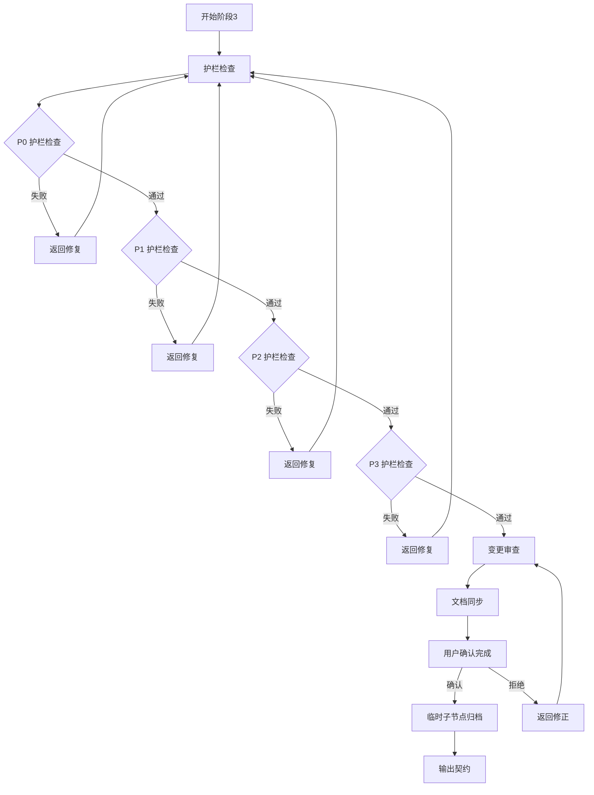

# 阶段3: 变更审查与确认

goal: 护栏检查，变更审查，用户确认完成，临时子节点归档

## 输入契约

```yaml
preconditions:
  required_inputs:
    - name: stage_2_contract
      type: yaml
      path: contracts/stage-2-contract.yaml
      validation: 阶段2必须通过
    - name: code_changes
      type: git_diff
      path: git commit
      validation: 代码变更必须存在且已提交
    - name: code_review_report
      type: json
      path: contracts/stage-2-code-review.json
      validation: 审查状态必须为passed
    - name: test_report
      type: json
      path: contracts/stage-2-test-report.json
      validation: 测试状态必须为passed
  constraints:
    - 所有审查和测试必须通过
    - 代码必须已合并到目标分支
```

## 处理流程



### 步骤详情

```yaml
steps:
  - id: 1
    name: 护栏检查
    actions:
      - P0 层级护栏检查（安全护栏、质量护栏、架构护栏）
      - P1 层级护栏检查（性能护栏、可用性护栏、接口护栏）
      - P2 层级护栏检查（代码质量护栏、文档护栏、测试护栏）
      - P3 层级护栏检查（编码规范护栏、注释规范护栏、Git 规范护栏）
      - 临时子节点护栏检查（任务范围护栏、约束一致性护栏、完成标准护栏）
    output:
      - 护栏检查结果

  - id: 2
    name: 变更审查
    actions:
      - 审查代码变更是否符合设计
      - 审查约束满足情况
      - 审查测试覆盖率
      - 审查文档同步
    output:
      - 变更审查报告

  - id: 3
    name: 文档同步
    actions:
      - 同步 README.md
      - 同步 API 文档
      - 同步 CHANGELOG.md
    output:
      - 更新的文档列表

  - id: 4
    name: 用户确认完成
    actions:
      - 验证交付物完整性
      - 生成变更摘要
      - 发送交付通知
      - 等待用户确认
    output:
      - 完成通知 + 变更摘要

  - id: 5
    name: 临时子节点归档
    actions:
      - 归档临时子节点到上级节点（P3）
      - 记录任务执行记录
      - 记录约束满足情况
      - 记录遗留问题和改进建议
      - 解除引用关系
    output:
      - 归档记录
```

## 用户确认完成步骤

```yaml
user_confirmation:
  steps:
    - 验证交付物完整性
    - 生成变更摘要
    - 发送交付通知
    - 等待用户确认
  
  confirmation_content:
    - 任务目标是否达成
    - 验收标准是否满足
    - 约束是否满足
    - 文档是否同步
  
  user_actions:
    - 确认完成：进入归档阶段
    - 拒绝：返回修正
    - 要求修改：返回相应阶段
```

## 临时子节点归档步骤

```yaml
temp_node_archive:
  steps:
    - 检查临时子节点是否存在
    - 归档到上级节点（P3）
    - 记录任务执行记录
    - 记录约束满足情况
    - 记录遗留问题和改进建议
    - 解除引用关系
  
  archive_content:
    - 任务执行记录
    - 约束满足情况
    - 遗留问题
    - 改进建议
  
  reference_handling:
    - 解除临时子节点与 P3 的引用关系
    - 更新 .meta.yaml 中的 archived_at 字段
    - 移动到归档目录（可选）
```

## 文档同步规范

```yaml
sync_rules:
  README.md:
    condition: 功能变更
    content: [功能描述, 使用说明]
  API文档:
    condition: 接口变更
    content: [接口定义, 参数说明]
  CHANGELOG.md:
    condition: 所有变更
    content: 变更记录
  design.md:
    condition: 设计变更
    content: 设计更新

checklist:
  - README.md已更新
  - API文档已更新(如有接口变更)
  - CHANGELOG.md已更新
  - 所有链接有效
  - 版本号已更新
```

## 输出契约

```yaml
stage_id: stage-3-deliver-sync
version: "2.0.0"

postconditions:
  required_outputs:
    - name: delivery_notification
      type: json
      path: contracts/stage-3-delivery.json
      format:
        delivery_status: completed
        delivered_at: 时间戳
        summary: 交付摘要
        changes: [变更清单]
    - name: documentation_updates
      type: files
      path: docs/或相关文档路径
      format: 更新的文档列表
    - name: temp_node_archive
      type: file
      path: archives/{change-id}-archive.md
      format: 临时子节点归档记录
    - name: user_confirmation
      type: json
      path: contracts/stage-3-confirmation.json
      format:
        confirmed: true|false
        confirmed_at: 时间戳
        user_feedback: 用户反馈

invariants:
  - 交付物必须完整(代码+文档+测试)
  - 所有变更必须可追溯(Git Commit Hash)
  - 文档必须与代码同步更新
  - 用户可见变更必须有通知
  - 临时子节点必须归档
  - 引用关系必须解除
```

## 质量门控

```yaml
quality_gates:
  - check: 护栏检查
    pass: 所有层级护栏检查通过
    fail: 返回相应层级修复
  - check: 需求实现
    pass: 所有需求已实现
    fail: 返回实现阶段
  - check: 验收满足
    pass: 所有验收条件满足
    fail: 返回验证阶段
  - check: 质量达标
    pass: 所有质量指标达标
    fail: 返回相应阶段
  - check: 文档同步
    pass: 文档与代码一致
    fail: 返回文档同步
  - check: 用户确认
    pass: 用户确认完成
    fail: 返回修正
  - check: 临时子节点归档
    pass: 归档记录完整
    fail: 返回归档
```

## 状态定义

```yaml
states:
  STAGE_3_STARTED:
    trigger: 阶段2通过
    action: 执行护栏检查
  STAGE_3_GUARD_CHECKING:
    trigger: 护栏检查
    action: 等待检查完成
  STAGE_3_REVIEWING:
    trigger: 护栏检查通过
    action: 变更审查
  STAGE_3_SYNCING:
    trigger: 审查通过
    action: 文档同步
  STAGE_3_WAITING_CONFIRM:
    trigger: 同步完成
    action: 等待用户确认
  STAGE_3_ARCHIVING:
    trigger: 用户确认
    action: 临时子节点归档
  STAGE_3_PASSED:
    trigger: 归档完成
    action: 进入阶段4
```

## 相关文档

- stage-2-implement.md: 阶段2执行计划与实现
- stage-4-archive.md: 阶段4归档与约束树更新
- contracts/stage-3-contract.yaml: 契约模板
