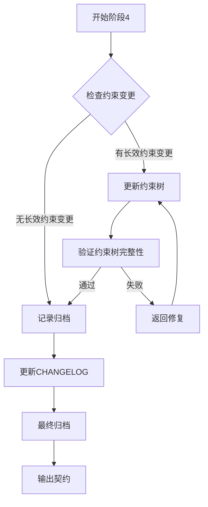

# 阶段4: 归档与约束树更新

goal: 约束树更新，长效约束变更记录，临时子节点归档记录，CHANGELOG更新

## 输入契约

```yaml
preconditions:
  required_inputs:
    - name: stage_3_contract
      type: yaml
      path: contracts/stage-3-contract.yaml
      validation: 阶段3必须通过
    - name: delivery_notification
      type: json
      path: contracts/stage-3-delivery.json
      validation: 交付状态必须为completed
    - name: all_stage_contracts
      type: files
      path: contracts/stage-*.json
      validation: 所有阶段的契约文件必须存在
  constraints:
    - 所有阶段必须已完成
    - 所有契约文件必须完整
```

## 处理流程



### 步骤详情

```yaml
steps:
  - id: 1
    name: 检查约束变更
    actions:
      - 检查是否有长效约束（P0-P3）变更
      - 评估变更影响范围
      - 确定是否需要更新约束树
    output:
      - 约束变更检测结果

  - id: 2
    name: 更新约束树
    actions:
      - 更新长效约束文档（如有变更）
      - 更新约束树结构（如有变更）
      - 验证约束树完整性
      - 验证约束继承关系
    output:
      - 更新的约束树文档
      - 约束树完整性验证结果
    condition: 如有长效约束变更

  - id: 3
    name: 长效约束变更记录
    actions:
      - 记录变更类型（新增/修改/删除）
      - 记录变更内容
      - 记录变更原因
      - 记录影响范围
      - 记录审批人
    output:
      - 长效约束变更记录
    condition: 如有长效约束变更

  - id: 4
    name: 临时子节点归档记录
    actions:
      - 记录临时子节点归档信息
      - 记录引用关系解除
      - 记录任务执行摘要
      - 记录约束满足情况
      - 记录遗留问题和改进建议
    output:
      - 临时子节点归档记录

  - id: 5
    name: 更新CHANGELOG
    actions:
      - 记录变更类型
      - 记录变更内容
      - 记录影响范围
      - 记录版本号
    output:
      - CHANGELOG.md
```

## 约束树更新步骤

```yaml
constraint_tree_update:
  check_rules:
    - 检查 P0 约束是否有变更
    - 检查 P1 约束是否有变更
    - 检查 P2 约束是否有变更
    - 检查 P3 约束是否有变更
  
  update_rules:
    - 父约束变更必须评估对子约束的影响
    - 子约束变更必须确保不违反父约束
    - 约束树结构变更必须验证完整性
    - 约束继承关系变更必须验证正确性
  
  verification:
    - 约束树结构完整性
    - 约束继承关系正确性
    - 约束从属关系明确性
    - 约束冲突检测
```

## 长效约束变更记录

```yaml
constraint_change_record:
  required_fields:
    - change_id: 变更唯一标识
    - change_type: 新增|修改|删除
    - constraint_level: P0|P1|P2|P3
    - constraint_id: 约束ID
    - change_content: 变更内容
    - change_reason: 变更原因
    - impact_scope: 影响范围
    - approver: 审批人
    - approved_at: 审批时间
  
  storage:
    path: "contracts/constraint-changes/"
    format: "yaml"
    retention: "永久保留"
```

## 临时子节点归档记录

```yaml
temp_node_archive_record:
  required_fields:
    - archive_id: 归档唯一标识
    - temp_node_path: 临时子节点路径
    - referenced_p3_node: 引用的 P3 节点 ID
    - task_summary: 任务执行摘要
    - constraint_satisfaction: 约束满足情况
    - legacy_issues: 遗留问题
    - improvement_suggestions: 改进建议
    - archived_at: 归档时间
    - reference_released: 引用关系是否解除
  
  storage:
    path: "archives/{change-id}-archive.md"
    format: "markdown"
    retention: "永久保留"
```

## 引用关系解除步骤

```yaml
reference_release:
  steps:
    - 检查临时子节点的引用关系
    - 更新 .meta.yaml 中的 archived_at 字段
    - 解除与 P3 节点的引用关系
    - 记录引用关系解除时间
  
  verification:
    - 确认引用关系已解除
    - 确认临时子节点不再影响约束树
    - 确认归档记录完整
```

## 归档记录模板

```markdown
# 归档记录：[功能名称]

## 基本信息
- 需求提案：[proposal.md链接]
- 技术确认：[confirmation.md链接]
- 完成时间：[YYYY-MM-DD]
- 实际耗时：[X人天]
- 负责人：[姓名]

## 约束树信息
- 引用的 P3 节点：[P3-XXX]
- 引用关系解除时间：[YYYY-MM-DD HH:MM:SS]

## 实现摘要
- [实现要点1]
- [实现要点2]

## 约束满足情况
- P0 约束：[满足情况]
- P1 约束：[满足情况]
- P2 约束：[满足情况]
- P3 约束：[满足情况]

## 变更记录
- [变更1：描述及原因]

## 长效约束变更
- 是否需要更新长效约束：是/否
- 变更内容：[描述]
- 影响范围：[描述]

## 遗留问题
- [问题1]
- [问题2]

## 改进建议
- [建议1]
- [建议2]

归档人：[姓名]
归档时间：[YYYY-MM-DD]
```

## CHANGELOG更新规范

```yaml
change_types:
  Added: 新功能
  Changed: 功能变更
  Fixed: Bug修复
  Deprecated: 即将移除
  Removed: 已移除
  Security: 安全相关
  Constraint: 约束变更

format: |
  ## [版本号] - YYYY-MM-DD

  ### 新增
  - [新增内容1]

  ### 变更
  - [变更内容1]

  ### 修复
  - [修复内容1]

  ### 安全
  - [安全相关内容]

  ### 约束
  - [约束变更内容]
```

## 输出契约

```yaml
stage_id: stage-4-archive-evolve
version: "2.0.0"

postconditions:
  required_outputs:
    - name: archive_record
      type: file
      path: archives/{change-id}-archive.md
      format: 归档记录(Markdown)
    - name: constraint_tree_updates
      type: files
      path: ../constraints/
      format: 更新的约束文档(如需要)
    - name: constraint_change_record
      type: yaml
      path: contracts/constraint-changes/{change-id}.yaml
      format: 长效约束变更记录(如有变更)
    - name: changelog_entry
      type: file
      path: CHANGELOG.md
      format: 变更日志条目

invariants:
  - 归档记录必须包含完整决策链
  - 必须明确是否需要更新长效约束
  - 变更日志必须更新
  - 经验教训必须记录
  - 引用关系必须解除
  - 约束树完整性必须验证
```

## 质量门控

```yaml
quality_gates:
  - check: 归档记录完整
    pass: 包含所有必需字段
    fail: 返回归档记录
  - check: 约束树更新
    pass: 约束树完整性验证通过
    fail: 返回约束树更新
  - check: 引用关系解除
    pass: 引用关系已解除
    fail: 返回引用关系解除
  - check: CHANGELOG更新
    pass: 变更日志已更新
    fail: 返回CHANGELOG更新
  - check: 经验教训记录
    pass: 记录了经验教训
    fail: 返回经验教训记录
```

## 状态定义

```yaml
states:
  STAGE_4_STARTED:
    trigger: 阶段3通过
    action: 检查约束变更
  STAGE_4_CHECKING:
    trigger: 检查约束变更
    action: 等待检查完成
  STAGE_4_UPDATING:
    trigger: 有长效约束变更
    action: 更新约束树
  STAGE_4_VERIFYING:
    trigger: 约束树更新
    action: 验证完整性
  STAGE_4_RECORDING:
    trigger: 记录归档
    action: 等待记录完成
  STAGE_4_ARCHIVING:
    trigger: 归档记录
    action: 等待归档完成
  STAGE_4_COMPLETED:
    trigger: 归档完成
    action: 流程结束
```

## 相关文档

- stage-3-deliver.md: 阶段3变更审查与确认
- stage-0-weight.md: 阶段0意图分析与约束识别
- contracts/stage-4-contract.yaml: 契约模板
- ../constraints/p0-constraints.md: P0 约束定义
