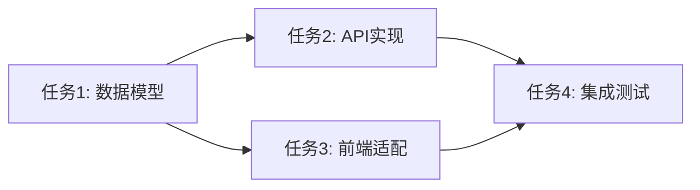

# SOP 核心理念与执行流程指南

> **文档版本**: v1.2.0
> **最后更新**: 2026-03-24
> **适用对象**: 开发者、使用者、技术决策者

---

## 目录

1. [SOP 概述](#1-sop-概述)
2. [核心理念](#2-核心理念)
3. [约束树架构](#3-约束树架构)
   - [3.5 Spec 树与设计文档树](#35-spec-树与设计文档树)
4. [5阶段工作流](#4-5阶段工作流)
5. [Skill 体系](#5-skill-体系)
6. [执行效果](#6-执行效果)
7. [最佳实践](#7-最佳实践)

**附录**：
- [A. 快速参考](#a-快速参考)
- [B. 相关文档](#b-相关文档)
- [C. 设计文档树模板路径](#c-设计文档树模板路径)
- [D. SOP 文档创建详解](#d-sop-文档创建详解sop-document-writer)

---

## 1. SOP 概述

### 1.1 什么是 SOP

SOP (Standard Operating Procedure) 是一套基于约束树的软件开发方法论，通过层级化约束驱动开发和契约式协作，确保软件开发过程的规范性、可追溯性和高质量交付。

### 1.2 设计目标

| 目标 | 描述 |
|------|------|
| **规范性** | 通过约束树层级定义，确保开发过程遵循既定规范 |
| **可追溯** | 从设计到实现，每一步都有记录和审查 |
| **高质量** | 层级护栏机制在关键节点进行验证，防止问题扩散 |
| **语言无关** | 除特定语言 Skill 外，方法论适用于任何技术栈 |

### 1.3 核心公式

```
SOP = 约束树 + 5阶段工作流 + 18个 Skill + 契约式协作
```

---

## 2. 核心理念

### 2.1 约束树驱动

**理念**: 所有开发活动都基于约束树执行，约束树定义了长效约束的层级关系。

```
P0 (工程宪章) - 不可违背，违反即熔断
├── P1 (系统规范) - 跨模块约束，警告可接受
│   ├── P2 (模块规范) - 单模块约束，自动化验证
│   │   └── P3 (实现规范) - 实现细节，IDE提示
```

**执行效果**:
- P0 违反立即阻止构建
- P1 违反产生警告但允许继续
- P2 违反触发自动验证
- P3 违反显示 IDE 提示

### 2.2 设计从根开始

**理念**: 设计必须从约束树根节点（P0）开始，按照层级顺序逐层向下。

```
设计流程: P0 → P1 → P2 → P3 → 临时子节点
```

**原因**:
- 上层约束决定下层设计的边界
- 确保设计不违反父约束
- 逐层细化，降低复杂度

**执行效果**:
- 每层设计完成后进行护栏检查
- 用户确认后才能进入下一层级
- 防止设计偏离核心约束

### 2.3 实现从叶子开始

**理念**: 实现必须从约束树叶子节点开始，按照层级顺序逐层向上。

```
实现流程: 临时子节点 → P3 → P2 → P1 → P0
```

**原因**:
- 叶子节点是最小变更单元
- 向上传递确保一致性
- 每层实现后验证约束满足

**执行效果**:
- 从最小变更单元开始，降低风险
- 每层实现后进行护栏检查
- 确保实现满足所有层级约束

### 2.4 契约式协作

**理念**: 各阶段通过契约文件（YAML/JSON）传递上下文，不共享状态。

```
┌──────────────┐     契约文件     ┌──────────────┐
│   Stage 0    │ ────────────────▶│   Stage 1    │
│  (前置条件)   │                  │   (逻辑上下文) │
└──────────────┘                  └──────────────┘
                                       │
                                       │ 契约文件
                                       ▼
                                  ┌──────────────┐
                                  │   Stage 2    │
                                  │  (后置条件)   │
                                  └──────────────┘
```

**契约结构**:
- **前置条件 (Precondition)**: 进入该阶段必须满足的条件
- **逻辑上下文 (Logic)**: 该阶段执行所需的信息
- **后置条件 (Postcondition)**: 该阶段完成后的输出
- **不变式 (Invariant)**: 整个过程必须保持的条件

**执行效果**:
- 阶段间解耦，无隐式依赖
- 契约可追溯，便于审查
- 支持并行开发和回滚

---

## 3. 约束树架构

### 3.1 层级定义

| 层级 | 名称 | 约束强度 | 内容 | 审批者 |
|------|------|----------|------|--------|
| **P0** | 工程宪章 | 不可违背 | 安全红线、质量红线、架构红线 | 技术委员会 |
| **P1** | 系统规范 | 警告可接受 | 性能约束、可用性约束、接口约束 | 技术负责人 |
| **P2** | 模块规范 | 自动化验证 | 代码质量、文档约束、测试约束 | 模块负责人 |
| **P3** | 实现规范 | IDE提示 | 编码规范、注释规范、Git规范 | 自动化工具 |

### 3.2 约束继承规则

| 规则 | 描述 | 示例 |
|------|------|------|
| 不违反父约束 | 子约束不得违反父约束的规定 | P2 不能违反 P1 的性能要求 |
| 可细化要求 | 子约束可以细化父约束的要求 | P2 可以细化 P1 的接口定义 |
| 可扩展范围 | 子约束可以扩展父约束的范围 | P3 可以扩展 P2 的测试覆盖 |
| 影响评估 | 父约束变更时必须评估对子约束的影响 | P1 变更时检查所有 P2 |

### 3.3 临时子节点机制

**存储位置**:
```
.sop/specs/{change-id}/           # 主存储路径
├── .meta.yaml                    # 元数据
├── proposal.md                   # 变更提案
├── design.md                     # 技术设计
├── specs/
│   ├── requirements.md           # 需求规范
│   └── scenarios.md              # BDD 场景
├── tasks.md                      # 任务列表
└── checklist.md                  # 检查清单

.trae/specs/{change-id}/          # 兼容路径（与 Trae IDE 兼容）
```

**生命周期**:
1. **创建**: 独立存储，引用 P3 节点
2. **执行**: 继承 P3 及其祖先节点的约束
3. **归档**: 从叶子节点向上更新约束树，解除引用关系

### 3.4 动态深度调整

| 复杂度 | 深度 | 层级路径 | 适用场景 |
|--------|------|----------|----------|
| 低 | 2 | P0 → P1 → 临时节点 | 简单修复、小型功能 |
| 中 | 3 | P0 → P1 → P2 → 临时节点 | 模块功能、接口变更 |
| 高 | 4 | P0 → P1 → P2 → P3 → 临时节点 | 架构调整、大型功能 |

### 3.5 Spec 树与设计文档树

#### 3.5.1 Spec 树定义

**Spec 树**（规范树）是 SOP 的核心数据结构，以多叉树形态定义长效约束的层级关系。

```
Spec 树结构:
┌─────────────────────────────────────────────────────────┐
│  P0 根节点（工程宪章）                                    │
│  存储路径: .sop/constitution/charter.md                  │
│  - 安全、质量、架构红线                                   │
│  - 不可违背                                              │
└──────────────────────┬──────────────────────────────────┘
                       │ 派生
                       ▼
┌─────────────────────────────────────────────────────────┐
│  P1 一级子节点（系统规范）                                │
│  存储路径: .sop/specs/system/                            │
│  - 性能、可用性、接口约束                                 │
│  - 继承 P0 约束                                          │
└──────────────────────┬──────────────────────────────────┘
                       │ 派生
                       ▼
┌─────────────────────────────────────────────────────────┐
│  P2 二级子节点（模块规范）                                │
│  存储路径: .sop/specs/modules/{module-name}/             │
│  - 代码质量、文档、测试约束                               │
│  - 继承 P1 约束                                          │
└──────────────────────┬──────────────────────────────────┘
                       │ 派生
                       ▼
┌─────────────────────────────────────────────────────────┐
│  P3 三级子节点（实现规范）                                │
│  存储路径: .sop/specs/impl/{feature-name}/               │
│  - 编码规范、注释、Git 规范                              │
│  - 继承 P2 约束                                          │
│  - 可挂载临时子节点（独立存储，引用关联）                  │
└─────────────────────────────────────────────────────────┘
```

#### 3.5.2 设计文档树定义

**设计文档树**是临时子节点的完整文档结构，参考 OpenSpec 设计，用于记录单次变更的完整设计过程。

```
设计文档树结构:
.sop/specs/{change-id}/           # 主存储路径（change-id: CHG-YYYYMMDD-NNN）
├── .meta.yaml                    # 元数据（状态、约束引用、复杂度）
├── proposal.md                   # 变更提案（Why & What）
├── design.md                     # 技术设计（How）
├── specs/                        # 详细规范
│   ├── requirements.md           # 需求规范
│   └── scenarios.md              # BDD 场景（Gherkin 语法）
├── tasks.md                      # 任务列表（含依赖关系和并行组）
└── checklist.md                  # 验收检查清单

.trae/specs/{change-id}/          # 兼容路径（与 Trae IDE 兼容）
```

#### 3.5.3 两树关系

```
┌─────────────────────────────────────────────────────────────────────────┐
│                           Spec 树（长效约束）                             │
│  ┌─────────────────────────────────────────────────────────────────┐    │
│  │ P0 工程宪章                                                      │    │
│  │ .sop/constitution/charter.md                                    │    │
│  └──────────────────────────────┬──────────────────────────────────┘    │
│                                 │ 派生                                   │
│  ┌──────────────────────────────▼──────────────────────────────────┐    │
│  │ P1 系统规范                                                      │    │
│  │ .sop/specs/system/                                              │    │
│  └──────────────────────────────┬──────────────────────────────────┘    │
│                                 │ 派生                                   │
│  ┌──────────────────────────────▼──────────────────────────────────┐    │
│  │ P2 模块规范                                                      │    │
│  │ .sop/specs/modules/{module}/                                    │    │
│  └──────────────────────────────┬──────────────────────────────────┘    │
│                                 │ 派生                                   │
│  ┌──────────────────────────────▼──────────────────────────────────┐    │
│  │ P3 实现规范                                                      │    │
│  │ .sop/specs/impl/{feature}/                                      │    │
│  └──────────────────────────────┬──────────────────────────────────┘    │
│                                 │                                        │
└─────────────────────────────────┼────────────────────────────────────────┘
                                  │
                                  │ 引用关联
                                  ▼
┌─────────────────────────────────────────────────────────────────────────┐
│                        设计文档树（临时约束）                             │
│  ┌─────────────────────────────────────────────────────────────────┐    │
│  │ .sop/specs/CHG-20260324-001/                                    │    │
│  │ ├── .meta.yaml         ─────────────────────────────────────────┤    │
│  │ │   # 引用 P3 节点 ID                                           │    │
│  │ │   # 复杂度评估结果                                            │    │
│  │ │   # 动态树深度                                                │    │
│  │ ├── proposal.md       # Why & What                             │    │
│  │ ├── design.md         # How（架构、数据模型、接口）              │    │
│  │ ├── specs/                                                     │    │
│  │ │   ├── requirements.md  # 功能/非功能需求                      │    │
│  │ │   └── scenarios.md     # BDD 测试场景                         │    │
│  │ ├── tasks.md          # 任务列表（支持依赖和并行）               │    │
│  │ └── checklist.md      # 验收标准                               │    │
│  └─────────────────────────────────────────────────────────────────┘    │
└─────────────────────────────────────────────────────────────────────────┘
```

#### 3.5.4 关键区别

| 特性 | Spec 树 | 设计文档树 |
|------|---------|------------|
| **生命周期** | 长效持久化 | 临时存在（任务完成后归档） |
| **存储位置** | 固定路径 `.sop/specs/` | 独立目录 `.sop/specs/{change-id}/` |
| **约束强度** | P0-P3 层级约束 | 继承父节点约束 |
| **变更频率** | 低频更新 | 每次变更创建新树 |
| **内容类型** | 规范、约束、标准 | 提案、设计、任务、检查清单 |
| **引用关系** | 被临时节点引用 | 引用 Spec 树节点 |

#### 3.5.5 设计文档树核心文件说明

##### proposal.md（变更提案）

记录变更的 Why 和 What，包含复杂度评估：

```yaml
---
change_id: CHG-20260324-001
status: proposed
complexity: medium          # 复杂度级别
estimated_depth: 3          # 预估 spec 树深度
complexity_factors:
  task_count: 5             # 任务数量
  code_change_lines: 250    # 代码变更行数
  module_count: 2           # 涉及模块数
  dependency_change: 1      # 依赖变更数
  security_impact: indirect # 安全影响
---

# 用户认证增强 提案

## Why（为什么）
[变更原因描述]

## What（做什么）
[变更目标描述]

## Impact（影响范围）
| 层级 | 是否影响 | 影响描述 |
|------|---------|---------|
| P0 工程宪章 | 是 | 涉及认证安全 |
| P1 系统规范 | 是 | 性能要求调整 |
| P2 模块规范 | 是 | 认证模块变更 |
| P3 实现规范 | 否 | - |
```

##### design.md（技术设计）

记录 How，包含架构决策和依赖子树引用：

```yaml
---
change_id: CHG-20260324-001
status: approved
---

# 用户认证增强 技术设计

## Architecture（架构设计）
[架构图和说明]

## Dependencies（依赖关系）
### 依赖子树引用
| 依赖 | 子树路径 | 状态 |
|------|---------|------|
| JWT | `.sop/specs/dependencies/DEP-jwt/` | 已创建 |
| Redis | `.sop/specs/dependencies/DEP-redis/` | 待创建 |
```

##### .meta.yaml（元数据）

记录状态追踪和约束引用：

```yaml
change_id: CHG-20260324-001
created: 2026-03-24T10:00:00Z
updated: 2026-03-24T15:30:00Z
status: in_progress          # draft | proposed | approved | in_progress | completed | archived

# 约束引用
constraint_reference:
  p3_node: impl-user-auth    # 引用的 P3 节点 ID
  inherited_constraints:
    - P0-SEC-001             # 安全约束
    - P1-PERF-002            # 性能约束
    - P2-MOD-AUTH-001        # 模块约束

# 复杂度评估
complexity:
  level: medium
  score: 0.55
  depth: 3

# 动态深度配置
depth_config:
  skip_layers: [P3]          # 跳过的层级
  temp_node_required: true   # 需要临时节点
```

##### tasks.md（任务列表）

支持任务依赖和并行执行：

```markdown
# 任务列表

## 任务依赖图



## 任务详情

| ID | 任务 | 依赖 | 并行组 | 状态 |
|----|------|------|--------|------|
| T1 | 数据模型设计 | - | G1 | 完成 |
| T2 | API 实现 | T1 | G2 | 进行中 |
| T3 | 前端适配 | T1 | G2 | 待开始 |
| T4 | 集成测试 | T2,T3 | G3 | 待开始 |
```

#### 3.5.6 两树协作流程

```
┌─────────────────────────────────────────────────────────────────────────┐
│                        Stage 1: 设计从 Spec 树根开始                      │
├─────────────────────────────────────────────────────────────────────────┤
│                                                                          │
│  1. 读取 P0 约束 ──────▶ P0 设计文档（proposal.md）                       │
│  2. 读取 P1 约束 ──────▶ P1 设计文档（design.md - 架构）                  │
│  3. 读取 P2 约束 ──────▶ P2 设计文档（design.md - 模块）                  │
│  4. 读取 P3 约束 ──────▶ P3 设计文档（specs/requirements.md）             │
│  5. 创建设计文档树 ────▶ .sop/specs/{change-id}/                          │
│                                                                          │
└─────────────────────────────────────────────────────────────────────────┘
                                    │
                                    ▼
┌─────────────────────────────────────────────────────────────────────────┐
│                        Stage 2: 实现从设计文档树叶子开始                  │
├─────────────────────────────────────────────────────────────────────────┤
│                                                                          │
│  1. 执行 tasks.md 中的任务（从叶子任务开始）                              │
│  2. 每完成一个任务，更新 .meta.yaml 状态                                  │
│  3. 运行 specs/scenarios.md 中的 BDD 场景验证                            │
│  4. 检查 checklist.md 中的验收标准                                       │
│                                                                          │
└─────────────────────────────────────────────────────────────────────────┘
                                    │
                                    ▼
┌─────────────────────────────────────────────────────────────────────────┐
│                        Stage 4: 归档更新 Spec 树                          │
├─────────────────────────────────────────────────────────────────────────┤
│                                                                          │
│  1. 设计文档树归档 ────▶ 移动到 .sop/archive/{change-id}/                │
│  2. 更新 Spec 树 ──────▶ 如有长效约束变更，更新 P0-P3 节点               │
│  3. 解除引用关系 ──────▶ 更新 .meta.yaml 引用状态                        │
│                                                                          │
└─────────────────────────────────────────────────────────────────────────┘
```

#### 3.5.7 依赖子树

第三方依赖作为独立的依赖子树存在，具有只读保护：

```
.sop/specs/dependencies/           # 依赖子树存储路径
├── DEP-react/                     # React 依赖子树
│   ├── .meta.yaml                 # readonly: true
│   ├── capabilities.md            # 提供的能力
│   ├── usage-patterns.md          # 使用方式
│   └── constraints.md             # 使用约束
├── DEP-jwt/                       # JWT 依赖子树
│   ├── .meta.yaml
│   ├── capabilities.md
│   └── constraints.md
└── ...

依赖子树特性:
- 只读保护：非用户指定不可变更
- 能力声明：记录依赖提供的能力
- 使用约束：记录使用方式和限制
- 被 design.md 引用
```

---

## 4. 5阶段工作流

### 4.1 流程概览

```
┌─────────────────────────────────────────────────────────────────┐
│  Stage 0: 意图分析与约束识别                                      │
│  - 理解用户任务目标                                               │
│  - 识别约束树中的相关节点                                          │
└──────────────────────┬──────────────────────────────────────────┘
                       │
                       ▼
┌─────────────────────────────────────────────────────────────────┐
│  Stage 1: 层级设计（从根开始）                                     │
│  - P0 设计 → P1 设计 → P2 设计 → P3 设计 → 临时子节点创建          │
└──────────────────────┬──────────────────────────────────────────┘
                       │
                       ▼
┌─────────────────────────────────────────────────────────────────┐
│  Stage 2: 执行计划与实现（从叶子开始）                             │
│  - 临时子节点实现 → P3 实现 → P2 实现 → P1 实现 → P0 验证          │
└──────────────────────┬──────────────────────────────────────────┘
                       │
                       ▼
┌─────────────────────────────────────────────────────────────────┐
│  Stage 3: 变更审查与确认                                          │
│  - 护栏检查 → 变更审查 → 用户确认                                  │
└──────────────────────┬──────────────────────────────────────────┘
                       │
                       ▼
┌─────────────────────────────────────────────────────────────────┐
│  Stage 4: 归档与约束树更新                                        │
│  - 临时子节点归档 → 引用关系解除 → CHANGELOG 更新                   │
└─────────────────────────────────────────────────────────────────┘
```

### 4.2 各阶段详解

#### Stage 0: 意图分析与约束识别

| 步骤 | 活动 | 输出 |
|------|------|------|
| 1 | 用户提出任务请求 | 任务描述 |
| 2 | 头脑风暴，探索方案 | 方案列表 |
| 3 | 细节确认 | 确认记录 |
| 4 | 约束识别 | 约束节点列表 |

**质量门控**: 意图清晰，约束识别完成

#### Stage 1: 层级设计

| 步骤 | 活动 | 输出 |
|------|------|------|
| 5 | P0 约束设计 + 护栏检查 | P0 设计文档 |
| 6 | P1 约束设计 + 护栏检查 | P1 设计文档 |
| 7 | P2 约束设计 + 护栏检查 | P2 设计文档 |
| 8 | P3 约束设计 + 护栏检查 | P3 设计文档 |
| 9 | 临时子节点创建 | spec.md + tasks.md + checklist.md |
| 10 | 执行计划创建 | 任务依赖图 |
| 11 | 最终审查 + 用户确认 | 确认记录 |

**质量门控**: 设计层级完整，护栏检查通过，用户确认

#### Stage 2: 执行计划与实现

| 步骤 | 活动 | 输出 |
|------|------|------|
| 12 | 临时子节点实现（如果存在） | 代码变更 |
| 13 | P3 实现 + 护栏检查 | 实现代码 |
| 14 | P2 实现 + 护栏检查 | 模块代码 |
| 15 | P1 实现 + 护栏检查 | 系统代码 |
| 16 | P0 验证 + 护栏检查 | 验证报告 |

**质量门控**: 实现层级完整，护栏检查通过，约束验证通过

#### Stage 3: 变更审查与确认

| 步骤 | 活动 | 输出 |
|------|------|------|
| 17 | 变更审查 | 审查报告 |
| 18 | 用户确认 | 确认记录 |

**质量门控**: 变更审查通过，用户确认完成

#### Stage 4: 归档与约束树更新

| 步骤 | 活动 | 输出 |
|------|------|------|
| 19 | 临时子节点归档 | 归档记录 |
| 20 | 引用关系解除 | 更新后的约束树 |
| 21 | CHANGELOG 更新 | CHANGELOG |

**质量门控**: 归档记录完整，引用关系解除，CHANGELOG 更新

### 4.3 护栏机制

**护栏优先级**:

| 优先级 | 护栏类型 | 失败处理 |
|--------|----------|----------|
| 1 | 安全护栏 | 立即熔断 |
| 2 | 质量护栏 | 警告 + 阻断 |
| 3 | 架构护栏 | 警告 + 审批 |
| 4 | 规范护栏 | 自动修复 |

**护栏检查时机**:
- 每个层级设计完成后
- 每个层级实现完成后
- 最终变更审查时

---

## 5. Skill 体系

### 5.1 Skill 架构图

```
18 个 Skill
├── 编排类 (3个) 【语言无关】
│   ├── sop-orchestrator      - 工作流编排，默认入口
│   ├── sop-sync              - 文档同步
│   └── sop-progress-supervisor - 进度监管
├── 规范类 (4个) 【语言无关】
│   ├── sop-decision-analyst  - 复杂需求决策分析
│   ├── sop-requirement-analyst - 需求分析
│   ├── sop-architecture-designer - 架构设计
│   └── sop-implementation-designer - 实现设计
├── 实现类 (3个) 【语言无关】
│   ├── sop-code-explorer     - 代码探索
│   ├── sop-code-implementer  - 代码实现
│   └── sop-test-implementer  - 测试实现
├── 验证类 (3个)
│   ├── sop-architecture-reviewer 【语言无关】 - 架构审查
│   ├── sop-code-reviewer     【语言无关】 - 代码审查
│   └── sop-spring-reviewer   【Java/Spring专用】 - Spring审查
├── 维护类 (4个) 【语言无关】
│   ├── sop-bug-analyst       - Bug分析
│   ├── sop-code-refactorer   - 代码重构
│   ├── sop-tech-debt-manager - 技术债务管理
│   └── sop-dependency-manager - 依赖管理
└── 文档类 (1个) 【语言无关】
    └── sop-document-writer   - 文档编写（技术+人类双模式）
```

### 5.2 Skill 与工作流阶段映射

| Skill | Stage 0 | Stage 1 | Stage 2 | Stage 3 | Stage 4 |
|-------|---------|---------|---------|---------|---------|
| sop-orchestrator | ★ | ★ | ★ | ★ | ★ |
| sop-decision-analyst | ★ | | | | |
| sop-requirement-analyst | | ★ | | | |
| sop-architecture-designer | | ★ | | | |
| sop-implementation-designer | | ★ | | | |
| sop-code-explorer | | | ★ | | |
| sop-code-implementer | | | ★ | | |
| sop-test-implementer | | | ★ | | |
| sop-architecture-reviewer | | | | ★ | |
| sop-code-reviewer | | | | ★ | |
| sop-spring-reviewer | | | | ★ | |
| sop-document-writer | | | | | ★ |
| sop-sync | | | | | ★ |
| sop-progress-supervisor | ★ | ★ | ★ | ★ | ★ |

### 5.3 Skill 与约束层级映射

| Skill | P0 | P1 | P2 | P3 | 临时节点 |
|-------|----|----|----|----|----|
| sop-orchestrator | 验证 | 验证 | 验证 | 验证 | 管理 |
| sop-architecture-designer | 参考 | 设计 | 设计 | | |
| sop-code-implementer | 约束 | 约束 | 约束 | 约束 | 实现 |
| sop-code-reviewer | 验证 | 验证 | 验证 | 验证 | 验证 |
| sop-bug-analyst | 安全 | 稳定性 | 功能 | UI | |
| sop-code-refactorer | | 架构 | 设计 | 代码风格 | |

### 5.4 各 Skill 理念体现

#### 编排类

| Skill | 体现的核心理念 |
|-------|----------------|
| **sop-orchestrator** | **约束树驱动**: 从约束树获取约束，按层级编排工作流 |
| **sop-sync** | **契约式协作**: 通过契约文件同步文档与代码状态 |
| **sop-progress-supervisor** | **质量门控**: 监控各阶段质量门控条件是否满足 |

#### 规范类

| Skill | 体现的核心理念 |
|-------|----------------|
| **sop-decision-analyst** | **设计从根开始**: 从 P0 开始分析决策路径 |
| **sop-requirement-analyst** | **约束继承**: 需求规范继承 P1-P2 约束 |
| **sop-architecture-designer** | **层级驱动**: P0→P1→P2 层级架构设计 |
| **sop-implementation-designer** | **设计从根开始**: P2→P3 实现设计 |

#### 实现类

| Skill | 体现的核心理念 |
|-------|----------------|
| **sop-code-explorer** | **约束识别**: 探索代码库中约束的体现 |
| **sop-code-implementer** | **实现从叶子开始**: 从 P3/临时节点开始实现 |
| **sop-test-implementer** | **护栏机制**: 测试作为护栏验证实现 |

#### 验证类

| Skill | 体现的核心理念 |
|-------|----------------|
| **sop-architecture-reviewer** | **层级护栏**: 验证架构是否满足 P0-P1 约束 |
| **sop-code-reviewer** | **约束验证**: 验证代码是否满足 P2-P3 约束 |
| **sop-spring-reviewer** | **约束验证**: Java/Spring 特定约束验证 |

#### 维护类

| Skill | 体现的核心理念 |
|-------|----------------|
| **sop-bug-analyst** | **约束树映射**: Bug 按 P0-P3 层级分类分析 |
| **sop-code-refactorer** | **护栏保护**: 重构前补充测试作为护栏 |
| **sop-tech-debt-manager** | **约束继承**: 技术债务按约束层级评估影响 |
| **sop-dependency-manager** | **约束验证**: 依赖升级后验证约束满足 |

#### 文档类

| Skill | 体现的核心理念 |
|-------|----------------|
| **sop-document-writer** | **渐进式披露**: 文档按层级披露，符合约束树思想 |

---

## 6. 执行效果

### 6.1 质量提升效果

| 指标 | 效果 |
|------|------|
| **缺陷检出率** | 护栏机制在开发阶段检出问题，防止流入生产 |
| **架构一致性** | 层级设计确保实现与架构设计一致 |
| **代码可维护性** | 约束继承确保代码风格和质量统一 |

### 6.2 流程规范效果

| 效果 | 描述 |
|------|------|
| **可追溯** | 每个阶段有契约文件，变更可追溯 |
| **可审查** | 护栏检查点提供审查依据 |
| **可量化** | 质量门控条件可量化评估 |

### 6.3 团队协作效果

| 效果 | 描述 |
|------|------|
| **职责清晰** | 各 Skill 职责明确，边界清晰 |
| **协作有序** | 契约式协作避免隐式依赖 |
| **并行开发** | 支持任务依赖声明和并行执行 |

### 6.4 典型场景执行路径

#### 场景 1: 新功能开发

```
用户请求 → sop-orchestrator
    → Stage 0: sop-decision-analyst (复杂度分析)
    → Stage 1: sop-requirement-analyst → sop-architecture-designer → sop-implementation-designer
    → Stage 2: sop-code-explorer → sop-code-implementer → sop-test-implementer
    → Stage 3: sop-code-reviewer
    → Stage 4: sop-document-writer → sop-sync
```

#### 场景 2: Bug 修复

```
Bug 报告 → sop-bug-analyst
    → 分析 Bug 层级 (P0-P3)
    → 复现测试编写
    → sop-code-implementer (修复)
    → sop-code-reviewer (验证)
    → 归档
```

#### 场景 3: 代码重构

```
重构请求 → sop-code-refactorer
    → 识别代码坏味道
    → 补充测试 (护栏)
    → 执行重构
    → sop-code-reviewer (验证)
    → 归档
```

---

## 7. 最佳实践

### 7.1 约束树维护

| 实践 | 描述 |
|------|------|
| 定期审查 | 每季度审查 P0-P3 约束是否需要更新 |
| 版本化 | 约束变更需要记录版本和原因 |
| 影响评估 | 父约束变更时评估对子约束的影响 |

### 7.2 工作流执行

| 实践 | 描述 |
|------|------|
| 严格顺序 | 按阶段顺序执行，不跳过质量门控 |
| 用户确认 | 每个关键节点需要用户确认 |
| 契约完整 | 确保契约文件完整记录上下文 |

### 7.3 Skill 使用

| 实践 | 描述 |
|------|------|
| 入口统一 | 通过 sop-orchestrator 作为默认入口 |
| 触发准确 | 使用正确的触发词触发对应 Skill |
| 组合使用 | 复杂任务组合多个 Skill 协作完成 |

### 7.4 常见陷阱

| 陷阱 | 解决方案 |
|------|----------|
| 跳过设计阶段 | 强制执行质量门控检查 |
| 护栏检查失败忽略 | P0 级护栏失败立即阻断 |
| 契约文件缺失 | 每个阶段必须生成契约文件 |
| 约束继承错误 | 设计时检查父约束是否被违反 |

---

## 附录

### A. 快速参考

#### 触发词速查

| Skill | 触发词 |
|-------|--------|
| sop-orchestrator | `$start`, `$workflow` |
| sop-decision-analyst | `$decision`, `$analyze` |
| sop-requirement-analyst | `$requirement`, `$spec` |
| sop-architecture-designer | `$architecture`, `$design` |
| sop-code-implementer | `$implement`, `$code` |
| sop-code-reviewer | `$review`, `$audit` |
| sop-bug-analyst | `$bug`, `$analyze` |
| sop-document-writer | `$doc`, `$create-doc` |

#### 命令速查

| 命令 | 用途 |
|------|------|
| `/init-spec-tree` | 初始化约束树结构 |

### B. 相关文档

| 文档 | 路径 |
|------|------|
| Skill 索引 | `plugins/mumu-sop/index.md` |
| 工作流规范 | `plugins/mumu-sop/_resources/workflow/index.md` |
| 架构原则 | `plugins/mumu-sop/_resources/constitution/architecture-principles.md` |
| 约束索引 | `plugins/mumu-sop/_resources/constraints/index.md` |
| 模板索引 | `plugins/mumu-sop/_resources/templates/index.md` |
| 测试用例 | `plugins/mumu-sop/tests/index.md` |
| 更新日志 | `plugins/mumu-sop/CHANGELOG.md` |

### C. 设计文档树模板路径

| 模板 | 路径 | 用途 |
|------|------|------|
| 变更提案模板 | `_resources/templates/temporary/proposal.md` | 记录 Why & What |
| 技术设计模板 | `_resources/templates/temporary/design.md` | 记录 How |
| 需求规范模板 | `_resources/templates/temporary/specs/requirements.md` | 功能/非功能需求 |
| BDD 场景模板 | `_resources/templates/temporary/specs/scenarios.md` | Gherkin 测试场景 |
| 任务列表模板 | `_resources/templates/temporary/tasks.md` | 含依赖和并行组 |
| 检查清单模板 | `_resources/templates/temporary/checklist.md` | 验收标准 |
| 元数据模板 | `_resources/templates/temporary/.meta.yaml` | 状态追踪 |
| 动态深度分析 | `_resources/templates/workflow/depth-analysis.md` | 复杂度评估 |
| 依赖子树模板 | `_resources/templates/dependencies/dependency-subtree.md` | 第三方依赖 |

### D. SOP 文档创建详解（sop-document-writer）

#### D.1 文档创建模式

**sop-document-writer** 支持两种文档创建模式：

| 模式 | 目标读者 | 核心原则 | 适用场景 |
|------|----------|----------|----------|
| **技术模式** | 开发者、技术团队 | 结构规范、元数据完整 | API 文档、设计文档、README、规范文档 |
| **人类模式** | 终端用户、非技术人员 | 渐进式披露 | 用户手册、需求文档、合规文档、培训材料 |

#### D.2 技术文档类型与模板

##### D.2.1 规范文档模板

```markdown
---
version: v1.0.0
created: YYYY-MM-DD
updated: YYYY-MM-DD
status: draft|review|approved
---

# [规范名称]

## 概述

[简要描述规范的目的和范围]

## 背景

[为什么需要这个规范]

## 规范内容

### [核心规则1]

[详细描述]

### [核心规则2]

[详细描述]

## 约束条件

[适用条件和限制]

## 示例

[规范应用示例]

## 相关文档

- [相关文档链接]
```

##### D.2.2 设计文档模板

```markdown
---
version: v1.0.0
created: YYYY-MM-DD
updated: YYYY-MM-DD
status: draft|review|approved
---

# [设计名称]

## 设计目标

[明确设计要解决的问题]

## 设计方案

### 架构概览

[整体架构描述]

### 核心组件

[组件说明]

### 接口定义

[接口描述]

## 设计决策

| 决策 | 选择 | 原因 |
|------|------|------|
| [决策点] | [选择] | [原因] |

## 风险与缓解

| 风险 | 影响 | 缓解措施 |
|------|------|----------|
| [风险] | [影响] | [措施] |

## 实施计划

[实施步骤]
```

##### D.2.3 API 文档模板

```markdown
---
version: v1.0.0
base_url: /api/v1
---

# [API名称]

## 概述

[API功能描述]

## 端点

### [端点名称]

**方法**: `GET|POST|PUT|DELETE`

**路径**: `/api/v1/resource`

**描述**: [端点描述]

#### 请求参数

| 参数 | 类型 | 必需 | 描述 |
|------|------|------|------|
| param1 | string | 是 | 参数描述 |

#### 请求示例

```json
{
  "param1": "value1"
}
```

#### 响应

| 状态码 | 描述 |
|--------|------|
| 200 | 成功 |
| 400 | 参数错误 |

#### 响应示例

```json
{
  "code": 200,
  "data": {}
}
```

## 错误码

| 错误码 | 描述 |
|--------|------|
| E001 | 错误描述 |
```

##### D.2.4 README 模板

```markdown
# [项目名称]

[项目简介，一句话描述项目功能]

## 特性

- 特性1
- 特性2

## 快速开始

### 安装

```bash
npm install package-name
```

### 使用

```javascript
const module = require('package-name');
module.doSomething();
```

## 文档

- [API文档](docs/api.md)
- [设计文档](docs/design.md)

## 贡献指南

[贡献指南]

## 许可证

[许可证]
```

##### D.2.5 CHANGELOG 模板

```markdown
# 更新日志

本项目的所有重要变更都将记录在此文件中。

格式基于 [Keep a Changelog](https://keepachangelog.com/)，
版本号遵循 [语义化版本](https://semver.org/)。

## [Unreleased]

### 新增
- [待发布的新功能]

## [1.0.0] - YYYY-MM-DD

### 新增
- [新功能]

### 变更
- [变更内容]

### 修复
- [Bug修复]

### 移除
- [移除的功能]

### 安全
- [安全相关变更]
```

#### D.3 人类文档类型与模板

##### D.3.1 渐进式披露结构

人类模式文档必须遵循渐进式披露原则：

```
┌─────────────────────────────────────────────────────────┐
│  第一层：标题 + 一句话摘要（≤30字）                        │
│  ↓ 用户需要时展开                                         │
├─────────────────────────────────────────────────────────┤
│  第二层：核心要点（3-5 条）                               │
│  ↓ 用户需要时展开                                         │
├─────────────────────────────────────────────────────────┤
│  第三层：详细说明                                         │
│  ↓ 用户需要时展开                                         │
├─────────────────────────────────────────────────────────┤
│  第四层：示例、边界情况、参考资料（折叠）                   │
└─────────────────────────────────────────────────────────┘
```

##### D.3.2 渐进式披露模式

| 模式 | 适用场景 | 结构 | 示例文档 |
|------|----------|------|----------|
| **执行型** | 操作指南、用户手册 | 目标→步骤→原理→排错 | 用户登录指南 |
| **参考型** | 需求文档、规范文档 | 定义→要点→细节→例外 | 需求规格说明 |
| **决策型** | 技术报告、提案文档 | 决策→理由→方案→计划 | 技术选型报告 |
| **学习型** | 培训材料、教程 | 目标→概念→实践→进阶 | Git 基础教程 |

##### D.3.3 人类模式通用模板

```markdown
# [标题]

> **一句话摘要**：[≤30字概括]

---

## 快速了解

- 要点 1
- 要点 2
- 要点 3

---

## 详细内容

### [章节 1]

[详细说明]

<details>
<summary>📖 深入了解</summary>

[可选深度内容]

</details>

---

## 常见问题

<details>
<summary>❓ [问题]</summary>

[答案]

</details>
```

##### D.3.4 执行型文档模板（用户手册/操作指南）

```markdown
# [操作名称]

> **一句话摘要**：[操作的简要描述]

---

## 目标

[完成本操作后能达到的目标]

---

## 前提条件

- [前提条件1]
- [前提条件2]

---

## 操作步骤

### 步骤 1: [步骤名称]

1. [具体操作]
2. [具体操作]

> 💡 **提示**：[操作提示]

### 步骤 2: [步骤名称]

1. [具体操作]

<details>
<summary>📖 为什么这样做？</summary>

[原理说明]

</details>

---

## 预期结果

[操作完成后的预期结果]

---

## 故障排除

<details>
<summary>❓ 常见问题</summary>

| 问题 | 解决方案 |
|------|----------|
| [问题描述] | [解决方案] |

</details>
```

##### D.3.5 参考型文档模板（需求文档）

```markdown
# [需求名称]

> **一句话摘要**：[需求的简要描述]

---

## 需求概述

- **优先级**：高/中/低
- **状态**：待确认/已确认/开发中
- **负责人**：[负责人]

---

## 功能需求

### FR-001: [功能名称]

**描述**：[功能描述]

**验收标准**：
- [ ] [验收条件1]
- [ ] [验收条件2]

<details>
<summary>📖 详细说明</summary>

[详细的功能说明]

</details>

---

## 非功能需求

### 性能要求

| 指标 | 目标值 |
|------|--------|
| 响应时间 | < 200ms |
| 并发用户 | > 1000 |

---

## 约束条件

<details>
<summary>📋 技术约束</summary>

[技术约束说明]

</details>
```

##### D.3.6 决策型文档模板（技术报告）

```markdown
# [决策标题]

> **一句话摘要**：[决策结论]

---

## 决策结论

**推荐方案**：[方案名称]

**核心理由**：
1. [理由1]
2. [理由2]

---

## 方案对比

| 维度 | 方案 A | 方案 B | 方案 C |
|------|--------|--------|--------|
| 成本 | 低 | 中 | 高 |
| 风险 | 中 | 低 | 低 |
| 周期 | 2周 | 4周 | 6周 |

<details>
<summary>📊 详细分析</summary>

### 方案 A 详细分析

[分析内容]

### 方案 B 详细分析

[分析内容]

</details>

---

## 风险评估

| 风险 | 概率 | 影响 | 缓解措施 |
|------|------|------|----------|
| [风险] | 高/中/低 | 高/中/低 | [措施] |

---

## 实施计划

1. [步骤1]
2. [步骤2]
```

##### D.3.7 学习型文档模板（培训材料）

```markdown
# [培训主题]

> **一句话摘要**：[培训内容简介]

---

## 学习目标

完成本教程后，你将能够：
- [目标1]
- [目标2]

---

## 核心概念

### 概念 1: [概念名称]

[概念解释]

> 💡 **类比**：[用日常事物类比解释]

---

## 实践操作

### 练习 1: [练习名称]

**目标**：[练习目标]

**步骤**：
```bash
# 步骤说明
command --option value
```

<details>
<summary>📖 代码详解</summary>

[代码详细解释]

</details>

---

## 进阶内容

<details>
<summary>🚀 进阶主题</summary>

[进阶内容]

</details>

---

## 检查清单

- [ ] 理解核心概念
- [ ] 完成实践操作
- [ ] 能独立应用
```

#### D.4 文档创建示例

##### D.4.1 技术文档示例：API 文档

**输入**：
```json
{
  "document_type": "api",
  "content_source": {
    "name": "用户管理API",
    "endpoints": [
      { "method": "GET", "path": "/users", "description": "获取用户列表" },
      { "method": "POST", "path": "/users", "description": "创建用户" }
    ]
  },
  "target_path": "docs/api/user-api.md"
}
```

**输出**：
```markdown
---
version: v1.0.0
base_url: /api/v1
created: 2026-03-24
updated: 2026-03-24
---

# 用户管理 API

## 概述

用户管理 API 提供用户的增删改查功能。

## 端点

### 获取用户列表

**方法**: `GET`

**路径**: `/api/v1/users`

**描述**: 获取系统中的用户列表

#### 请求参数

| 参数 | 类型 | 必需 | 描述 |
|------|------|------|------|
| page | integer | 否 | 页码，默认1 |
| size | integer | 否 | 每页数量，默认10 |

#### 响应示例

```json
{
  "code": 200,
  "data": {
    "users": [...],
    "total": 100
  }
}
```

### 创建用户

**方法**: `POST`

**路径**: `/api/v1/users`

**描述**: 创建新用户

#### 请求体

```json
{
  "name": "string",
  "email": "string"
}
```

#### 响应示例

```json
{
  "code": 201,
  "data": {
    "id": "user-001",
    "name": "张三",
    "email": "zhangsan@example.com"
  }
}
```

## 错误码

| 错误码 | 描述 |
|--------|------|
| 400 | 参数错误 |
| 401 | 未授权 |
| 409 | 用户已存在 |
```

##### D.4.2 人类文档示例：用户手册（执行型）

**输入**：
```json
{
  "document_type": "user-guide",
  "target_audience": "user",
  "progressive_mode": "execution",
  "content_source": {
    "name": "系统登录",
    "steps": [
      "访问系统网址",
      "输入用户名和密码",
      "点击登录按钮"
    ]
  }
}
```

**输出**：
```markdown
# 系统登录指南

> **一句话摘要**：使用用户名和密码登录系统，仅需3步。

---

## 目标

完成本操作后，你将成功登录系统并进入主界面。

---

## 前提条件

- 已获取系统账号
- 网络连接正常

---

## 操作步骤

### 步骤 1: 访问系统网址

在浏览器地址栏输入系统网址，按回车键。

> 💡 **提示**：建议将网址添加到浏览器收藏夹，方便下次访问。

### 步骤 2: 输入用户名和密码

在登录页面：
1. 在"用户名"输入框中输入你的账号
2. 在"密码"输入框中输入你的密码

<details>
<summary>📖 忘记密码怎么办？</summary>

如果忘记密码，点击登录页面下方的"忘记密码"链接，按照提示重置密码。

</details>

### 步骤 3: 点击登录按钮

点击"登录"按钮，等待系统验证。

---

## 预期结果

登录成功后，你将看到系统主界面。

---

## 故障排除

<details>
<summary>❓ 常见问题</summary>

| 问题 | 解决方案 |
|------|----------|
| 提示"用户名或密码错误" | 检查输入是否正确，注意大小写 |
| 页面无法打开 | 检查网络连接，确认网址正确 |
| 账号被锁定 | 联系管理员解锁 |

</details>
```

##### D.4.3 人类文档示例：需求文档（参考型）

**输入**：
```json
{
  "document_type": "requirements",
  "progressive_mode": "reference",
  "industry_standard": "IEEE 830"
}
```

**输出**：
```markdown
# 用户认证需求规范

> **一句话摘要**：定义用户认证系统的功能和非功能需求。

---

## 需求概述

- **文档编号**：REQ-AUTH-001
- **版本**：v1.0.0
- **状态**：已确认
- **负责人**：产品团队

---

## 功能需求

### FR-001: 用户登录

**描述**：用户通过用户名和密码登录系统

**验收标准**：
- [ ] 支持用户名/密码登录
- [ ] 支持"记住我"功能
- [ ] 登录失败显示错误提示

<details>
<summary>📖 详细说明</summary>

#### 业务规则

1. 密码错误次数超过5次，锁定账号30分钟
2. 会话超时时间为30分钟
3. 支持 CAPTCHA 验证

</details>

### FR-002: 密码重置

**描述**：用户通过邮箱重置密码

**验收标准**：
- [ ] 发送重置链接到注册邮箱
- [ ] 重置链接24小时内有效
- [ ] 新密码不能与最近5次密码相同

---

## 非功能需求

### 性能要求

| 指标 | 目标值 |
|------|--------|
| 登录响应时间 | < 500ms |
| 并发登录数 | > 1000 |
| 可用性 | 99.9% |

### 安全要求

<details>
<summary>📋 安全规范</summary>

- 密码必须加密存储（bcrypt）
- 传输使用 HTTPS
- 实现 CSRF 防护
- 实现 XSS 防护

</details>
```

#### D.5 文档质量检查清单

##### D.5.1 通用检查项

| 检查项 | 要求 |
|--------|------|
| 元数据头 | 版本、日期、状态完整 |
| 标题层级 | 不超过4级 |
| 内容完整 | 无缺失章节 |
| 描述清晰 | 无歧义表述 |
| 敏感信息 | 无密钥、密码等 |

##### D.5.2 技术模式检查项

| 检查项 | 要求 |
|--------|------|
| 示例代码 | 可运行、有注释 |
| 链接有效性 | 无死链 |
| API 参数 | 类型、必填、描述完整 |
| 错误码 | 列出所有可能错误 |

##### D.5.3 人类模式检查项

| 检查项 | 要求 |
|--------|------|
| 一句话摘要 | ≤ 30 字 |
| 核心要点 | 3-5 条 |
| 深度内容 | 使用 `<details>` 折叠 |
| 可读性分数 | ≥ 70 |
| 平均句长 | ≤ 25 字 |

#### D.6 行业规范参考

| 文档类型 | 主要标准 | 渐进模式 | 核心读者 |
|----------|----------|----------|----------|
| 用户手册 | ISO 26514 | 执行型 | 终端用户 |
| 操作指南 | ISO 9001 | 执行型 | 操作人员 |
| 需求文档 | IEEE 830 | 参考型 | 产品、开发 |
| 技术报告 | ISO 26512 | 决策型 | 决策者 |
| API 用户指南 | OpenAPI | 参考型 | 开发者 |
| 培训材料 | ADDIE | 学习型 | 学员 |

---

**文档所有者**: mumu-sop 开发团队
**反馈渠道**: https://github.com/luckyMUMU/mumu-sop/issues