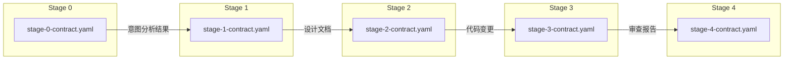

# 契约索引

> **用途**: 定义各阶段工作流的输入输出契约

---

## 概述

本目录存放所有工作流阶段的契约定义文件，确保工作流执行的数据一致性和可追溯性。

---

## 契约文件列表

| 阶段 | 文件 | 描述 |
|------|------|------|
| Stage 0 | [stage-0-contract.yaml](stage-0-contract.yaml) | 意图分析与约束识别契约 |
| Stage 1 | [stage-1-contract.yaml](stage-1-contract.yaml) | 层级设计输出契约 |
| Stage 2 | [stage-2-contract.yaml](stage-2-contract.yaml) | 执行计划与实现输出契约 |
| Stage 3 | [stage-3-contract.yaml](stage-3-contract.yaml) | 变更审查与确认输出契约 |
| Stage 4 | [stage-4-contract.yaml](stage-4-contract.yaml) | 归档与约束树更新输出契约 |

---

## 契约结构

每个契约文件包含以下标准结构：

```yaml
---
version: v5.0.0
stage: N
description: 阶段描述
---

# Stage N 契约

## 契约标识
- contract_id: 契约唯一标识
- version: 版本号
- stage: 阶段名称

## 输入契约
- required_inputs: 必需输入
- optional_inputs: 可选输入

## 输出契约
- required_outputs: 必需输出
- guarantees: 输出保证

## 行为契约
- preconditions: 前置条件
- postconditions: 后置条件
- invariants: 不变式

## 质量门控
- gate_conditions: 门控检查项
```

---

## 契约流转图



---

## 契约版本管理

### 版本规则

- **主版本号**: 契约结构变更
- **次版本号**: 新增字段或检查项
- **修订号**: 文档修正

### 变更记录

| 版本 | 日期 | 变更说明 |
|------|------|----------|
| v5.0.0 | 2026-03-20 | 初始版本，定义 5 个阶段契约 |

---

## 相关文档

- [工作流定义](../workflow/) - 5 阶段流程
- [约束规范](../constraints/) - P0-P3 约束
- [模板参考](../templates/) - 规范模板

---

**文档所有者**: 架构团队
**最后审核**: 2026-03-20
**下次审核**: 2026-06-20