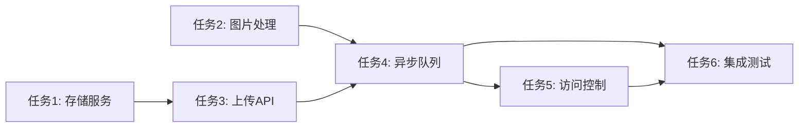

# 任务列表

> **关联规范**: [spec.md](./spec.md)
> **检查清单**: [checklist.md](./checklist.md)

---

## 任务概览

| 状态 | 任务数 |
|------|--------|
| 待开始 | 2 |
| 进行中 | 1 |
| 已完成 | 3 |
| 阻塞 | 0 |
| **总计** | **6** |

---

## 任务详情

### 1. 创建头像存储服务

- **状态**: ✅ 已完成
- **负责人**: Developer A
- **开始时间**: 2026-03-20T10:00:00Z
- **完成时间**: 2026-03-20T11:00:00Z
- **描述**: 实现头像文件存储服务，支持上传到 S3/OSS

**子任务**:
- [x] 创建 StorageService 接口
- [x] 实现 S3StorageService
- [x] 实现本地存储 MockStorageService（测试用）
- [x] 编写单元测试

**产物**:
- `src/services/storage/StorageService.ts`
- `src/services/storage/S3StorageService.ts`
- `tests/services/storage/StorageService.test.ts`

---

### 2. 实现图片处理服务

- **状态**: ✅ 已完成
- **负责人**: Developer A
- **开始时间**: 2026-03-20T11:00:00Z
- **完成时间**: 2026-03-20T12:30:00Z
- **描述**: 实现图片格式转换、压缩和缩略图生成

**子任务**:
- [x] 集成 Sharp 图片处理库
- [x] 实现格式转换（JPEG/PNG → WebP）
- [x] 实现尺寸压缩（生成 50/100/200 三种尺寸）
- [x] 实现质量压缩（80% 质量）
- [x] 编写单元测试

**产物**:
- `src/services/image/ImageProcessor.ts`
- `tests/services/image/ImageProcessor.test.ts`

---

### 3. 创建头像上传 API

- **状态**: ✅ 已完成
- **负责人**: Developer B
- **开始时间**: 2026-03-20T10:30:00Z
- **完成时间**: 2026-03-20T13:00:00Z
- **描述**: 实现 POST /api/v1/users/{userId}/avatar 接口

**子任务**:
- [x] 创建 AvatarController
- [x] 实现文件上传中间件
- [x] 实现文件类型验证
- [x] 实现文件大小限制
- [x] 编写集成测试

**产物**:
- `src/controllers/AvatarController.ts`
- `src/middleware/uploadMiddleware.ts`
- `tests/integration/avatar.test.ts`

---

### 4. 实现异步图片处理队列

- **状态**: 🔄 进行中
- **负责人**: Developer A
- **开始时间**: 2026-03-20T13:00:00Z
- **描述**: 使用消息队列异步处理图片

**子任务**:
- [x] 配置 Redis 队列
- [ ] 实现 ImageProcessingJob
- [ ] 实现队列消费者
- [ ] 添加错误重试机制
- [ ] 编写测试

**产物**:
- `src/jobs/ImageProcessingJob.ts`
- `src/queue/ImageQueue.ts`

**当前进度**: 40%

---

### 5. 实现头像访问控制

- **状态**: ⏳ 待开始
- **负责人**: Developer B
- **描述**: 实现签名 URL 访问控制

**子任务**:
- [ ] 实现签名 URL 生成
- [ ] 实现访问权限验证
- [ ] 配置 CDN 缓存策略
- [ ] 编写测试

**依赖**: 任务 4 完成

---

### 6. 编写集成测试和文档

- **状态**: ⏳ 待开始
- **负责人**: Developer A
- **描述**: 完成 E2E 测试和 API 文档

**子任务**:
- [ ] 编写 E2E 测试用例
- [ ] 更新 API 文档
- [ ] 更新 CHANGELOG
- [ ] 代码审查

**依赖**: 任务 4、5 完成

---

## 依赖关系

---

## 风险项

| 风险 | 影响 | 缓解措施 | 状态 |
|------|------|----------|------|
| S3 服务不稳定 | 上传失败 | 实现重试机制，本地缓存 | 已处理 |
| 图片处理内存占用 | 服务 OOM | 限制并发处理数量，流式处理 | 待处理 |

---

## 备注

- 2026-03-20: 任务 4 遇到 Redis 连接问题，正在排查
- 2026-03-20: 建议考虑使用 Bull 队列替代当前方案