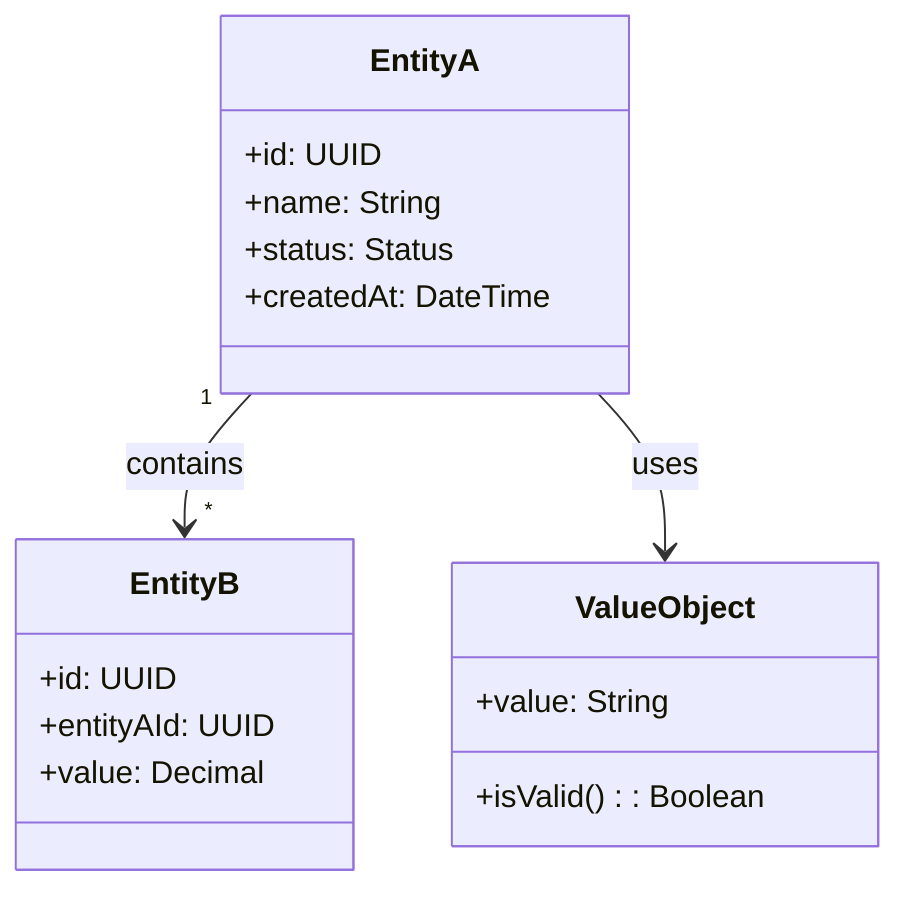
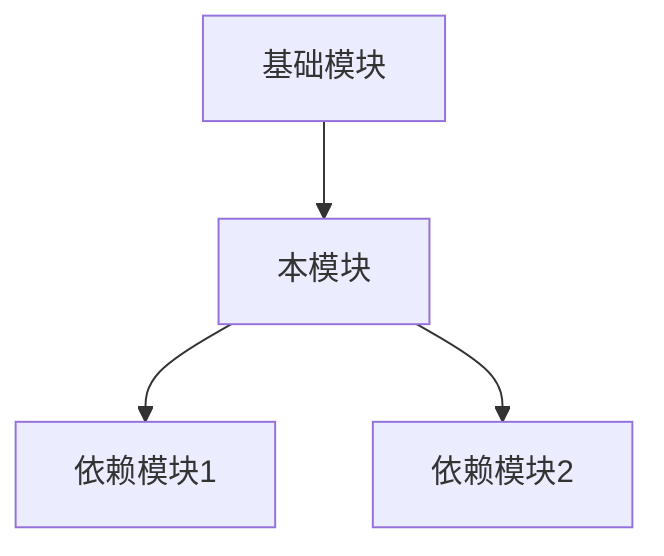

# [模块名称] 模块规范

> **规范层级**: P2 级（模块规范）
> **约束强度**: 单模块约束，自动化验证，需模块负责人审批
> **继承**: 本规范继承 P1 系统规范约束

---

## 元数据

```yaml
spec_id: SPEC-P2-XXX
version: 1.0.0
module_name: [模块名称]
parent_system: [所属系统]
owner: [模块负责人]
created: [创建日期]
last_reviewed: [最后审核日期]
status: draft | review | approved | deprecated
```

---

## 模块概述

### 职责定义

[描述模块的核心职责和定位]

### 边界范围

| 边界类型 | 范围说明 |
|----------|----------|
| 功能边界 | [负责什么功能] |
| 数据边界 | [管理什么数据] |
| 交互边界 | [与哪些模块交互] |

---

## 领域模型

### 核心实体



### 实体定义

#### EntityA

| 属性 | 类型 | 必填 | 描述 | 约束 |
|------|------|------|------|------|
| id | UUID | 是 | 唯一标识 | 系统生成 |
| name | String | 是 | 名称 | 1-100字符 |
| status | Enum | 是 | 状态 | ACTIVE/INACTIVE |
| createdAt | DateTime | 是 | 创建时间 | 系统生成 |

### 值对象

| 值对象 | 属性 | 验证规则 |
|--------|------|----------|
| [名称] | [属性列表] | [验证规则] |

### 领域事件

| 事件名称 | 触发条件 | 携带数据 | 订阅者 |
|----------|----------|----------|--------|
| EntityACreated | 实体A创建完成 | id, name | [模块列表] |
| EntityAStatusChanged | 实体A状态变更 | id, oldStatus, newStatus | [模块列表] |

---

## 接口契约

### 对外暴露接口

| 接口名称 | 方法 | 描述 | 契约引用 |
|----------|------|------|----------|
| EntityAService.create | POST | 创建实体A | [API文档链接] |
| EntityAService.getById | GET | 获取实体A | [API文档链接] |
| EntityAService.update | PUT | 更新实体A | [API文档链接] |

### 服务接口定义

```typescript
// 接口定义示例（语言无关，可根据技术栈实现）

interface EntityAService {
  // 创建实体
  create(request: CreateEntityARequest): Promise<Result<EntityA, EntityAError>>

  // 获取实体
  getById(id: UUID): Promise<Result<EntityA, EntityAError>>

  // 更新实体
  update(id: UUID, request: UpdateEntityARequest): Promise<Result<EntityA, EntityAError>>

  // 删除实体
  delete(id: UUID): Promise<Result<void, EntityAError>>
}
```

### 错误码定义

| 错误码 | 错误名称 | HTTP状态码 | 描述 |
|--------|----------|------------|------|
| 400001 | INVALID_PARAMETER | 400 | 参数验证失败 |
| 404001 | ENTITY_NOT_FOUND | 404 | 实体不存在 |
| 409001 | ENTITY_CONFLICT | 409 | 实体冲突 |
| 500001 | INTERNAL_ERROR | 500 | 内部错误 |

---

## 数据模型

### 数据库表设计

#### entity_a 表

| 字段名 | 类型 | 约束 | 索引 | 描述 |
|--------|------|------|------|------|
| id | UUID | PK | 主键 | 唯一标识 |
| name | VARCHAR(100) | NOT NULL | 普通索引 | 名称 |
| status | VARCHAR(20) | NOT NULL | - | 状态 |
| created_at | TIMESTAMP | NOT NULL | - | 创建时间 |
| updated_at | TIMESTAMP | - | - | 更新时间 |

### 索引策略

| 索引名 | 字段 | 类型 | 用途 |
|--------|------|------|------|
| idx_entity_a_name | name | B-Tree | 名称查询 |
| idx_entity_a_status | status | B-Tree | 状态过滤 |

### 数据迁移

| 版本 | 迁移文件 | 描述 |
|------|----------|------|
| V1.0.0 | V1.0.0__init_schema.sql | 初始化表结构 |

---

## 依赖关系

### 模块依赖



### 依赖清单

| 依赖模块 | 依赖类型 | 接口 | 版本要求 |
|----------|----------|------|----------|
| [模块1] | 强依赖 | [接口名] | >= 1.0.0 |
| [模块2] | 弱依赖 | [接口名] | >= 2.0.0 |

### 被依赖清单

| 模块 | 使用的接口 | 稳定性要求 |
|------|------------|------------|
| [模块X] | [接口名] | 稳定 |

---

## 测试规范

### 测试覆盖率要求

| 类型 | 覆盖率要求 | 说明 |
|------|------------|------|
| 单元测试 | 100% | 核心业务逻辑 |
| 集成测试 | >= 80% | 接口集成 |
| E2E测试 | 关键场景 | 端到端流程 |

### 测试场景

| 场景ID | 场景描述 | 测试类型 | 优先级 |
|--------|----------|----------|--------|
| TC-001 | 创建实体-正常流程 | 单元测试 | P0 |
| TC-002 | 创建实体-参数校验 | 单元测试 | P0 |
| TC-003 | 创建实体-并发冲突 | 单元测试 | P1 |
| TC-004 | 完整业务流程 | E2E测试 | P0 |

### BDD 场景

```gherkin
Feature: 实体A管理

  Scenario: 成功创建实体A
    Given 用户已登录
    And 提供有效的创建参数
    When 调用创建接口
    Then 返回创建成功的实体
    And 实体状态为 PENDING

  Scenario: 创建实体A失败-参数无效
    Given 用户已登录
    And 提供无效的名称（空字符串）
    When 调用创建接口
    Then 返回参数错误
    And 错误码为 INVALID_PARAMETER
```

---

## 约束继承

### P1 约束遵循

```yaml
p1_inheritance:
  - constraint_id: P1-PERF-001
    compliance: "接口 P95 < 200ms，通过性能测试验证"

  - constraint_id: P1-INT-001
    compliance: "API 版本兼容，通过契约测试验证"
```

### P2 特有约束

```yaml
p2_constraints:
  - constraint_id: P2-CODE-001
    name: 代码质量约束
    desc: |
      - 圈复杂度 <= 10
      - 方法长度 <= 50 行
      - 类长度 <= 300 行
    verify: SonarQube

  - constraint_id: P2-TEST-001
    name: 测试约束
    desc: 核心业务逻辑单元测试覆盖率必须 100%
    verify: 覆盖率工具

  - constraint_id: P2-DOC-001
    name: 文档约束
    desc: 公共 API 必须有文档注释
    verify: 文档生成工具
```

---

## 配置项

| 配置项 | 类型 | 默认值 | 描述 |
|--------|------|--------|------|
| module.feature.enabled | boolean | true | 功能开关 |
| module.timeout.ms | integer | 5000 | 超时时间(ms) |
| module.retry.count | integer | 3 | 重试次数 |

---

## 相关文档

- [系统规范](./system-spec.md) - P1 级规范
- [API 契约](./api-contract.yaml) - 接口详细定义
- [约束定义](../constraints/p2-constraints.md) - P2 约束详情
- [实现规范](../templates/constraints/p3-constraint.md) - P3 级模板

---

## 版本历史

| 版本 | 日期 | 变更说明 | 审批人 |
|------|------|----------|--------|
| 1.0.0 | [日期] | 初始版本 | [审批人] |

---

**文档所有者**: [模块负责人]
**最后审核**: [日期]
**下次审核**: [日期]