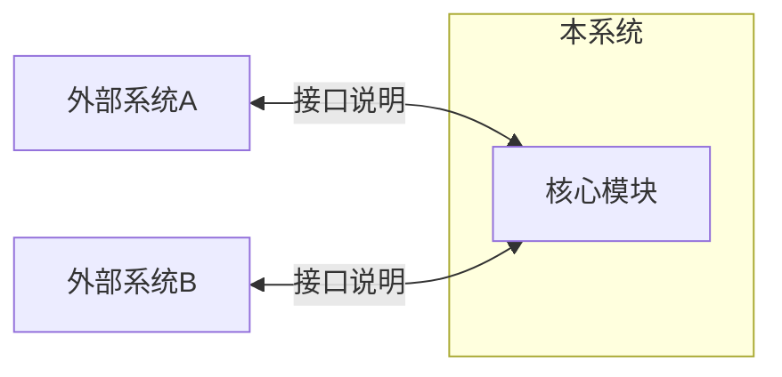
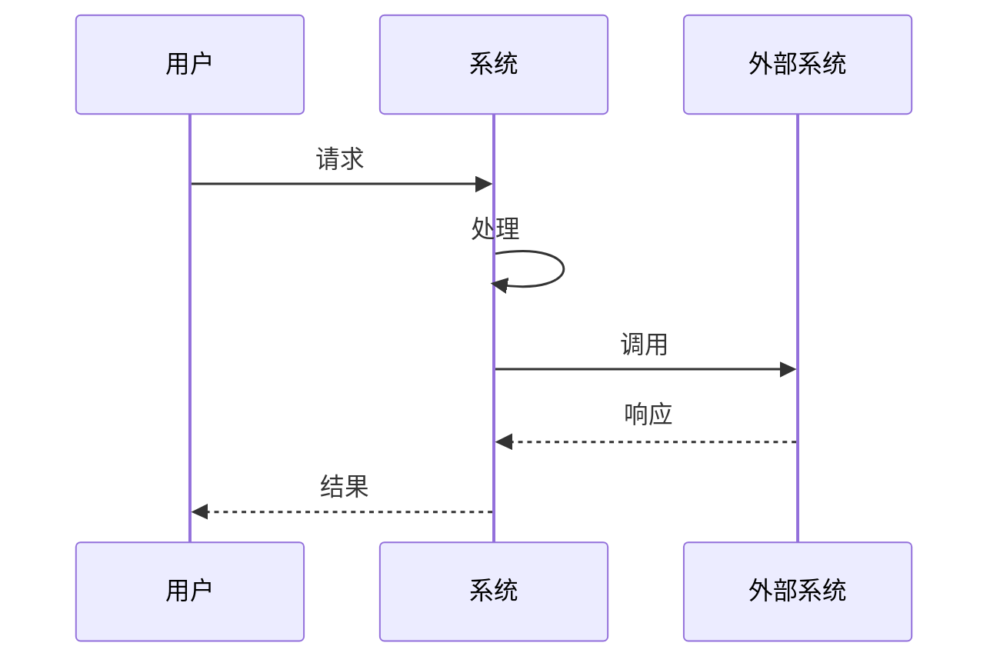

# [系统名称] 系统规范

> **规范层级**: P1 级（系统规范）
> **约束强度**: 跨模块约束，警告可接受，需技术负责人审批
> **继承**: 本规范继承 P0 工程宪章约束

---

## 元数据

```yaml
spec_id: SPEC-P1-XXX
version: 1.0.0
owner: [技术负责人]
created: [创建日期]
last_reviewed: [最后审核日期]
status: draft | review | approved | deprecated
```

---

## 功能边界

### 系统定位

[描述系统在整体架构中的定位和职责]

### 功能范围

| 功能域 | 包含 | 不包含 |
|--------|------|--------|
| [域1] | [具体功能] | [排除项] |
| [域2] | [具体功能] | [排除项] |

### 与外部系统边界



---

## 核心业务流程

### 主流程



### 业务场景

| 场景ID | 场景名称 | 触发条件 | 预期结果 |
|--------|----------|----------|----------|
| S-001 | [场景名] | [触发条件] | [预期结果] |
| S-002 | [场景名] | [触发条件] | [预期结果] |

### 异常处理

| 异常类型 | 处理策略 | 用户提示 |
|----------|----------|----------|
| [异常1] | [策略] | [提示] |
| [异常2] | [策略] | [提示] |

---

## 外部接口定义

### 接入接口（Inbound）

| 接口ID | 接口名称 | 协议 | 认证方式 | 限流策略 |
|--------|----------|------|----------|----------|
| API-001 | [名称] | REST/gRPC | [方式] | [策略] |

### 接出接口（Outbound）

| 接口ID | 目标系统 | 接口名称 | 协议 | 超时设置 | 重试策略 |
|--------|----------|----------|------|----------|----------|
| EXT-001 | [系统] | [名称] | REST | 30s | 3次 |

### 接口契约引用

> 详细接口定义请参考 API 契约文档

- [API 契约文档](./api-contract.yaml)

---

## 性能指标

### 响应时间

| 操作类型 | P50 | P95 | P99 |
|----------|-----|-----|-----|
| [操作1] | Xms | Xms | Xms |
| [操作2] | Xms | Xms | Xms |

### 吞吐量

| 场景 | QPS 目标 | 峰值 QPS |
|------|----------|----------|
| [场景1] | X | X |

### 资源限制

| 资源类型 | 限制 | 告警阈值 |
|----------|------|----------|
| CPU | X 核 | 80% |
| 内存 | X GB | 85% |
| 存储 | X GB | 90% |

---

## 可用性要求

### SLA 定义

| 指标 | 目标值 | 计算方式 |
|------|--------|----------|
| 可用性 | 99.9% | 月度计算 |
| RTO | X 分钟 | 故障恢复时间 |
| RPO | X 秒 | 数据丢失容忍 |

### 容错策略

| 故障类型 | 检测方式 | 恢复策略 |
|----------|----------|----------|
| [故障1] | [检测] | [恢复] |

---

## 安全要求

### 认证授权

| 认证方式 | 适用场景 | 实现要求 |
|----------|----------|----------|
| [方式] | [场景] | [要求] |

### 数据安全

| 数据类型 | 敏感级别 | 保护措施 |
|----------|----------|----------|
| [类型] | 高/中/低 | [措施] |

### 审计日志

| 审计项 | 记录内容 | 保留期限 |
|--------|----------|----------|
| [项] | [内容] | [期限] |

---

## 约束继承

### P0 约束遵循

```yaml
p0_inheritance:
  - constraint_id: P0-SEC-001
    compliance: "无硬编码密钥，使用环境变量注入"

  - constraint_id: P0-ARCH-001
    compliance: "模块间无循环依赖，已通过 dependency-cruiser 验证"
```

### P1 特有约束

```yaml
p1_constraints:
  - constraint_id: P1-PERF-001
    name: 接口响应时间约束
    desc: 所有接口 P95 响应时间不超过 500ms
    verify: 性能测试

  - constraint_id: P1-INT-001
    name: 接口版本兼容
    desc: API 变更必须向后兼容至少一个版本
    verify: 契约测试
```

---

## 相关文档

- [工程宪章](../constitution/architecture-principles.md) - P0 级规范
- [API 契约](./api-contract.yaml) - 接口详细定义
- [模块规范](./module-spec.md) - P2 级规范
- [约束定义](../constraints/p1-constraints.md) - P1 约束详情

---

## 版本历史

| 版本 | 日期 | 变更说明 | 审批人 |
|------|------|----------|--------|
| 1.0.0 | [日期] | 初始版本 | [审批人] |

---

**文档所有者**: [技术负责人]
**最后审核**: [日期]
**下次审核**: [日期]