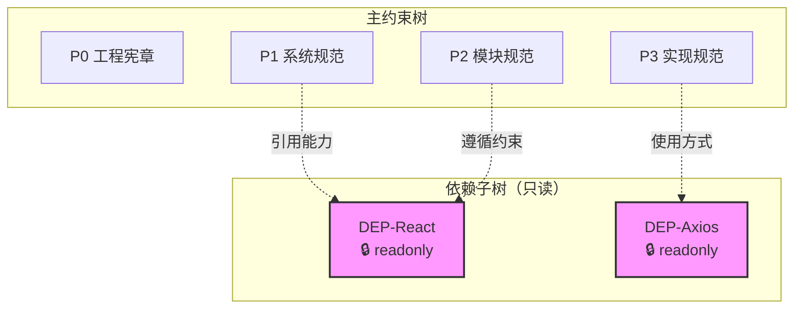

# 第三方依赖子树模板

> **用途**: 独立管理第三方依赖的能力和使用方式
> **存储路径**: `.sop/specs/dependencies/DEP-{dependency-name}/`
> **关键特性**: 只读标识，非用户指定不可变更

---

## 依赖子树结构

```
.sop/specs/dependencies/DEP-{dependency-name}/
├── .meta.yaml           # 元数据（readonly: true）
├── capabilities.md      # 提供的能力
├── usage-patterns.md    # 使用方式
└── constraints.md       # 使用约束
```

---

## .meta.yaml 模板

```yaml
---
# 依赖标识
dependency_id: DEP-{dependency-name}
dependency_name: "{Dependency Name}"
version: "x.x.x"
type: third_party_dependency

# 只读保护（关键！）
readonly: true
user_modifiable: false

# 来源信息
source: npm | pip | maven | gradle | cargo | go | other
repository: "https://github.com/..."
license: "MIT | Apache-2.0 | ..."

# 状态
status: active | deprecated | security_issue

# 时间戳
created: YYYY-MM-DDTHH:MM:SSZ
updated: YYYY-MM-DDTHH:MM:SSZ
last_version_check: YYYY-MM-DDTHH:MM:SSZ

# 引用关系
referenced_by: []  # 引用此依赖的约束节点列表

# 能力标签
capability_tags:
  - tag1
  - tag2

# 安全信息
security:
  known_vulnerabilities: []
  last_audit: YYYY-MM-DDTHH:MM:SSZ
  audit_result: pass | fail | warning
---
```

---

## capabilities.md 模板

```markdown
# {Dependency Name} 能力说明

## 概述

[依赖的总体描述和用途]

## 核心能力

### 能力 1: [能力名称]

**描述**: [能力描述]
**API 入口**: [主要 API 入口]
**使用场景**: [典型使用场景]

```typescript
// 示例代码
import { Feature } from 'dependency';

const result = Feature.doSomething();
```

### 能力 2: [能力名称]

**描述**: [能力描述]
**API 入口**: [主要 API 入口]

## 能力边界

| 能力 | 支持 | 备注 |
|------|------|------|
| [能力] | ✓/✗ | [备注] |

## 版本兼容性

| 版本 | 兼容性 | 说明 |
|------|--------|------|
| x.x.x | ✓ | 当前使用版本 |
| y.y.y | ✗ | 不兼容原因 |
```

---

## usage-patterns.md 模板

```markdown
# {Dependency Name} 使用方式

## 安装

```bash
# npm
npm install {dependency-name}

# yarn
yarn add {dependency-name}

# pnpm
pnpm add {dependency-name}
```

## 基本用法

### 场景 1: [场景名称]

```typescript
import { Module } from '{dependency-name}';

// 基本用法示例
const instance = new Module({
  option1: 'value1',
  option2: 'value2'
});

instance.doSomething();
```

### 场景 2: [场景名称]

```typescript
// 高级用法示例
```

## 最佳实践

### 推荐做法

1. [推荐做法 1]
2. [推荐做法 2]
3. [推荐做法 3]

### 避免的做法

1. [避免做法 1 及原因]
2. [避免做法 2 及原因]

## 常见问题

### Q1: [问题]

**A**: [答案]

### Q2: [问题]

**A**: [答案]

## 性能考虑

| 场景 | 建议 |
|------|------|
| [场景] | [建议] |

## 与其他依赖的集成

| 依赖 | 集成方式 | 说明 |
|------|---------|------|
| [依赖名] | [方式] | [说明] |
```

---

## constraints.md 模板

```markdown
# {Dependency Name} 使用约束

## 必须遵守

### C-001: [约束名称]

**描述**: [约束描述]
**原因**: [约束原因]
**违反后果**: [后果描述]

```typescript
// 正确示例
doRightThing();

// 错误示例 - 禁止
// doWrongThing();  // 这会导致问题
```

### C-002: [约束名称]

**描述**: [约束描述]

## 建议遵守

### R-001: [建议名称]

**描述**: [建议描述]
**原因**: [建议原因]

## 版本约束

| 约束 | 版本要求 | 原因 |
|------|---------|------|
| 最低版本 | >= x.x.x | [原因] |
| 最高版本 | < y.y.y | [原因] |
| 推荐版本 | = z.z.z | [原因] |

## 安全约束

| 约束 | 描述 |
|------|------|
| S-001 | [安全约束描述] |
| S-002 | [安全约束描述] |

## 已知问题

| 问题 | 版本 | 状态 | 规避方案 |
|------|------|------|---------|
| [问题] | [版本] | open/fixed | [方案] |
```

---

## 只读保护机制

### 保护规则

1. **自动创建**: 引入新依赖时由 Agent 自动创建
2. **只读标识**: `.meta.yaml` 中 `readonly: true`
3. **修改保护**: 非用户显式指定，禁止修改内容
4. **版本同步**: 依赖版本变更时自动更新

### 保护实现

```yaml
# 在 .meta.yaml 中
readonly: true
user_modifiable: false

# 保护行为
on_modify_attempt:
  action: reject
  message: "依赖子树为只读，如需修改请显式指定 --force-dependency-update"
  require_user_confirmation: true
```

### 例外情况

允许修改的情况：
1. 用户显式指定 `--force-dependency-update`
2. 依赖版本升级时自动更新
3. 发现安全漏洞时的紧急更新

---

## 依赖子树与约束树关系



---

## 创建流程

```
1. 检测到新依赖引入
       ↓
2. 获取依赖信息
   - 名称、版本
   - 许可证
   - 仓库地址
       ↓
3. 自动生成依赖子树
   - .meta.yaml
   - capabilities.md
   - usage-patterns.md
   - constraints.md
       ↓
4. 设置只读保护
       ↓
5. 建立引用关系
```

---

## 相关文档

- [设计模板](../temporary/design.md)
- [动态深度分析](./depth-analysis.md)
- [约束树更新流程](./spec-tree-update-flow.md)