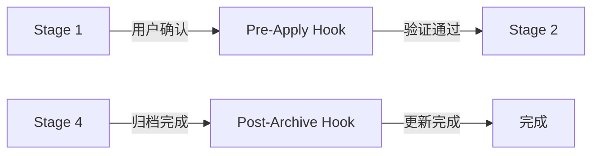

# 模板索引

> **用途**: 提供各类文档和契约的标准模板
> **语言无关性**: 所有模板适用于任何编程语言和框架

---

## 概述

本目录存放所有模板文件，包括约束模板、临时约束模板、文档模板、契约模板、报告模板、工作流模板、依赖子树模板和 Hook 模板。

---

## 约束模板（与 P0-P3 对齐）

**目录**: [constraints/](constraints/)

| 模板 | 用途 | 约束强度 |
|------|------|----------|
| [p0-constraint.md](constraints/p0-constraint.md) | P0 约束模板 | 不可违背，违反即熔断 |
| [p1-constraint.md](constraints/p1-constraint.md) | P1 约束模板 | 警告可接受，需技术负责人审批 |
| [p2-constraint.md](constraints/p2-constraint.md) | P2 约束模板 | 自动化验证，需模块负责人审批 |
| [p3-constraint.md](constraints/p3-constraint.md) | P3 约束模板 | IDE 实时提示，自动化工具验证 |

### 约束模板结构

```markdown
---
version: v5.0.0
level: P0|P1|P2|P3
---

# [约束名称]

constraint_id: PX-XXX-NNN
constraint_strength: [约束强度]

## 约束描述
[约束的详细描述]

## 验证方法
[如何验证此约束]

## 违反处理
[违反时的处理方式]

## 例外情况
[允许的例外情况，若无例外则说明]
```

---

## 临时约束模板（参考 OpenSpec 设计）

**目录**: [temporary/](temporary/)

### 核心模板

| 模板 | 用途 | 说明 |
|------|------|------|
| [.meta.yaml](temporary/.meta.yaml) | 元数据模板 | 状态追踪、约束引用、时间戳 |
| [proposal.md](temporary/proposal.md) | 变更提案模板 | Why & What，复杂度评估 |
| [design.md](temporary/design.md) | 技术设计模板 | 架构决策、依赖关系 |
| [spec.md](temporary/spec.md) | 临时规范模板 | 任务规范文档 |
| [tasks.md](temporary/tasks.md) | 任务列表模板 | 含依赖关系和并行组支持 |
| [checklist.md](temporary/checklist.md) | 检查清单模板 | 验收标准 |

### 详细规范模板

**目录**: [temporary/specs/](temporary/specs/)

| 模板 | 用途 | 说明 |
|------|------|------|
| [requirements.md](temporary/specs/requirements.md) | 需求规范模板 | 功能/非功能需求 |
| [scenarios.md](temporary/specs/scenarios.md) | BDD 场景模板 | Gherkin 语法测试场景 |

### 存储路径（双路径兼容）

```
主路径: .sop/specs/{change-id}/
├── .meta.yaml        # 元数据
├── proposal.md       # 变更提案
├── specs/            # 详细规范
│   ├── requirements.md
│   └── scenarios.md
├── design.md         # 技术设计
├── tasks.md          # 任务清单（含依赖关系）
└── checklist.md      # 验收检查清单

兼容路径: .trae/specs/{change-id}/ (与 Trae IDE 兼容)
```

### 临时约束生命周期

1. **创建**: 独立存储，引用 P3 节点
2. **执行**: 继承 P3 及其祖先节点的约束
3. **归档**: 从叶子节点向上更新约束树，解除引用关系

---

## 工作流模板

**目录**: [workflow/](workflow/)

| 模板 | 用途 | 说明 |
|------|------|------|
| [workflow-state.json](workflow/workflow-state.json) | 工作流状态文件 | 记录工作流执行状态 |
| [workflow-state-schema.json](workflow/workflow-state-schema.json) | 状态文件 Schema | JSON Schema 定义 |
| [depth-analysis.md](workflow/depth-analysis.md) | 动态深度分析模板 | 根据复杂度调整 spec 树深度 |
| [spec-tree-update-flow.md](workflow/spec-tree-update-flow.md) | 约束树更新流程 | 归档后从叶子向上更新 |

### 动态深度规则

| 复杂度 | 深度 | 层级 |
|--------|------|------|
| 低 | 2 | P0 → P1 → 临时节点 |
| 中 | 3 | P0 → P1 → P2 → 临时节点 |
| 高 | 4 | P0 → P1 → P2 → P3 → 临时节点 |

---

## 依赖子树模板

**目录**: [dependencies/](dependencies/)

| 模板 | 用途 | 说明 |
|------|------|------|
| [dependency-subtree.md](dependencies/dependency-subtree.md) | 依赖子树模板 | 第三方依赖能力说明，只读保护 |

### 依赖子树特性

- **只读保护**: 非用户指定不可变更
- **能力声明**: 记录依赖提供的能力
- **使用约束**: 记录使用方式和限制

---

## Hook 模板

**目录**: [hooks/](../../hooks/)

| 模板 | 用途 | 触发时机 |
|------|------|----------|
| [pre-apply-hook.yaml](../../hooks/pre-apply-hook.yaml) | 实现前验证 Hook | Stage 2 开始前 |
| [post-archive-hook.yaml](../../hooks/post-archive-hook.yaml) | 归档后更新 Hook | Stage 4 完成后 |

### Hook 执行流程



### Pre-Apply Hook 动作

| 动作 | 描述 | 严重性 |
|------|------|--------|
| verify-temp-node | 验证临时子节点结构完整性 | blocker |
| guardrail-check | 执行各层级护栏预检查 | blocker/warning |
| complexity-confirmation | 确认动态深度分析结果 | info |
| dependency-subtree-check | 检查第三方依赖子树状态 | blocker |

### Post-Archive Hook 动作

| 动作 | 描述 | 顺序 |
|------|------|------|
| spec-tree-update | 从 P3 向上更新约束树 | 1 |
| reference-cleanup | 解除临时子节点引用关系 | 2 |
| changelog-update | 更新 CHANGELOG | 3 |
| constraint-validation | 验证约束树完整性 | 4 |

---

## 决策记录模板

**目录**: [decisions/](decisions/)

| 模板 | 用途 | 使用场景 |
|------|------|----------|
| [decision-record.yaml](decisions/decision-record.yaml) | 决策记录模板 | 约束冲突、变更范围暧昧、需求歧义 |

### 决策类型

| 类型 | 描述 |
|------|------|
| constraint_conflict | 约束之间存在矛盾 |
| scope_ambiguity | 无法确定变更属于哪个层级 |
| requirement_ambiguity | 需求描述存在多种理解 |

---

## 报告模板

**目录**: [reports/](reports/)

| 模板 | 用途 | 使用场景 |
|------|------|----------|
| [review-report.md](reports/review-report.md) | 审查报告模板 | 代码/架构审查 |
| [constraint-report.md](reports/constraint-report.md) | 约束验证报告模板 | 约束验证 |

---

## 核心原则

### 设计从 Spec 根开始

```
P0 (工程宪章) → P1 (系统规范) → P2 (模块规范) → P3 (实现规范) → 临时节点
```

### 实现从 Spec 叶子开始

```
临时节点 → P3 → P2 → P1 → P0
```

---

## 使用方法

1. 复制模板文件到目标目录
2. 替换 `[占位符]` 为实际内容
3. 删除不需要的部分
4. 确保符合相关约束

---

## 相关文档

- [约束规范](../constraints/) - P0-P3 约束定义
- [工作流程](../workflow/) - 5 阶段流程
- [工程宪章](../constitution/) - P0 级规范
- [契约定义](../contracts/) - 阶段契约文件
- [规范模板](../specifications/) - P1/P2 规范模板
- [示例文件](../examples/) - 临时子节点示例

---

**文档所有者**: 文档团队
**最后审核**: 2026-03-24
**下次审核**: 2026-07-24
