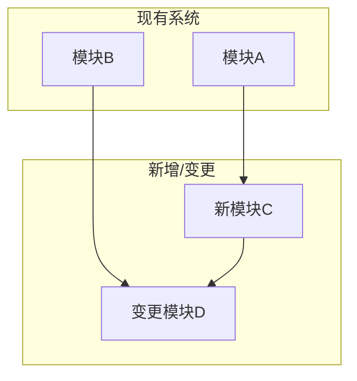
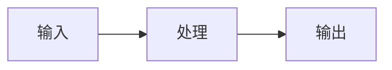
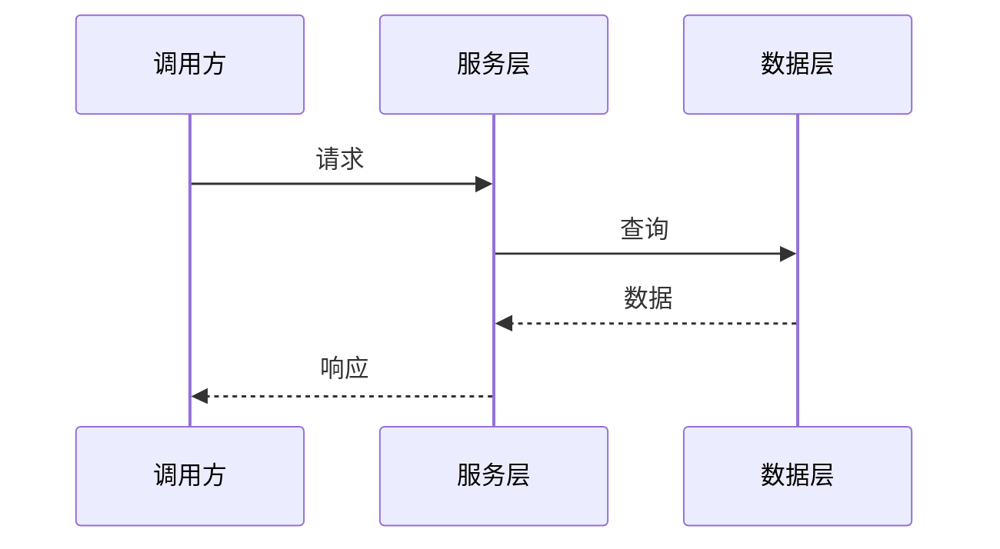
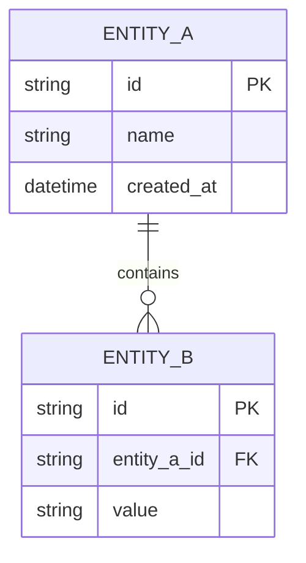

# 技术设计模板

> **用途**: 记录技术方案、架构决策和依赖关系
> **存储路径**: `.sop/specs/{change-id}/design.md`
> **参考**: OpenSpec design.md 设计

---

## 基本结构

```markdown
# [变更名称] 技术设计

## Overview（概述）

[技术方案概述]

## Architecture（架构设计）

[架构图和说明]

## Data Model（数据模型）

[数据模型设计]

## API Design（接口设计）

[接口定义]

## Dependencies（依赖关系）

[依赖项说明]

## Security Considerations（安全考虑）

[安全相关设计]

## Performance Considerations（性能考虑）

[性能相关设计]

## Implementation Notes（实现注意事项）

[实现时需要注意的事项]
```

---

## 详细模板

```markdown
---
change_id: CHG-YYYYMMDD-NNN
created: YYYY-MM-DDTHH:MM:SSZ
updated: YYYY-MM-DDTHH:MM:SSZ
status: draft | review | approved
---

# [变更名称] 技术设计

## Overview（概述）

### 设计目标

[明确技术设计要达成的目标]

### 关键决策

| 决策项 | 选择 | 理由 |
|--------|------|------|
| [决策名] | [选择] | [理由] |

### 约束条件

| 约束类型 | 约束描述 | 来源 |
|----------|---------|------|
| 技术约束 | [描述] | [P0/P1/P2/P3] |
| 业务约束 | [描述] | [需求方] |
| 时间约束 | [描述] | [项目计划] |

---

## Architecture（架构设计）

### 系统架构图



### 组件说明

| 组件 | 职责 | 技术栈 | 状态 |
|------|------|--------|------|
| [组件名] | [职责描述] | [技术栈] | 新增/修改/不变 |

### 数据流图



### 调用关系



---

## Data Model（数据模型）

### 实体关系图



### 数据模型定义

#### EntityA

| 字段 | 类型 | 必填 | 说明 |
|------|------|------|------|
| id | string | 是 | 主键 |
| name | string | 是 | 名称 |
| created_at | datetime | 是 | 创建时间 |

### 数据变更说明

| 变更类型 | 表/集合 | 变更描述 |
|----------|--------|---------|
| 新增 | [表名] | [描述] |
| 修改 | [表名] | [描述] |
| 删除 | [表名] | [描述] |

---

## API Design（接口设计）

### 接口列表

| 方法 | 路径 | 描述 | 状态 |
|------|------|------|------|
| POST | /api/v1/resource | 创建资源 | 新增 |
| GET | /api/v1/resource/{id} | 获取资源 | 修改 |

### 接口详情

#### POST /api/v1/resource

**请求**:
```json
{
  "name": "string",
  "value": "integer"
}
```

**响应**:
```json
{
  "code": 0,
  "message": "success",
  "data": {
    "id": "string",
    "name": "string",
    "value": "integer",
    "created_at": "datetime"
  }
}
```

**错误码**:
| 错误码 | 描述 |
|--------|------|
| 400 | 参数错误 |
| 401 | 未授权 |
| 500 | 服务器错误 |

---

## Dependencies（依赖关系）

### 新增依赖

| 依赖 | 版本 | 用途 | 许可证 |
|------|------|------|--------|
| [依赖名] | [版本] | [用途] | [许可证] |

### 依赖子树引用

> **重要**: 第三方依赖需要创建独立的依赖子树

| 依赖 | 子树路径 | 状态 |
|------|---------|------|
| React | `.sop/specs/dependencies/DEP-react/` | 待创建 |
| Axios | `.sop/specs/dependencies/DEP-axios/` | 待创建 |

### 依赖子树创建说明

引入新依赖时，需要在 `.sop/specs/dependencies/` 下创建对应的依赖子树：

```
.sop/specs/dependencies/DEP-{dependency-name}/
├── .meta.yaml           # readonly: true
├── capabilities.md      # 提供的能力
├── usage-patterns.md    # 使用方式
└── constraints.md       # 使用约束
```

---

## Security Considerations（安全考虑）

### 安全设计

| 安全项 | 设计方案 | 验证方式 |
|--------|---------|---------|
| 认证 | [方案] | [验证] |
| 授权 | [方案] | [验证] |
| 数据加密 | [方案] | [验证] |
| 输入验证 | [方案] | [验证] |

### 安全风险

| 风险 | 影响 | 缓解措施 |
|------|------|----------|
| [风险] | 高/中/低 | [措施] |

---

## Performance Considerations（性能考虑）

### 性能目标

| 指标 | 目标值 | 测量方式 |
|------|--------|---------|
| 响应时间 | < 200ms | P95 |
| 吞吐量 | > 1000 QPS | 压测 |
| 资源使用 | < 80% | 监控 |

### 性能优化策略

| 策略 | 适用场景 | 预期收益 |
|------|---------|---------|
| [策略] | [场景] | [收益] |

---

## Implementation Notes（实现注意事项）

### 关键实现点

1. [注意事项1]
2. [注意事项2]

### 已知限制

| 限制 | 原因 | 规避方案 |
|------|------|---------|
| [限制] | [原因] | [方案] |

### 技术债务

| 债务项 | 原因 | 计划偿还时间 |
|--------|------|-------------|
| [债务] | [原因] | [时间] |

---

## Test Strategy（测试策略）

### 测试类型

| 测试类型 | 覆盖目标 | 工具 |
|----------|---------|------|
| 单元测试 | >= 90% | Jest/JUnit |
| 集成测试 | 核心流程 | [工具] |
| E2E测试 | 关键场景 | [工具] |

### 测试场景

| 场景 | 前置条件 | 操作步骤 | 预期结果 |
|------|---------|---------|---------|
| [场景] | [前置] | [步骤] | [结果] |

---

## Rollback Plan（回滚计划）

### 回滚条件

- [条件1]
- [条件2]

### 回滚步骤

1. [步骤1]
2. [步骤2]

---

## References（参考）

- [相关文档1]
- [相关文档2]

---

## Changelog

| 日期 | 版本 | 变更说明 |
|------|------|---------|
| YYYY-MM-DD | v1.0.0 | 初始版本 |
```

---

## 相关文档

- [提案模板](./proposal.md)
- [需求规范模板](./requirements.md)
- [依赖子树模板](../dependencies/dependency-subtree.md)