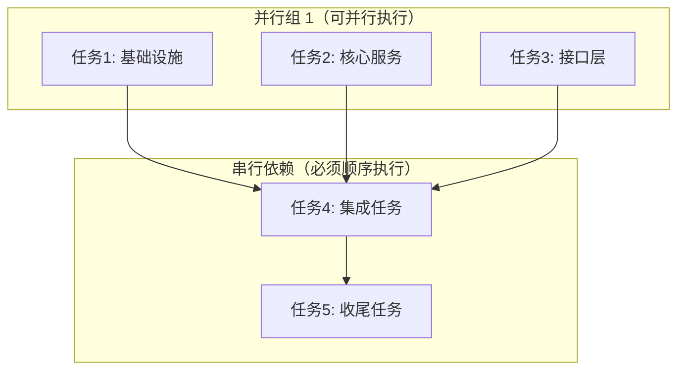

# 任务列表

> **关联规范**: [proposal.md](./proposal.md)
> **设计文档**: [design.md](./design.md)
> **检查清单**: [checklist.md](./checklist.md)

---

## 任务执行图



---

## 任务概览

| 状态 | 任务数 |
|------|--------|
| 待开始 | X |
| 进行中 | X |
| 已完成 | X |
| 阻塞 | X |
| **总计** | **X** |

---

## 任务详情

### 任务1: [任务名称]

- **id**: T1
- **status**: pending | in_progress | completed | blocked
- **parallel_group**: 1
- **dependencies**: []
- **estimated_time**: 1h
- **priority**: P0 | P1 | P2
- **assignee**: [负责人]

**描述**: [任务详细描述]

**子任务**:
- [ ] 子任务 1.1: [描述]
- [ ] 子任务 1.2: [描述]

**产物**:
- `path/to/file1.ts`
- `path/to/file2.ts`

**验收标准**:
- [ ] [标准1]
- [ ] [标准2]

---

### 任务2: [任务名称]

- **id**: T2
- **status**: pending
- **parallel_group**: 1
- **dependencies**: []
- **estimated_time**: 1.5h

**描述**: [任务详细描述]

**子任务**:
- [ ] 子任务 2.1: [描述]
- [ ] 子任务 2.2: [描述]

**产物**:
- `path/to/file.ts`

---

### 任务3: [任务名称]

- **id**: T3
- **status**: pending
- **parallel_group**: 1
- **dependencies**: []
- **estimated_time**: 1h

**描述**: [任务详细描述]

**子任务**:
- [ ] 子任务 3.1: [描述]

---

### 任务4: [集成任务名称]

- **id**: T4
- **status**: pending
- **parallel_group**: null
- **dependencies**: [T1, T2, T3]
- **estimated_time**: 2h

**描述**: [任务详细描述]
**依赖说明**: 必须等待 T1, T2, T3 全部完成后才能开始

**子任务**:
- [ ] 子任务 4.1: [描述]
- [ ] 子任务 4.2: [描述]

---

### 任务5: [收尾任务名称]

- **id**: T5
- **status**: pending
- **parallel_group**: null
- **dependencies**: [T4]
- **estimated_time**: 1h

**描述**: [任务详细描述]
**依赖说明**: 必须等待 T4 完成后才能开始

**子任务**:
- [ ] 子任务 5.1: [描述]
- [ ] 子任务 5.2: [描述]
- [ ] 子任务 5.3: [描述]

---

## 依赖关系矩阵

| 任务 | 依赖 | 被依赖 | 并行组 |
|------|------|--------|--------|
| T1 | - | T4 | 1 |
| T2 | - | T4 | 1 |
| T3 | - | T4 | 1 |
| T4 | T1, T2, T3 | T5 | - |
| T5 | T4 | - | - |

---

## 并行执行规则

### 规则说明

1. **parallel_group 相同的任务可并行执行**
   - Agent 可以同时启动同一并行组的多个任务
   - 使用并行执行可以提高效率

2. **有 dependencies 的任务必须等待依赖完成**
   - 所有依赖任务必须状态为 `completed`
   - 依赖未完成时任务状态应为 `blocked`

3. **同一 parallel_group 内的任务无相互依赖**
   - 如果存在依赖，不应放在同一并行组
   - 检测到冲突时应报错

4. **parallel_group: null 表示串行任务**
   - 这类任务需要按依赖顺序执行
   - 不参与并行调度

### Agent 调度策略

```yaml
scheduling_strategy:
  max_parallel: 3  # 最大并行任务数

  parallel_groups:
    - group_id: 1
      tasks: [T1, T2, T3]
      strategy: all_at_once  # 全部并行启动

  sequential:
    - task_id: T4
      wait_for: [T1, T2, T3]
    - task_id: T5
      wait_for: [T4]
```

---

## 风险项

| 风险 | 影响 | 概率 | 缓解措施 | 状态 |
|------|------|------|----------|------|
| [风险描述] | 高/中/低 | 高/中/低 | [措施] | 待处理 |

---

## 备注

- YYYY-MM-DD: [备注内容]