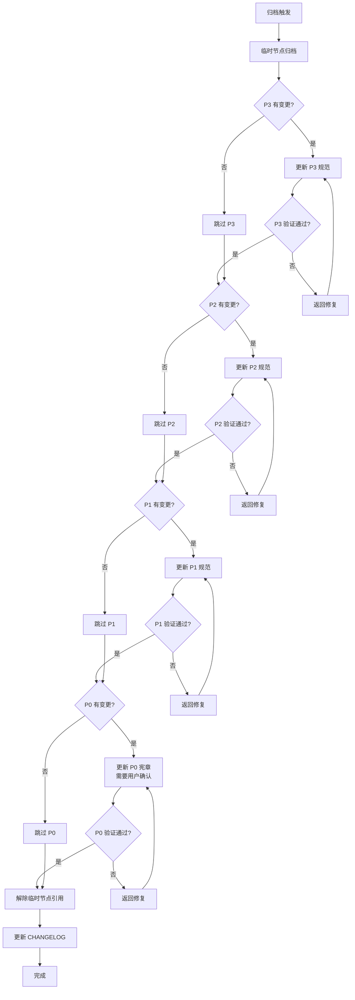

# 约束树更新流程

> **用途**: 归档后从叶子节点开始逐层向上更新约束树
> **核心原则**: 实现从叶子开始，验证从下向上

---

## 更新流程概览



---

## 分层更新详情

### Step 1: 临时节点归档

```yaml
temp_node_archive:
  actions:
    - 读取临时节点内容
    - 提取约束变更记录
    - 确定需要更新的层级
  outputs:
    - archive_record: "归档记录"
    - constraint_changes: "约束变更列表"
    - affected_levels: [P3, P2, P1, P0]  # 按影响范围
```

### Step 2: P3 层更新

```yaml
p3_update:
  condition: "临时节点有 P3 级别的约束变更"

  actions:
    - 分析临时节点的 P3 约束继承
    - 识别需要更新的 P3 节点
    - 更新 P3 实现规范文档
    - 验证 P3 约束完整性

  verification:
    - P3 约束与 P2 约束一致性
    - P3 约束不违反父节点约束
    - P3 文档格式正确

  outputs:
    - updated_p3_nodes: []
    - p3_violations: []

  next: "P2 层更新"
```

### Step 3: P2 层更新

```yaml
p2_update:
  condition: "P3 更新导致 P2 约束需要更新，或直接有 P2 级别变更"

  actions:
    - 分析 P2 节点的子约束（P3）变更
    - 评估是否需要更新 P2 模块规范
    - 更新 P2 模块规范文档
    - 验证 P2 约束完整性

  verification:
    - P2 约束与 P1 约束一致性
    - P2 约束不违反父节点约束
    - 所有子约束（P3）已更新

  outputs:
    - updated_p2_nodes: []
    - p2_violations: []

  next: "P1 层更新"
```

### Step 4: P1 层更新

```yaml
p1_update:
  condition: "P2 更新导致 P1 约束需要更新，或直接有 P1 级别变更"

  actions:
    - 分析 P1 节点的子约束（P2）变更
    - 评估是否需要更新 P1 系统规范
    - 更新 P1 系统规范文档
    - 验证 P1 约束完整性

  verification:
    - P1 约束与 P0 约束一致性
    - P1 约束不违反父节点约束
    - 所有子约束（P2）已更新

  outputs:
    - updated_p1_nodes: []
    - p1_violations: []

  next: "P0 层更新"
```

### Step 5: P0 层更新（需用户确认）

```yaml
p0_update:
  condition: "P1 更新导致 P0 约束需要更新，或直接有 P0 级别变更"

  requires_user_confirmation: true

  actions:
    - 分析 P0 节点的子约束（P1）变更
    - 评估是否需要更新 P0 工程宪章
    - **提示用户确认**
    - 更新 P0 工程宪章文档
    - 验证 P0 约束完整性

  verification:
    - P0 约束不变性验证
    - P0 约束完整性
    - 所有子约束（P1）已更新

  outputs:
    - updated_p0_nodes: []
    - p0_violations: []
    - user_confirmation: required

  on_rejection:
    - 回滚所有更新
    - 记录拒绝原因
    - 终止流程
```

### Step 6: 引用解除

```yaml
reference_cleanup:
  actions:
    - 更新临时节点的 .meta.yaml
    - 设置 archived_at 时间戳
    - 解除与 P3 节点的引用关系
    - 记录解除时间

  outputs:
    - archived_at: "timestamp"
    - reference_released: true
```

### Step 7: CHANGELOG 更新

```yaml
changelog_update:
  actions:
    - 生成变更摘要
    - 按格式更新 CHANGELOG.md
    - 记录约束树更新信息

  format: |
    ## [版本号] - YYYY-MM-DD

    ### Added
    - [新增内容]

    ### Changed
    - [变更内容]

    ### Constraint Updates
    - P0: [更新描述]
    - P1: [更新描述]
    - P2: [更新描述]
    - P3: [更新描述]
```

---

## 验证规则

### 层级验证

| 层级 | 验证项 | 严重性 |
|------|--------|--------|
| P0 | 约束不可违背性 | blocker |
| P0 | 安全红线不违反 | blocker |
| P1 | 系统规范一致性 | blocker |
| P1 | 性能指标满足 | warning |
| P2 | 模块规范完整性 | blocker |
| P2 | API 契约一致性 | blocker |
| P3 | 实现规范正确性 | warning |

### 父子约束一致性

```yaml
consistency_rules:
  - rule: "子约束不得违反父约束"
    check: "compare_constraint_values"
    severity: blocker

  - rule: "父约束变更需评估子约束影响"
    check: "evaluate_child_constraints"
    severity: blocker

  - rule: "约束继承关系正确"
    check: "verify_inheritance_chain"
    severity: blocker
```

---

## 回滚机制

### 回滚触发条件

- P0 更新被用户拒绝
- 验证发现严重问题
- 约束冲突无法解决

### 回滚步骤

```yaml
rollback:
  trigger: "validation_failure | user_rejection"

  steps:
    - 恢复所有更新的约束文档
    - 恢复临时节点引用关系
    - 删除归档记录
    - 记录回滚原因

  outputs:
    - rollback_record: "回滚记录"
    - restored_files: []
```

---

## 约束变更记录格式

```yaml
# 文件位置: contracts/constraint-changes/{change-id}.yaml

change_id: CHG-YYYYMMDD-NNN
changed_at: YYYY-MM-DDTHH:MM:SSZ

constraint_changes:
  - level: P3
    node_id: P3-USER-001
    change_type: modified
    before: "原约束内容"
    after: "新约束内容"
    reason: "变更原因"

  - level: P2
    node_id: P2-AUTH-001
    change_type: added
    content: "新增约束内容"
    reason: "新增原因"

affected_modules:
  - user-module
  - auth-module

approval:
  approved_by: "user"
  approved_at: "timestamp"
```

---

## 相关文档

- [动态深度分析](./depth-analysis.md)
- [Stage 4 归档](../../workflow/stage-4-archive.md)
- [契约定义](../../contracts/stage-4-contract.yaml)