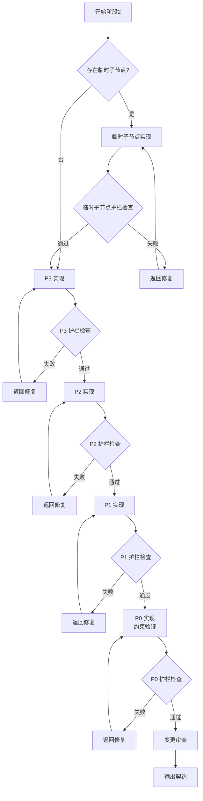
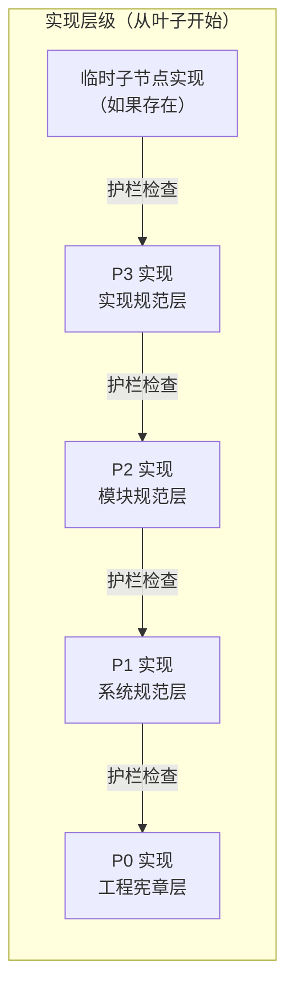
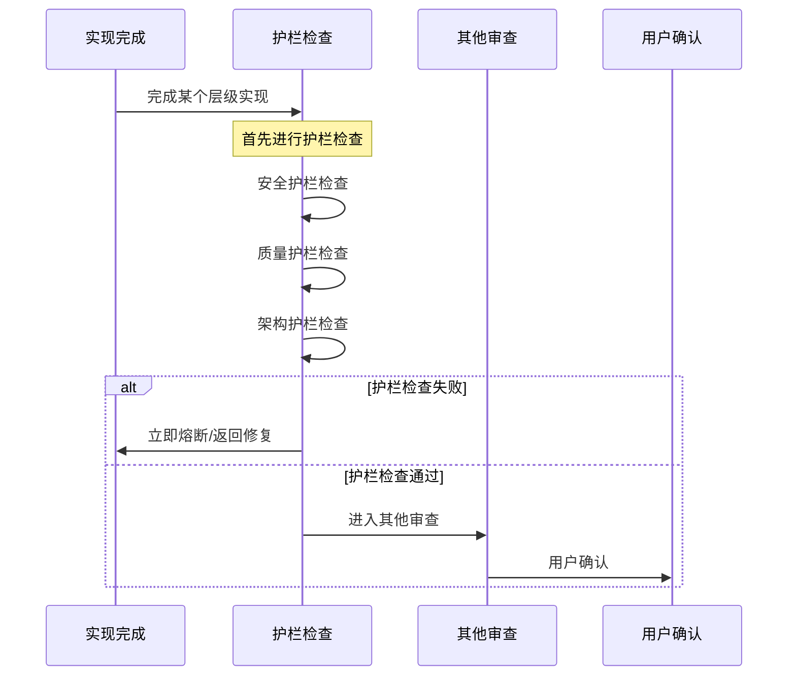

# 阶段2: 执行计划与实现

goal: 从约束树叶子节点开始实现，逐层向上，每层护栏检查

## 输入契约

```yaml
preconditions:
  required_inputs:
    - name: stage_1_contract
      type: yaml
      path: contracts/stage-1-contract.yaml
      validation: 阶段1必须通过
    - name: temp_node
      type: directory
      path: .sop/specs/{change-id}/
      compatible_path: .trae/specs/{change-id}/
      validation: 临时子节点必须存在
    - name: execution_plan
      type: file
      path: .sop/specs/{change-id}/execution-plan.md
      compatible_path: .trae/specs/{change-id}/execution-plan.md
      validation: 执行计划必须存在
  constraints:
    - 阶段1必须通过质量门控
    - 用户必须已确认执行
```

## 处理流程



### 步骤详情

```yaml
steps:
  - id: 1
    name: 叶子节点实现（临时子节点或 P3）
    actions:
      - 检查是否存在临时子节点
      - 如存在临时子节点，先实现临时子节点
      - 如不存在临时子节点，直接实现 P3
      - 进行护栏检查
    output:
      - 叶子节点实现代码
      - 护栏检查结果

  - id: 2
    name: P3 实现（实现规范层）
    actions:
      - 实现具体代码、组件、工具函数
      - 参考 P3 级约束
      - 满足 P3 层级护栏
      - 进行护栏检查
    output:
      - P3 实现代码
      - P3 护栏检查结果

  - id: 3
    name: P2 实现（模块规范层）
    actions:
      - 实现模块功能、模块集成
      - 参考 P2 级约束
      - 满足 P2 层级护栏
      - 进行护栏检查
    output:
      - P2 实现代码
      - P2 护栏检查结果

  - id: 4
    name: P1 实现（系统规范层）
    actions:
      - 实现系统集成、接口对接
      - 参考 P1 级约束
      - 满足 P1 层级护栏
      - 进行护栏检查
    output:
      - P1 实现代码
      - P1 护栏检查结果

  - id: 5
    name: P0 实现（工程宪章层）
    actions:
      - 进行约束验证、质量门控
      - 参考 P0 级约束
      - 满足 P0 层级护栏
      - 进行护栏检查
    output:
      - P0 约束验证结果
      - P0 护栏检查结果

  - id: 6
    name: 变更审查
    actions:
      - 审查代码变更
      - 审查约束满足情况
      - 审查测试覆盖率
      - 审查文档同步
    output:
      - 变更审查报告
```

## 实现层级流程



## 护栏优先检查步骤



## 变更范围区分步骤

```yaml
change_scope_analysis:
  timing: 实现开始前
  steps:
    - 分析变更影响的约束节点层级
    - 明确变更范围（P3/P2/P1/P0）
    - 如无法区分，暂停执行询问用户决策
  
  scope_definition:
    P3_change:
      desc: 仅影响实现规范
      examples: 代码重构、命名调整
    P2_change:
      desc: 影响模块规范
      examples: 模块接口变更、新增功能
    P1_change:
      desc: 影响系统规范
      examples: 架构调整、性能优化
    P0_change:
      desc: 影响工程宪章
      examples: 安全策略、质量红线
  
  ambiguity_handling:
    - 暂停执行
    - 提供可能的变更范围分析
    - 提供各范围的影响评估
    - 提供推荐的范围及理由
    - 询问用户决策
    - 记录用户决策
```

## TDD 循环规范（层级驱动）

```yaml
tdd_cycle:
  principle: 每个层级的实现都遵循 TDD 循环
  
  temp_node_tdd:
    red:
      - 根据临时子节点的 tasks.md 和 checklist.md 生成测试
      - 验证测试因功能未实现而失败
    green:
      - 编写满足测试的最小代码增量
      - 确保测试通过
    refactor:
      - 在测试保护下优化代码结构
      - 确保不引入新的失败
  
  P3_tdd:
    red:
      - 根据 P3 设计生成单元测试
      - 验证测试因功能未实现而失败
    green:
      - 编写满足测试的最小代码增量
      - 确保测试通过
    refactor:
      - 在测试保护下优化代码结构
      - 确保不引入新的失败
  
  P2_tdd:
    red:
      - 根据 P2 设计生成模块测试
      - 验证测试因功能未实现而失败
    green:
      - 编写满足测试的最小代码增量
      - 确保测试通过
    refactor:
      - 在测试保护下优化代码结构
      - 确保不引入新的失败
  
  P1_tdd:
    red:
      - 根据 P1 设计生成集成测试
      - 验证测试因功能未实现而失败
    green:
      - 编写满足测试的最小代码增量
      - 确保测试通过
    refactor:
      - 在测试保护下优化代码结构
      - 确保不引入新的失败
  
  P0_tdd:
    red:
      - 根据 P0 约束生成约束验证测试
      - 验证测试因约束未满足而失败
    green:
      - 确保所有约束验证通过
      - 确保测试通过
    refactor:
      - 在测试保护下优化代码结构
      - 确保不引入新的失败
```

## 约束验证规范

```yaml
P0_verification:
  - constraint: 禁止硬编码密钥
    method: 静态分析
    pass: 零违反
  - constraint: 核心模块覆盖率100%
    method: 覆盖率工具
    pass: ">=100%"
  - constraint: 禁止强制解包
    method: 静态分析
    pass: 零违反
  - constraint: 禁止循环依赖
    method: 依赖分析
    pass: 零违反
  - constraint: 层级驱动约束
    method: 工作流状态检查
    pass: 按层级顺序执行

P1_verification:
  - constraint: API响应时间<500ms
    method: 性能测试
    pass: 平均<500ms
  - constraint: 优先使用项目已有库
    method: 依赖审查
    pass: 无新依赖或已审批

P2_verification:
  - constraint: 遵循命名约定
    method: 代码风格检查
    pass: 无违规命名
  - constraint: 公共API必须注释
    method: 文档检查
    pass: 无缺失注释

P3_verification:
  - constraint: 编码规范
    method: IDE插件
    pass: 自动格式化
  - constraint: Git规范
    method: Git Hook
    pass: 提交信息规范
```

## 输出契约

```yaml
stage_id: stage-2-implement-verify
version: "2.0.0"

postconditions:
  required_outputs:
    - name: code_changes
      type: git_diff
      path: git commit
      format: 符合项目代码规范的代码变更
    - name: guard_check_results
      type: json
      path: contracts/stage-2-guard-check.json
      format:
        temp_guard: passed|failed
        P3_guard: passed|failed
        P2_guard: passed|failed
        P1_guard: passed|failed
        P0_guard: passed|failed
    - name: code_review_report
      type: json
      path: contracts/stage-2-code-review.json
      format:
        review_status: passed|failed
        coverage: 0-100
        issues: [问题清单]
        security_scan: 安全扫描结果
    - name: test_report
      type: json
      path: contracts/stage-2-test-report.json
      format:
        test_status: passed|failed
        total_tests: 数字
        passed_tests: 数字
        coverage: 0-100
    - name: constraint_report
      type: json
      path: contracts/stage-2-constraint-report.json
      format:
        p0_violations: 0
        p1_warnings: 数字
        p2_warnings: 数字
        p3_hints: 数字

invariants:
  - 实现必须从叶子节点开始，逐层向上
  - 每层实现必须通过护栏检查
  - 代码必须通过P0级约束验证(零违反)
  - 代码必须通过P1级约束验证(警告可接受)
  - 核心模块测试覆盖率必须>=100%
  - 禁止强制解包(unwrap/expect)
  - 禁止硬编码密钥等敏感信息
  - 禁止跳过任何层级
```

## 质量门控

```yaml
quality_gates:
  - check: 叶子节点实现
    pass: 叶子节点通过护栏检查
    fail: 返回叶子节点实现
  - check: P3 实现
    pass: P3 实现通过护栏检查
    fail: 返回 P3 实现
  - check: P2 实现
    pass: P2 实现通过护栏检查
    fail: 返回 P2 实现
  - check: P1 实现
    pass: P1 实现通过护栏检查
    fail: 返回 P1 实现
  - check: P0 实现
    pass: P0 实现通过护栏检查
    fail: 返回 P0 实现
  - check: 代码规范
    pass: 通过lint检查
    fail: 返回代码修正
  - check: 测试通过
    pass: 所有测试通过
    fail: 返回测试修正
  - check: 文档同步
    pass: 文档与代码一致
    fail: 返回文档修正
  - check: P0约束
    pass: 零违反
    fail: 返回代码修正
  - check: P1约束
    pass: 无阻断性问题
    fail: 返回代码修正
  - check: 代码审查
    pass: 审查通过
    fail: 返回代码修正
```

## 状态定义

```yaml
states:
  STAGE_2_STARTED:
    trigger: 阶段1通过
    action: 检查叶子节点
  STAGE_2_TEMP_IMPLEMENTING:
    trigger: 存在临时子节点
    action: 实现临时子节点
  STAGE_2_TEMP_GUARD_CHECKING:
    trigger: 临时子节点实现完成
    action: 护栏检查
  STAGE_2_P3_IMPLEMENTING:
    trigger: P3 实现
    action: 等待实现完成
  STAGE_2_P3_GUARD_CHECKING:
    trigger: P3 护栏检查
    action: 等待检查完成
  STAGE_2_P2_IMPLEMENTING:
    trigger: P3 通过
    action: 实现 P2
  STAGE_2_P2_GUARD_CHECKING:
    trigger: P2 护栏检查
    action: 等待检查完成
  STAGE_2_P1_IMPLEMENTING:
    trigger: P2 通过
    action: 实现 P1
  STAGE_2_P1_GUARD_CHECKING:
    trigger: P1 护栏检查
    action: 等待检查完成
  STAGE_2_P0_IMPLEMENTING:
    trigger: P1 通过
    action: 实现 P0（约束验证）
  STAGE_2_P0_GUARD_CHECKING:
    trigger: P0 护栏检查
    action: 等待检查完成
  STAGE_2_REVIEWING:
    trigger: P0 通过
    action: 变更审查
  STAGE_2_WAITING_CONFIRM:
    trigger: 审查完成
    action: 用户确认后进入阶段3
  STAGE_2_PASSED:
    trigger: 用户确认
    action: 进入阶段3
  STAGE_2_FAILED:
    trigger: 审查失败
    action: 返回代码修正
```

## 相关文档

- stage-1-design.md: 阶段1层级设计
- stage-3-deliver.md: 阶段3变更审查与确认
- contracts/stage-2-contract.yaml: 契约模板
