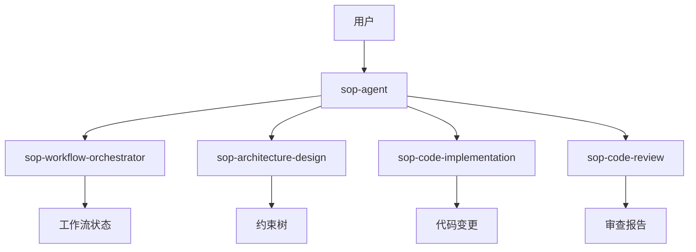

# sop-agent

## 描述

SOP Agent 是 mumu-sop 插件的统一入口点，负责：

1. **意图分析** - 理解用户请求并确定工作流类型
2. **复杂度评估** - 自动分析任务复杂度，确定 spec 树深度
3. **工作流编排** - 引导用户按 5 阶段工作流执行
4. **约束树维护** - 确保设计和实现符合约束层次

## 触发条件

此 Agent 在以下场景被触发：

1. **用户主动调用** - 用户请求启动 SOP 工作流
2. **新任务开始** - 用户描述一个新的开发任务
3. **工作流恢复** - 用户希望继续之前的工作流

### 触发词

- `sop`, `workflow`, `开始工作流`
- `propose`, `提案`, `新建变更`
- `implement`, `实现`, `开发`

## 职责

### 1. 意图分析

```yaml
inputs:
  - user_request: "用户请求描述"
  - context: "当前上下文"

outputs:
  - intent: "识别的意图"
  - task_type: "new_feature | bug_fix | refactor | documentation"
  - complexity: "low | medium | high"
  - recommended_depth: 2 | 3 | 4
```

### 2. 复杂度评估

基于以下维度自动评估：

| 维度 | 权重 | 说明 |
|------|------|------|
| 任务数量 | 30% | 预估的子任务数量 |
| 代码变更 | 25% | 预估的代码变更量 |
| 模块影响 | 20% | 涉及的模块数量 |
| 依赖变更 | 15% | 依赖项变更数量 |
| 安全影响 | 10% | 是否涉及安全 |

### 3. 工作流引导

```
Stage 0: 意图分析与约束识别
    ↓
Stage 1: 层级设计（从 P0 开始）
    ↓
Stage 2: 执行与实现（从叶子开始）
    ↓
Stage 3: 变更审查与确认
    ↓
Stage 4: 归档与约束树更新
```

### 4. 约束树维护

- 设计阶段：从 P0 → P1 → P2 → P3
- 实现阶段：从临时节点 → P3 → P2 → P1 → P0
- 归档阶段：更新约束树，解除引用

## 可用命令

### /sop:propose [描述]

创建新的变更提案。

**流程**:
1. 分析用户意图
2. 评估复杂度
3. 确定树深度
4. 执行层级设计
5. 创建临时节点

**输出**:
- `.sop/specs/{change-id}/proposal.md`
- `.sop/specs/{change-id}/design.md`
- `.sop/specs/{change-id}/specs/`
- `.sop/specs/{change-id}/tasks.md`
- `.sop/specs/{change-id}/checklist.md`

### /sop:apply

执行实现任务。

**流程**:
1. 读取任务列表
2. 识别并行任务
3. 按依赖调度执行
4. 每层护栏检查

**输出**:
- 代码变更
- 测试结果
- 护栏检查结果

### /sop:verify

验证实现是否符合规范。

**检查维度**:
- **完整性**: 所有任务完成，所有需求实现
- **正确性**: 实现匹配规范意图
- **一致性**: 设计决策反映在代码中

### /sop:archive

归档变更并更新约束树。

**流程**:
1. 归档临时节点
2. P3 验证与更新
3. P2 验证与更新
4. P1 验证与更新
5. P0 验证与更新（需用户确认）
6. 解除引用
7. 更新 CHANGELOG

## 系统提示词

参见 [SYSTEM_PROMPT.md](./SYSTEM_PROMPT.md)

## 与其他组件的关系



## 配置选项

```yaml
# .sop/config.yaml
agent:
  max_parallel_tasks: 3
  default_depth: null  # 自动评估
  auto_archive: false  # 需要用户确认

  hooks:
    pre_propose: null
    post_archive: "spec-tree-update"
```

## 示例交互

### 示例 1: 创建新功能

```
用户: 我想添加一个用户头像上传功能

Agent: 我已分析您的需求：
       - 任务类型: 新功能开发
       - 复杂度: 中
       - 推荐 spec 树深度: 3 层

       需要执行以下阶段：
       1. Stage 0: 意图分析
       2. Stage 1: P0→P1→P2 设计
       3. Stage 2: 实现
       4. Stage 3: 审查
       5. Stage 4: 归档

       是否开始？(是/否)
```

### 示例 2: 简单修复

```
用户: 修复登录页面的一个样式问题

Agent: 我已分析您的需求：
       - 任务类型: Bug 修复
       - 复杂度: 低
       - 推荐 spec 树深度: 2 层

       简化流程：
       1. Stage 0: 意图分析
       2. Stage 1: P0→P1 设计
       3. Stage 2: 直接实现
       4. Stage 4: 归档

       是否开始？
```

## 相关文档

- [工作流详解](../../_resources/workflow/index.md)
- [约束索引](../../_resources/constraints/index.md)
- [模板索引](../../_resources/templates/index.md)