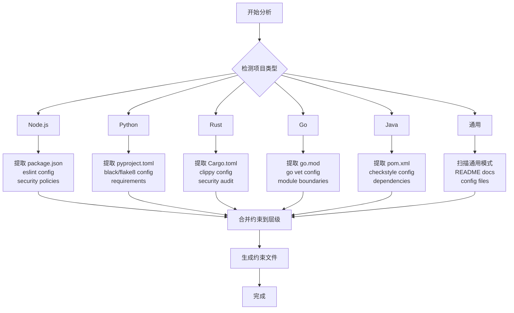
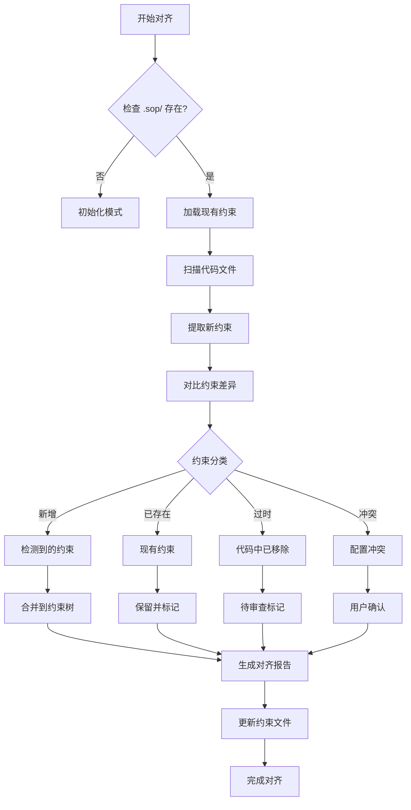
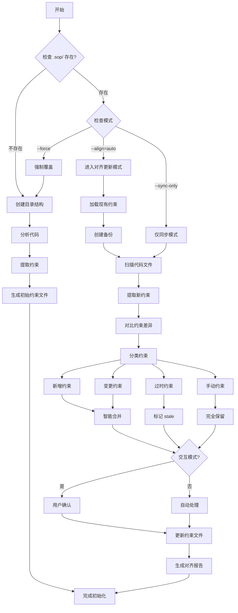

# init-spec-tree 命令

初始化或更新项目的约束树（Spec Tree）结构，并分析当前代码实现进行约束同步。

## 用法

```bash
/init-spec-tree [options]
```

### 选项

| 选项 | 说明 | 默认值 |
|------|------|--------|
| `--force` | 强制覆盖现有文件 | false |
| `--depth` | 初始化深度 (1-4) | 4 |
| `--project` | 项目名称 | 当前目录名 |
| `--analyze` | 分析代码并同步约束 | true |
| `--sync-only` | 仅同步，不创建新结构 | false |
| `--align` | 对齐更新模式（已有约束时自动启用） | auto |
| `--interactive` | 交互模式，每个变更要求确认 | false |
| `--dry-run` | 仅检测，不实际修改 | false |
| `--force-align` | 强制对齐，忽略 manual 标记 | false |
| `--prune-stale` | 清理过时约束 | false |
| `--backup` | 更新前创建备份 | true |

## 功能描述

### 1. 检查现有结构

首先检查项目中是否已存在约束树结构：

```
检查目录:
- .sop/
- .sop/specs/
- .sop/constraints/
- .sop/constitution/
- .trae/specs/ (兼容路径)
```

### 2. 分析当前代码实现

当 `--analyze=true` 时，自动分析项目代码：

#### 2.1 项目类型检测

```
检测信号:
├── package.json → Node.js/JavaScript 项目
├── pyproject.toml / requirements.txt → Python 项目
├── Cargo.toml → Rust 项目
├── go.mod → Go 项目
├── pom.xml / build.gradle → Java 项目
├── composer.json → PHP 项目
└── 其他 → 通用项目
```

#### 2.2 约束提取

**P0 约束提取（安全红线）:**
- 扫描硬编码密钥模式（API keys, tokens, passwords）
- 检测不安全依赖版本（通过 lock 文件）
- 检查安全配置文件（security policies）

**P1 约束提取（系统规范）:**
- 从配置文件提取性能约束
- API 契约定义（OpenAPI specs）
- 数据库 schema 约束

**P2 约束提取（模块规范）:**
- 代码风格配置（eslint, prettier, black, rustfmt）
- 测试配置（coverage thresholds）
- 模块边界（从架构文件提取）

**P3 约束提取（实现规范）:**
- Git 规范（.gitignore, commitlint 配置）
- 注释规范（从现有代码提取）
- 命名约定（从目录结构推断）

### 3. 创建/更新目录结构

```
.sop/
├── specs/                    # 临时 spec 节点存储
│   └── .gitkeep
├── constraints/              # 约束定义
│   ├── p0/                   # P0 约束（安全、质量红线）
│   │   └── .gitkeep
│   ├── p1/                   # P1 约束（系统规范）
│   │   └── .gitkeep
│   ├── p2/                   # P2 约束（模块规范）
│   │   └── .gitkeep
│   ├── p3/                   # P3 约束（实现规范）
│   │   └── .gitkeep
│   └── dependencies/         # 依赖子树
│       └── .gitkeep
├── constitution/             # 工程宪章
│   └── charter.md
├── contracts/                # 阶段契约
│   └── .gitkeep
└── analysis/                 # 代码分析结果 [新增]
    └── detected-constraints.yaml

.trae/
└── specs/ -> ../.sop/specs/  # 符号链接（兼容 Trae IDE）
```

### 4. 代码分析流程



### 5. 约束同步示例

**示例 1: Node.js 项目分析结果**

```yaml
# .sop/analysis/detected-constraints.yaml
detected_at: "2026-04-08T10:30:00Z"
project_type: "nodejs"
project_name: "my-app"

p0_constraints:
  - id: "P0-SEC-001"
    source: "package.json audit"
    severity: "blocker"
    description: "检测到 lodash@4.17.20 存在 CVE-2021-23337"
    action: "升级至 lodash@4.17.21"

p1_constraints:
  - id: "P1-PERF-001"
    source: "next.config.js"
    severity: "warning"
    description: "API 路由响应时间目标 < 500ms"
    target: "pages/api/*"

p2_constraints:
  - id: "P2-STYLE-001"
    source: ".eslintrc.json"
    severity: "warning"
    description: "代码风格: Airbnb JavaScript Style"
    rules: ["airbnb/base", "airbnb/react"]

p3_constraints:
  - id: "P3-GIT-001"
    source: ".commitlintrc.json"
    severity: "info"
    description: "提交信息遵循 Conventional Commits"
    pattern: "^(feat|fix|docs|style|refactor|test|chore)(\\(.+\\))?: .+"
```

**示例 2: Python 项目分析结果**

```yaml
p0_constraints:
  - id: "P0-SEC-002"
    source: "requirements.txt scan"
    severity: "blocker"
    description: "requests==2.25.0 存在 CVE-2023-32681"

p2_constraints:
  - id: "P2-COVERAGE-001"
    source: "pyproject.toml [tool.coverage.run]"
    severity: "warning"
    description: "测试覆盖率最低 80%"
    threshold: 80
```

### 6. 生成的约束文件

#### P0 约束文件 (constitution/charter.md)

基于代码分析自动填充：

```markdown
---
version: v1.0.0
level: P0
generated_from: "code-analysis"
updated_at: 2026-04-08
---

# 工程宪章

> **约束强度**: P0 级（不可违背，违反即熔断）
> 
> **来源**: 自动分析生成，请根据实际情况调整

## 安全红线

### 已检测到的安全约束

- [ ] **P0-SEC-001**: lodash@4.17.20 存在 CVE-2021-23337
  - 位置: package.json
  - 修复: 升级至 lodash@4.17.21+

## 质量红线

- [ ] **P0-QUAL-001**: 核心模块测试覆盖率必须 ≥ 80%
  - 来源: jest.config.js coverage threshold

## 架构红线

- [ ] **P0-ARCH-001**: 禁止循环依赖
  - 来源: eslint-plugin-import/no-cycle
```

### 7. 对齐更新模式（Constraint Alignment）

当检测到已有约束树时，命令自动进入**对齐更新模式**，执行智能约束同步：

#### 7.1 对齐流程



#### 7.2 约束对比策略

| 状态 | 判定条件 | 处理方式 |
|------|----------|----------|
| **新增** | 代码中存在，约束树中不存在 | 自动添加，标记为 `auto-detected` |
| **一致** | 代码和约束树完全匹配 | 保留，更新 `last-verified` 时间戳 |
| **变更** | 代码配置已修改，约束树未更新 | 标记为 `needs-update`，高亮差异 |
| **过时** | 约束树中存在，代码中已移除 | 标记为 `stale`，建议删除或归档 |
| **冲突** | 手动约束与自动检测冲突 | 保留手动约束，添加注释说明 |
| **手动** | 无对应代码配置，标记为 manual | 完全保留，不自动修改 |

#### 7.3 智能合并规则

**规则 1: 手动约束优先**
```yaml
# 现有约束 (手动创建)
- id: P2-STYLE-001
  source: "manual"
  description: "必须使用分号结尾"
  status: "active"

# 代码检测 (prettier 配置)
- id: P2-STYLE-001
  source: ".prettierrc"
  semi: false  # 与手动约束冲突

# 对齐结果：保留手动约束，添加注释
- id: P2-STYLE-001
  source: "manual"
  description: "必须使用分号结尾"
  status: "active"
  # NOTE: 代码检测发现 prettier 配置 semi=false，与手动约束冲突
  # 保留手动约束，如需同步请删除 manual 标记
```

**规则 2: 安全约束强制更新**
```yaml
# CVE 信息变化时，强制更新 P0 约束
# 即使手动编辑过，也会添加新的 CVE 条目
- id: P0-SEC-001
  description: "lodash 安全漏洞"
  cves:
    - "CVE-2021-23337"  # 原有
    - "CVE-2024-1234"   # 新增检测
  status: "critical"
```

**规则 3: 配置漂移检测**
```yaml
# 代码配置变更 vs 约束记录
代码当前: eslint "@typescript-eslint/no-explicit-any": "error"
约束记录: "@typescript-eslint/no-explicit-any": "warn"

# 标记为漂移（drift）
- id: P2-LINT-001
  rule: "@typescript-eslint/no-explicit-any"
  constraint_value: "warn"
  code_value: "error"
  drift: true
  action_required: "更新约束或恢复代码配置"
```

#### 7.4 对齐报告格式

```
🔄 Spec Tree 对齐更新完成

📊 对齐摘要
═══════════════════════════════════════════
  项目类型: Node.js
  上次更新: 2026-04-01
  本次更新: 2026-04-08
  
  约束统计:
    P0 (工程宪章):  2 个 (+1 新增, 0 变更, 0 过时)
    P1 (系统规范):  3 个 (+0 新增, 1 变更, 0 过时)
    P2 (模块规范):  5 个 (+2 新增, 0 变更, 1 过时)
    P3 (实现规范):  2 个 (+0 新增, 0 变更, 0 过时)
    ─────────────────────────────────
    总计: 12 个约束 (+3, -1)

📋 新增约束 (3)
───────────────────────────────────────────
  ✅ P0-SEC-002 [高] 检测到新的 CVE-2024-1234
       位置: axios@0.21.1 → package.json
       建议: 升级至 axios@1.6.0
       状态: 已自动添加

  ✅ P2-COVERAGE-002 [中] 新增模块覆盖率要求
       来源: jest.config.js 新增 threshold
       模块: src/api/
       要求: 80%
       状态: 已自动添加

  ✅ P3-FORMAT-002 [低] 新增 import 排序规则
       来源: eslint-plugin-import
       规则: import/order
       状态: 已自动添加

📝 变更约束 (1)
───────────────────────────────────────────
  ⚠️  P1-PERF-001 [中] API 响应时间阈值变更
       约束值: 500ms → 300ms (代码配置已更新)
       来源: next.config.js api.timings
       状态: 约束已同步
       漂移: ✅ 已修复

🗑️ 过时约束 (1)
───────────────────────────────────────────
  🗑️  P2-DEPRECATED-001 [低] 旧的模块边界定义
       原模块: src/old-module/ (已删除)
       建议: 删除或归档此约束
       状态: 标记为 stale

🔒 保留的手动约束 (2)
───────────────────────────────────────────
  👤 P2-STYLE-CUSTOM [中] 自定义命名规范
       来源: manual
       说明: 业务实体必须使用 PascalCase
       状态: 保留 (无代码配置对应)

  👤 P3-GIT-CUSTOM [低] 提交信息模板
       来源: manual
       说明: 必须包含 JIRA  ticket 号
       状态: 保留 (无代码配置对应)

⚠️ 需要注意
───────────────────────────────────────────
  1. P0-SEC-002 是高优先级安全漏洞，请尽快修复
  2. 1 个过时约束建议清理
  3. 运行 /sop 可基于更新后的约束开始工作流

📁 更新文件:
  - .sop/constitution/charter.md (更新)
  - .sop/constraints/p2/coverage.md (新增)
  - .sop/analysis/detected-constraints.yaml (更新)
  - .sop/analysis/alignment-report.yaml (新增)
```

#### 7.5 非侵入式更新原则

对齐更新遵循以下原则，确保不破坏现有工作流：

1. **保留所有手动约束** - 标记为 `manual` 的约束永远不会被自动删除
2. **增量添加** - 仅添加代码中新检测到的约束
3. **变更提示** - 配置漂移时高亮显示，但不强制同步
4. **过时标记** - 而非直接删除，允许用户审查后决定
5. **备份机制** - 更新前创建 `.sop/backup/` 快照

#### 7.6 交互式对齐选项

```bash
# 自动模式（默认）- 自动合并无冲突的约束
/init-spec-tree --analyze

# 交互模式 - 每个变更都要求确认
/init-spec-tree --interactive

# 仅检测，不实际修改
/init-spec-tree --dry-run

# 强制对齐 - 忽略 manual 标记（谨慎使用）
/init-spec-tree --force-align

# 清理过时约束
/init-spec-tree --prune-stale
```


## 执行流程



## 输出示例

### 初始化完成

```
✅ Spec Tree 初始化完成（含代码分析）

📁 目录结构:
  .sop/
  ├── specs/
  ├── constraints/
  │   ├── p0/
  │   ├── p1/
  │   ├── p2/
  │   └── p3/
  ├── constitution/
  │   └── charter.md
  ├── contracts/
  └── analysis/
      └── detected-constraints.yaml

🔍 代码分析结果:
  项目类型: Node.js
  检测文件:
    - package.json ✓
    - .eslintrc.json ✓
    - jest.config.js ✓
    - .commitlintrc.json ✓

📋 同步的约束:
  P0 (工程宪章): 1 个新约束
    - P0-SEC-001: lodash CVE 漏洞
  P1 (系统规范): 2 个新约束
    - P1-PERF-001: API 响应时间
    - P1-API-001: OpenAPI 规范
  P2 (模块规范): 3 个新约束
    - P2-STYLE-001: Airbnb ESLint
    - P2-COVERAGE-001: 80% 覆盖率
  P3 (实现规范): 1 个新约束
    - P3-GIT-001: Conventional Commits

📝 下一步:
  1. 查看 .sop/analysis/detected-constraints.yaml
  2. 编辑 .sop/constitution/charter.md 确认约束
  3. 使用 /sop 开始工作流
```

### 对齐更新模式 (--align=auto，默认)

```
🔄 Spec Tree 对齐更新完成

📊 对齐摘要
═══════════════════════════════════════════
  项目类型: Node.js
  上次更新: 2026-04-01
  本次更新: 2026-04-08
  
  变更统计:
    新增: 3 个约束
    变更: 1 个约束
    过时: 1 个约束
    保留: 2 个手动约束
    ─────────────────────────────────
    总计: 12 个约束 (+3, -1)

📋 新增约束
  ✅ P0-SEC-002 [高] lodash CVE-2024-1234
  ✅ P2-COVERAGE-002 [中] 新增模块覆盖率要求
  ✅ P3-FORMAT-002 [低] 新增 import 排序规则

📝 变更约束
  ⚠️  P1-PERF-001 API 响应时间 500ms → 300ms

🗑️ 过时约束
  🗑️  P2-DEPRECATED-001 src/old-module/ 已删除

🔒 保留的手动约束
  👤 P2-STYLE-CUSTOM [中] 自定义命名规范
  👤 P3-GIT-CUSTOM [低] 提交信息模板

⚠️ 需要注意
  1. P0-SEC-002 是高优先级安全漏洞，请尽快修复
  2. 1 个过时约束建议清理
```

### 仅检测模式 (--dry-run)

```
🔍 Spec Tree 对齐预览（未实际修改）

📊 预计变更:
  将新增: 3 个约束
  将变更: 1 个约束
  将标记过时: 1 个约束

💡 运行 /init-spec-tree 应用这些变更
```

## 支持的配置文件

### Node.js / JavaScript

| 文件 | 提取的约束 |
|------|-----------|
| `package.json` | 依赖版本约束、脚本规范 |
| `.eslintrc.*` | 代码风格约束 (P2) |
| `prettier.config.*` | 格式化约束 (P3) |
| `jest.config.*` | 测试覆盖率约束 (P2) |
| `.commitlintrc.*` | Git 提交规范 (P3) |
| `next.config.*` | 性能约束 (P1) |
| `tsconfig.json` | 类型检查约束 (P2) |

### Python

| 文件 | 提取的约束 |
|------|-----------|
| `pyproject.toml` | 项目配置、工具配置 |
| `requirements.txt` | 依赖安全约束 (P0) |
| `.flake8` / `setup.cfg` | 代码风格约束 (P2) |
| `pytest.ini` | 测试约束 (P2) |
| `.pylintrc` | 静态分析约束 (P2) |

### Rust

| 文件 | 提取的约束 |
|------|-----------|
| `Cargo.toml` | 依赖约束 |
| `clippy.toml` | 代码质量约束 (P2) |
| `rustfmt.toml` | 格式化约束 (P3) |

### Go

| 文件 | 提取的约束 |
|------|-----------|
| `go.mod` / `go.sum` | 依赖约束 |
| `.golangci.yml` | 代码质量约束 (P2) |

### Java

| 文件 | 提取的约束 |
|------|-----------|
| `pom.xml` / `build.gradle` | 依赖约束 |
| `checkstyle.xml` | 代码风格约束 (P2) |

## 错误处理

| 错误 | 处理方式 |
|------|----------|
| 权限不足 | 提示用户检查目录权限 |
| 符号链接失败 | 创建普通目录替代 |
| 文件已存在 | 跳过或覆盖（根据 --force 选项）|
| 代码分析失败 | 生成基本结构，显示警告 |
| 配置文件解析失败 | 跳过该文件，继续其他文件 |

## 相关文档

- [约束树结构](../_resources/constraints/index.md)
- [工程宪章](../_resources/constitution/architecture-principles.md)
- [工作流概述](../_resources/workflow/index.md)
- [/sop 命令](../.claude/commands/sop.md) - SOP 工作流入口

---

**版本**: 2.2.0
**最后更新**: 2026-04-08
