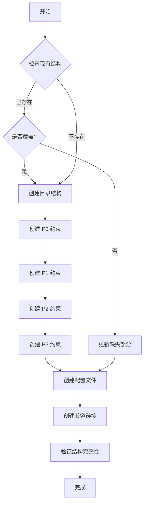

# init-spec-tree 命令

初始化或更新项目的约束树（Spec Tree）结构。

## 用法

```bash
/init-spec-tree [options]
```

### 选项

| 选项 | 说明 | 默认值 |
|------|------|--------|
| `--force` | 强制覆盖现有文件 | false |
| `--depth` | 初始化深度 (1-4) | 4 |
| `--project` | 项目名称 | 当前目录名 |

## 功能描述

### 1. 检查现有结构

首先检查项目中是否已存在约束树结构：

```
检查目录:
- .sop/
- .sop/specs/
- .sop/constraints/
- .sop/constitution/
- .trae/specs/ (兼容路径)
```

### 2. 创建目录结构

```
.sop/
├── specs/                    # 临时 spec 节点存储
│   └── .gitkeep
├── constraints/              # 约束定义
│   ├── p0/                   # P0 约束（安全、质量红线）
│   │   └── .gitkeep
│   ├── p1/                   # P1 约束（系统规范）
│   │   └── .gitkeep
│   ├── p2/                   # P2 约束（模块规范）
│   │   └── .gitkeep
│   ├── p3/                   # P3 约束（实现规范）
│   │   └── .gitkeep
│   └── dependencies/         # 依赖子树
│       └── .gitkeep
├── constitution/             # 工程宪章
│   └── charter.md
└── contracts/                # 阶段契约
    └── .gitkeep

.trae/
└── specs/ -> ../.sop/specs/  # 符号链接（兼容 Trae IDE）
```

### 3. 创建约束树文件

#### P0 约束模板 (constitution/charter.md)

```markdown
---
version: v1.0.0
level: P0
---

# 工程宪章

> **约束强度**: P0 级（不可违背，违反即熔断）

## 安全红线

- [ ] 禁止硬编码密钥、密码等敏感信息
- [ ] 禁止使用不安全的依赖版本
- [ ] 禁止绕过安全检查

## 质量红线

- [ ] 核心模块测试覆盖率必须 100%
- [ ] 禁止强制解包（unwrap/expect）在核心路径
- [ ] 禁止循环依赖

## 架构红线

- [ ] 禁止跨层直接调用
- [ ] 禁止违反依赖方向原则
```

#### 约束索引文件 (constraints/index.md)

```markdown
---
version: v1.0.0
---

# 约束索引

## P0 约束

| 约束 ID | 名称 | 描述 |
|---------|------|------|
| P0-SEC-001 | 禁止硬编码密钥 | 敏感信息必须通过环境变量或密钥管理服务获取 |
| P0-QUAL-001 | 核心模块覆盖率 | 核心模块测试覆盖率必须达到 100% |

## P1 约束

| 约束 ID | 名称 | 描述 |
|---------|------|------|
| P1-PERF-001 | API 响应时间 | API 平均响应时间应 < 500ms |
| P1-API-001 | API 版本控制 | API 必须包含版本号 |

## P2 约束

| 约束 ID | 名称 | 描述 |
|---------|------|------|
| P2-STYLE-001 | 命名约定 | 遵循项目命名规范 |
| P2-DOC-001 | 公共 API 注释 | 公共 API 必须有文档注释 |

## P3 约束

| 约束 ID | 名称 | 描述 |
|---------|------|------|
| P3-FORMAT-001 | 代码格式化 | 遵循项目代码格式化规则 |
| P3-GIT-001 | 提交信息规范 | 遵循 Conventional Commits 规范 |
```

### 4. 创建约束树配置 (constraints/tree.yaml)

```yaml
---
version: v1.0.0
created_at: ${timestamp}
project: ${project_name}

tree_structure:
  P0:
    name: 工程宪章
    description: 安全、质量、架构红线
    severity: blocker
    children:
      - P1

  P1:
    name: 系统规范
    description: 性能、可用性、接口约束
    severity: warning
    parent: P0
    children:
      - P2

  P2:
    name: 模块规范
    description: 代码质量、文档、测试约束
    severity: warning
    parent: P1
    children:
      - P3

  P3:
    name: 实现规范
    description: 编码规范、注释、Git 规范
    severity: info
    parent: P2
    children: []

storage:
  primary: .sop/
  compatible:
    - .trae/

status: initialized
```

### 5. 创建初始契约文件

```
contracts/
├── stage-0-contract.yaml    # Stage 0 契约模板
├── stage-1-contract.yaml    # Stage 1 契约模板
├── stage-2-contract.yaml    # Stage 2 契约模板
├── stage-3-contract.yaml    # Stage 3 契约模板
└── stage-4-contract.yaml    # Stage 4 契约模板
```

## 执行流程



## 输出

执行完成后将显示：

```
✅ Spec Tree 初始化完成

目录结构:
  .sop/
  ├── specs/
  ├── constraints/
  │   ├── p0/
  │   ├── p1/
  │   ├── p2/
  │   ├── p3/
  │   └── dependencies/
  ├── constitution/
  │   └── charter.md
  └── contracts/

  .trae/specs/ -> .sop/specs/

约束层级:
  P0 (工程宪章) - 3 个约束
  P1 (系统规范) - 0 个约束
  P2 (模块规范) - 0 个约束
  P3 (实现规范) - 0 个约束

下一步:
  1. 编辑 .sop/constitution/charter.md 定义项目宪章
  2. 在各层级约束目录添加具体约束文件
  3. 使用 /sop 开始工作流
```

## 更新模式

如果约束树已存在，命令将：

1. **检查完整性**: 验证所有必需目录和文件
2. **补充缺失**: 创建缺失的目录和文件
3. **更新索引**: 重新生成约束索引文件
4. **验证一致性**: 确保约束树配置与实际结构一致

## 错误处理

| 错误 | 处理方式 |
|------|----------|
| 权限不足 | 提示用户检查目录权限 |
| 符号链接失败 | 创建普通目录替代 |
| 文件已存在 | 跳过或覆盖（根据 --force 选项） |

## 相关文档

- [约束树结构](../_resources/constraints/index.md)
- [工程宪章](../_resources/constitution/architecture-principles.md)
- [工作流概述](../_resources/workflow/index.md)