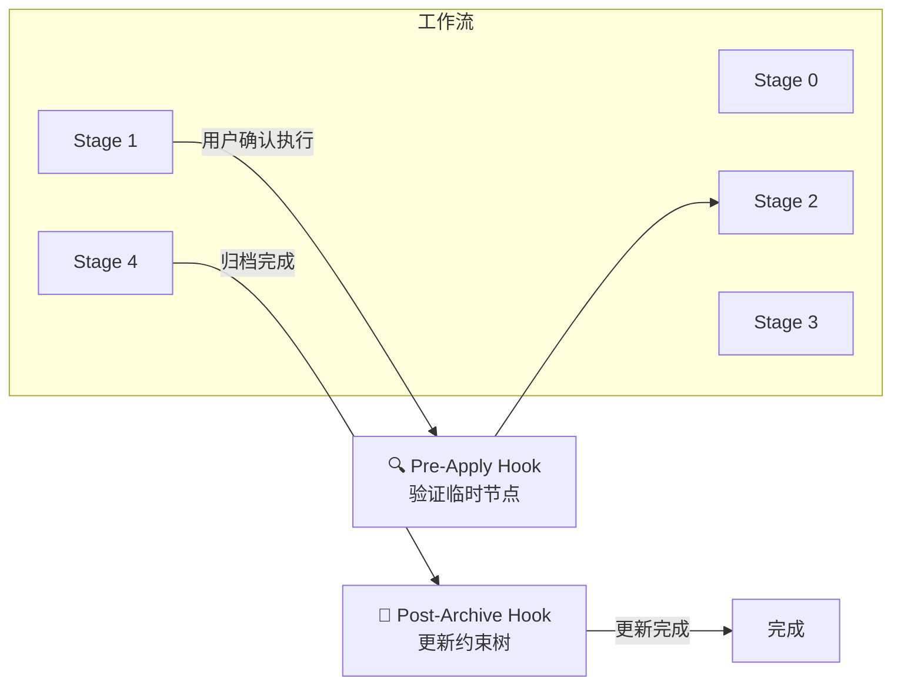

# Hooks 索引

SOP 插件提供的自动化 Hook，用于在工作流关键节点自动触发验证和更新操作。

---

## Hook 概述



---

## 可用 Hooks

### 1. Pre-Apply Hook (pre-apply-hook)

**触发时机**: Stage 2 实现开始前

**用途**: 验证临时节点完整性，确保实现前的准备工作已完成

**执行动作**:

| 动作 | 描述 | 严重性 |
|------|------|--------|
| verify-temp-node | 验证临时子节点结构完整性 | blocker |
| guardrail-check | 执行各层级护栏预检查 | blocker/warning |
| complexity-confirmation | 确认动态深度分析结果 | info |
| dependency-subtree-check | 检查第三方依赖子树状态 | blocker |

**阻断条件**:
- 临时节点验证失败
- P0 护栏检查失败
- 依赖子树只读违规
- 任务存在循环依赖

**输出文件**: `contracts/stage-2-pre-check.json`

---

### 2. Post-Archive Hook (post-archive-hook)

**触发时机**: Stage 4 归档完成后

**用途**: 从叶子节点向上更新约束树，解除引用关系

**执行动作**:

| 动作 | 描述 | 顺序 |
|------|------|------|
| spec-tree-update | 从 P3 向上更新约束树 | 1 |
| reference-cleanup | 解除临时子节点引用关系 | 2 |
| changelog-update | 更新 CHANGELOG | 3 |
| constraint-validation | 验证约束树完整性 | 4 |

**约束树更新流程**:

```
P3 验证 → P3 更新（如有变更）
    ↓
P2 验证 → P2 更新（如有变更）
    ↓
P1 验证 → P1 更新（如有变更）
    ↓
P0 验证 → P0 更新（需审批）
```

**输出文件**:
- `contracts/stage-4-constraint-update.json`
- `contracts/stage-4-reference.json`
- `CHANGELOG.md`

---

## Hook 配置

### plugin.json 配置

```json
{
  "metadata": {
    "hooks": {
      "pre-apply": {
        "path": "hooks/pre-apply-hook.sh",
        "description": "Stage 2 实现前验证临时节点完整性",
        "triggers": ["stage-2-start", "pre-implement"]
      },
      "post-archive": {
        "path": "hooks/post-archive-hook.sh",
        "description": "Stage 4 归档后自动更新约束树",
        "triggers": ["stage-4-complete", "post-archive"]
      }
    }
  }
}
```

### 触发器配置

Hook 可通过以下方式触发：

1. **命令触发**: 使用触发关键词
   - `pre-apply`: `stage-2-start`, `pre-implement`
   - `post-archive`: `stage-4-complete`, `post-archive`

2. **事件触发**: 工作流状态变化
   - Stage 1 确认执行后 → Pre-Apply
   - Stage 4 归档完成后 → Post-Archive

3. **手动触发**: 直接执行脚本
   ```bash
   ./hooks/pre-apply-hook.sh
   ./hooks/post-archive-hook.sh
   ```

---

## Hook 输出格式

### Pre-Apply 输出

```json
{
  "change_id": "CHG-20260324-001",
  "checked_at": "2026-03-24T10:00:00Z",
  "temp_node_valid": true,
  "spec_path": ".sop/specs/CHG-20260324-001",
  "errors": 0,
  "warnings": 2,
  "guardrail_results": {
    "P0": "passed",
    "P1": "passed",
    "P2": "passed",
    "P3": "passed"
  },
  "ready_to_proceed": true
}
```

### Post-Archive 输出

```json
{
  "change_id": "CHG-20260324-001",
  "updated_at": "2026-03-24T12:00:00Z",
  "updated_nodes": ["P3-xxx", "P2-yyy"],
  "new_nodes": [],
  "deprecated_nodes": [],
  "validation_status": "completed"
}
```

---

## 错误处理

### Pre-Apply 错误

| 错误类型 | 处理方式 |
|----------|----------|
| 临时节点不存在 | 阻止 Stage 2 启动 |
| 必需文件缺失 | 阻止 Stage 2 启动 |
| P0 护栏失败 | 阻止 Stage 2 启动 |
| 任务循环依赖 | 阻止 Stage 2 启动 |

### Post-Archive 错误

| 错误类型 | 处理方式 |
|----------|----------|
| P0 验证失败 | 暂停更新，通知用户审批 |
| 约束冲突 | 记录冲突，暂停更新 |
| 引用解除失败 | 回滚已执行的更新 |
| CHANGELOG 更新失败 | 记录错误，不影响其他操作 |

---

## 相关文档

- [工作流索引](../workflow/index.md)
- [约束树更新流程](../templates/workflow/spec-tree-update-flow.md)
- [动态深度分析](../templates/workflow/depth-analysis.md)
- [Stage 2 详解](../workflow/stage-2-implement.md)
- [Stage 4 详解](../workflow/stage-4-archive.md)