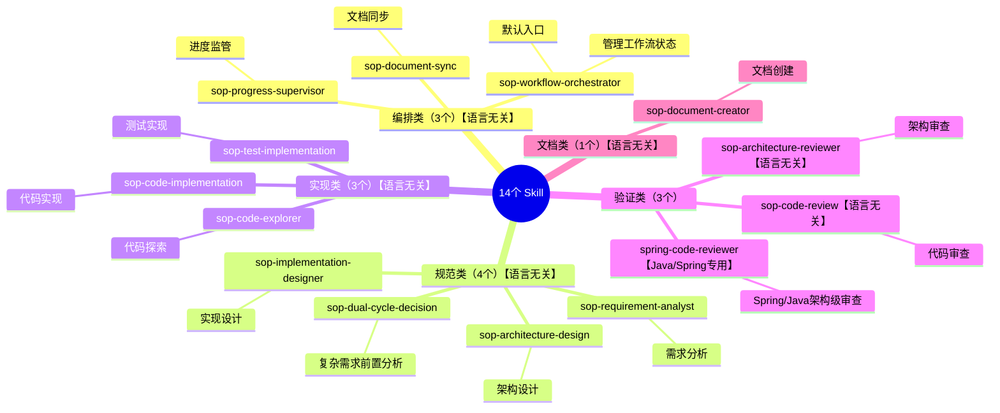

# Skill 索引

> **核心理念**: 规范驱动 Skill，Skill 是规范的执行工具
>
> **语言无关性**: 除 `spring-code-reviewer` 外，所有 Skill 均为语言无关，适用于任何编程语言和框架。

## Skill 架构

## 编排类 Skill

**职责**: 管理规范版本和流程编排，**系统默认入口 Skill**

| Skill | 触发词 | 描述 | 输入 | 输出 |
|-------|--------|------|------|------|
| [sop-workflow-orchestrator](./sop-workflow-orchestrator/SKILL.md) | `$start`, `$workflow` | **默认入口**：编排工作流程 | 权重决策、宪章文档 | 工作流状态文件 |
| [sop-document-sync](./sop-document-sync/SKILL.md) | `$sync`, `$document` | 同步文档与代码 | 代码变更、设计文档 | 文档更新列表 |
| [sop-progress-supervisor](./sop-progress-supervisor/SKILL.md) | `$progress`, `$status` | 监管工作流进度 | 工作流状态、任务列表 | 进度报告 |

## 规范类 Skill
**职责**: 生成规范文档

| Skill | 触发词 | 描述 | 输入 | 输出 |
|-------|--------|------|------|------|
| [sop-dual-cycle-decision](./sop-dual-cycle-decision/SKILL.md) | `$decision`, `$analyze` | **前置决策**：复杂需求分析 | 用户请求、上下文 | 意图分析、决策路径、执行计划 |
| [sop-requirement-analyst](./sop-requirement-analyst/SKILL.md) | `$requirement`, `$spec` | 分析需求生成规范 | 需求描述、现有规范 | 规范文档、BDD场景 |
| [sop-architecture-design](./sop-architecture-design/SKILL.md) | `$architecture`, `$design` | 系统架构设计 | 系统需求、宪章文档 | 架构设计文档 |
| [sop-implementation-designer](./sop-implementation-designer/SKILL.md) | `$impl-design` | 实现详细设计 | 架构文档、规范文档 | 实现设计文档 |

## 实现类 Skill
**职责**: 将规范翻译为代码

| Skill | 触发词 | 描述 | 输入 | 输出 |
|-------|--------|------|------|------|
| [sop-code-explorer](./sop-code-explorer/SKILL.md) | `$explore`, `$codebase` | 探索代码库 | 规范文档、代码库 | 代码分析报告 |
| [sop-code-implementation](./sop-code-implementation/SKILL.md) | `$implement`, `$code` | 根据规范实现代码 | 设计文档、规范文档 | 代码变更 |
| [sop-test-implementation](./sop-test-implementation/SKILL.md) | `$test`, `$tdd` | 根据BDD场景编写测试 | 规范文档、BDD场景 | 测试代码 |

## 验证类 Skill
**职责**: 验证规范是否被满足

| Skill | 触发词 | 描述 | 输入 | 输出 |
|-------|--------|------|------|------|
| [sop-architecture-reviewer](./sop-architecture-reviewer/SKILL.md) | `$arch-review` | 审查架构设计 | 架构文档、代码变更 | 架构审查报告 |
| [sop-code-review](./sop-code-review/SKILL.md) | `$review`, `$audit` | 审查代码实现 | 代码变更、测试报告 | 代码审查报告 |
| [spring-code-reviewer](./spring-code-reviewer/SKILL.md) ⚠️ | `$spring-review`, `$java-review` | **[Java/Spring专用]** Spring/Java架构级代码审查 | 代码变更 | Spring代码审查报告 |

> ⚠️ **语言特定说明**: `spring-code-reviewer` 仅适用于 Java/Spring 项目。对于其他语言，请使用 `sop-code-review`。

## 文档类 Skill
**职责**: 创建符合最佳实践的技术文档

| Skill | 触发词 | 描述 | 输入 | 输出 |
|-------|--------|------|------|------|
| [sop-document-creator](./sop-document-creator/SKILL.md) | `$doc`, `$create-doc` | 创建技术文档 | 文档类型、内容来源 | 规范文档 |

## 资源引用

- [_resources/constitution/](./_resources/constitution/) - 工程宪章资源
- [_resources/constraints/](./_resources/constraints/) - 约束资源
- [_resources/workflow/](./_resources/workflow/) - 工作流资源
- [_resources/templates/](./_resources/templates/) - 模板资源
- [_resources/specifications/](./_resources/specifications/) - 规范资源
