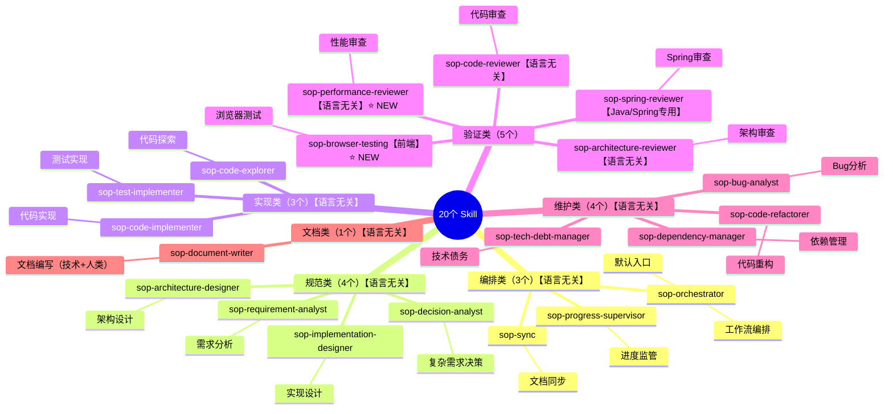

# Skill 索引

> **核心理念**: 规范驱动 Skill，Skill 是规范的执行工具
>
> **语言无关性**: 除 `sop-spring-reviewer` 外，所有 Skill 均为语言无关，适用于任何编程语言和框架。

## Skill 架构



## 入口 Agent

**sop-agent** 是 SOP 工作流的统一入口 Agent，自动分析任务复杂度并引导用户按工作流执行。

| Agent | 触发词 | 描述 | 功能 |
|-------|--------|------|------|
| [sop-agent](./agents/sop-agent/AGENT.md) | `sop`, `workflow`, `propose` | 工作流入口 | 复杂度分析、动态深度调整、引导工作流 |

### Agent 工作流程

```
用户请求 → 复杂度分析 → 确定树深度 → 构建精简树 → 按树深度执行设计 → 从叶子开始实现
```

### 动态深度规则

| 复杂度 | 深度 | 层级 |
|--------|------|------|
| 低 | 2 | P0 → P1 → 临时节点 |
| 中 | 3 | P0 → P1 → P2 → 临时节点 |
| 高 | 4 | P0 → P1 → P2 → P3 → 临时节点 |

## 可用命令

### 6 阶段工作流命令

| 命令 | 触发词 | 描述 | 对应阶段 |
|------|--------|------|---------|
| `spec` | `spec`, `define`, `规范` | 启动规范阶段 | Stage 0: Define |
| `plan` | `plan`, `计划`, `规划` | 启动计划阶段 | Stage 1: Plan |
| `build` | `build`, `构建`, `实现` | 启动构建阶段 | Stage 2: Build |
| `test` | `test`, `测试`, `验证` | 启动测试阶段 | Stage 3: Verify |
| `review` | `review`, `审查`, `评审` | 启动审查阶段 | Stage 4: Review |
| `ship` | `ship`, `交付`, `发布` | 启动交付阶段 | Stage 5: Ship |

### 初始化命令

| 命令 | 触发词 | 描述 | 用途 |
|------|--------|------|------|
| `/init-spec-tree` | `init-spec`, `init-tree` | 初始化约束树 | 创建 P0-P3 约束结构 |

详细文档: [commands/index.md](./commands/index.md)

## 6 阶段工作流

```
┌─────────┐   ┌─────────┐   ┌─────────┐   ┌─────────┐   ┌─────────┐   ┌─────────┐
│ Define  │ → │  Plan   │ → │  Build  │ → │ Verify  │ → │ Review  │ → │  Ship   │
│  (spec) │   │  (plan) │   │ (build) │   │  (test) │   │ (review)│   │  (ship) │
└─────────┘   └─────────┘   └─────────┘   └─────────┘   └─────────┘   └─────────┘
   定义          计划          构建          验证          审查          交付
```

## 五轴审查体系

每个审查覆盖五个核心维度：

| 维度 | 检查内容 | 对应层级 |
|------|---------|---------|
| **Correctness** | 正确性：是否按规范工作 | P2 |
| **Readability** | 可读性：是否易于理解 | P3 |
| **Architecture** | 架构：是否符合设计 | P2/P0 |
| **Security** | 安全：是否引入漏洞 | P0 |
| **Performance** | 性能：是否存在性能问题 | P1 |

详细文档: [_resources/references/five-axis-review.md](./_resources/references/five-axis-review.md)

## 编排类 Skill

**职责**: 管理规范版本和流程编排

| Skill | 触发词 | 描述 | 输入 | 输出 |
|-------|--------|------|------|------|
| [sop-orchestrator](./sop-orchestrator/SKILL.md) | `workflow`, `orchestrate`, `start workflow`, `开始工作流` | **默认入口**：编排工作流程 | 权重决策、宪章文档 | 工作流状态文件 |
| [sop-sync](./sop-sync/SKILL.md) | `sync`, `document`, `同步文档` | 同步文档与代码 | 代码变更、设计文档 | 文档更新列表 |
| [sop-progress-supervisor](./sop-progress-supervisor/SKILL.md) | `progress`, `status`, `监管进度` | 监管工作流进度 | 工作流状态、任务列表 | 进度报告 |

## 规范类 Skill

**职责**: 生成规范文档

| Skill | 触发词 | 描述 | 输入 | 输出 |
|-------|--------|------|------|------|
| [sop-decision-analyst](./sop-decision-analyst/SKILL.md) | `decision`, `analyze`, `决策分析` | **前置决策**：复杂需求分析 | 用户请求、上下文 | 意图分析、决策路径、执行计划 |
| [sop-requirement-analyst](./sop-requirement-analyst/SKILL.md) | `requirement`, `spec`, `需求分析` | 分析需求生成规范 | 需求描述、现有规范 | 规范文档、BDD场景 |
| [sop-architecture-designer](./sop-architecture-designer/SKILL.md) | `architecture`, `design`, `架构设计` | 系统架构设计 | 系统需求、宪章文档 | 架构设计文档 |
| [sop-implementation-designer](./sop-implementation-designer/SKILL.md) | `impl-design`, `实现设计` | 实现详细设计 | 架构文档、规范文档 | 实现设计文档 |

## 实现类 Skill

**职责**: 将规范翻译为代码

| Skill | 触发词 | 描述 | 输入 | 输出 |
|-------|--------|------|------|------|
| [sop-code-explorer](./sop-code-explorer/SKILL.md) | `explore`, `codebase`, `探索代码` | 探索代码库 | 规范文档、代码库 | 代码分析报告 |
| [sop-code-implementer](./sop-code-implementer/SKILL.md) | `implement`, `code`, `实现代码` | 根据规范实现代码 | 设计文档、规范文档 | 代码变更 |
| [sop-test-implementer](./sop-test-implementer/SKILL.md) | `test`, `tdd`, `编写测试` | 根据BDD场景编写测试 | 规范文档、BDD场景 | 测试代码 |

## 验证类 Skill

**职责**: 验证规范是否被满足

| Skill | 触发词 | 描述 | 输入 | 输出 |
|-------|--------|------|------|------|
| [sop-architecture-reviewer](./sop-architecture-reviewer/SKILL.md) | `arch-review`, `架构审查` | 审查架构设计 | 架构文档、代码变更 | 架构审查报告 |
| [sop-code-reviewer](./sop-code-reviewer/SKILL.md) | `review`, `audit`, `代码审查` | **五轴审查**：正确性、可读性、架构、安全、性能 | 代码变更、测试报告 | 代码审查报告 |
| [sop-performance-reviewer](./sop-performance-reviewer/SKILL.md) ⭐ NEW | `performance`, `性能审查` | 性能审查（五轴之一） | 代码变更 | 性能审查报告 |
| [sop-browser-testing](./sop-browser-testing/SKILL.md) ⭐ NEW | `browser`, `浏览器测试` | 浏览器测试（DevTools MCP） | 前端代码 | 浏览器测试报告 |
| [sop-spring-reviewer](./sop-spring-reviewer/SKILL.md) ⚠️ | `spring-review`, `java-review`, `Spring审查` | **[Java/Spring专用]** Spring审查 | 代码变更 | Spring审查报告 |

> ⚠️ **语言特定说明**: `sop-spring-reviewer` 仅适用于 Java/Spring 项目。
> 
> ⭐ **新增**: `sop-performance-reviewer` 和 `sop-browser-testing` 提供五轴审查和浏览器测试支持。

## 维护类 Skill

**职责**: 处理软件开发维护阶段的各类场景

| Skill | 触发词 | 描述 | 输入 | 输出 |
|-------|--------|------|------|------|
| [sop-bug-analyst](./sop-bug-analyst/SKILL.md) | `bug`, `analyze`, `分析Bug` | Bug分析与根因定位 | Bug描述、复现步骤 | 复现测试、分析报告 |
| [sop-code-refactorer](./sop-code-refactorer/SKILL.md) | `refactor`, `clean`, `重构代码` | 安全重构代码 | 重构目标、代码位置 | 重构后代码、变更报告 |
| [sop-tech-debt-manager](./sop-tech-debt-manager/SKILL.md) | `tech-debt`, `debt`, `技术债务` | 技术债务管理 | 代码库、关注领域 | 债务报告、偿还计划 |
| [sop-dependency-manager](./sop-dependency-manager/SKILL.md) | `dependency`, `upgrade`, `依赖升级` | 依赖升级管理 | 依赖名称、目标版本 | 升级报告 |

## 文档类 Skill

**职责**: 创建各类文档（技术文档 + 人类文档）

| Skill | 触发词 | 描述 | 输入 | 输出 |
|-------|--------|------|------|------|
| [sop-document-writer](./sop-document-writer/SKILL.md) | `doc`, `create-doc`, `user-guide`, `创建文档` | 创建文档（技术/人类双模式） | 文档类型、目标读者 | 规范文档、用户手册 |

### 双模式支持

| 模式 | 目标读者 | 核心原则 | 文档类型 |
|------|----------|----------|----------|
| **技术模式** | 开发者 | 结构规范 | API 文档、README、设计文档 |
| **人类模式** | 终端用户 | 渐进式披露 | 用户手册、需求文档、培训材料 |

## 约束树映射

Skill 执行过程中需遵循约束树层级：

| 约束层级 | 优先级 | 说明 | 相关Skill |
|----------|--------|------|-----------|
| **P0 工程宪章** | 最高 | 安全、数据完整性、系统可用性 | 所有Skill（不变量） |
| **P1 系统规范** | 高 | 系统架构、接口契约、性能要求 | sop-architecture-designer, sop-bug-analyst |
| **P2 模块规范** | 中 | 模块职责、API设计、测试覆盖 | sop-code-implementer, sop-code-refactorer |
| **P3 实现规范** | 低 | 代码风格、命名约定、注释规范 | sop-code-reviewer, sop-tech-debt-manager |

## 自动化 Hooks

SOP 提供自动化 Hook，在工作流关键节点自动触发验证和更新：

### Pre-Apply Hook

**触发时机**: Stage 2 实现开始前

| 动作 | 描述 | 严重性 |
|------|------|--------|
| verify-temp-node | 验证临时子节点结构完整性 | blocker |
| guardrail-check | 执行各层级护栏预检查 | blocker/warning |
| complexity-confirmation | 确认动态深度分析结果 | info |
| dependency-subtree-check | 检查第三方依赖子树状态 | blocker |

### Post-Archive Hook

**触发时机**: Stage 4 归档完成后

| 动作 | 描述 | 顺序 |
|------|------|------|
| spec-tree-update | 从 P3 向上更新约束树 | 1 |
| reference-cleanup | 解除临时子节点引用关系 | 2 |
| changelog-update | 更新 CHANGELOG | 3 |
| constraint-validation | 验证约束树完整性 | 4 |

详细文档: [hooks/index.md](./hooks/index.md)

## 快捷路径

针对常见场景的 Skill 快速入口：

| 场景 | 入口Skill | 典型流程 |
|------|-----------|----------|
| **新功能开发** | sop-orchestrator | 需求→设计→实现→测试→审查 |
| **Bug修复** | sop-bug-analyst | 分析→复现测试→修复→验证 |
| **代码重构** | sop-code-refactorer | 识别坏味道→补充测试→重构→验证 |
| **技术债务** | sop-tech-debt-manager | 识别→评估→计划→偿还 |
| **依赖升级** | sop-dependency-manager | 检查→分析→升级→验证 |

## 资源引用

- [_resources/constitution/](./_resources/constitution/) - 工程宪章资源
- [_resources/constraints/](./_resources/constraints/) - 约束资源（含3层边界系统）
- [_resources/workflow/](./_resources/workflow/) - 6阶段工作流资源
- [_resources/templates/](./_resources/templates/) - 模板资源
- [_resources/specifications/](./_resources/specifications/) - 规范资源
- [_resources/references/](./_resources/references/) - 参考文档（五轴审查等）
- [.claude/commands/](./.claude/commands/) - 6阶段命令
- [docs/](./docs/) - IDE配置指南（Cursor/Windsurf/Copilot/Gemini）
- [agents/sop-agent/](./agents/sop-agent/) - 入口 Agent
- [commands/](./commands/) - 可用命令
- [hooks/](./hooks/) - 自动化 Hooks