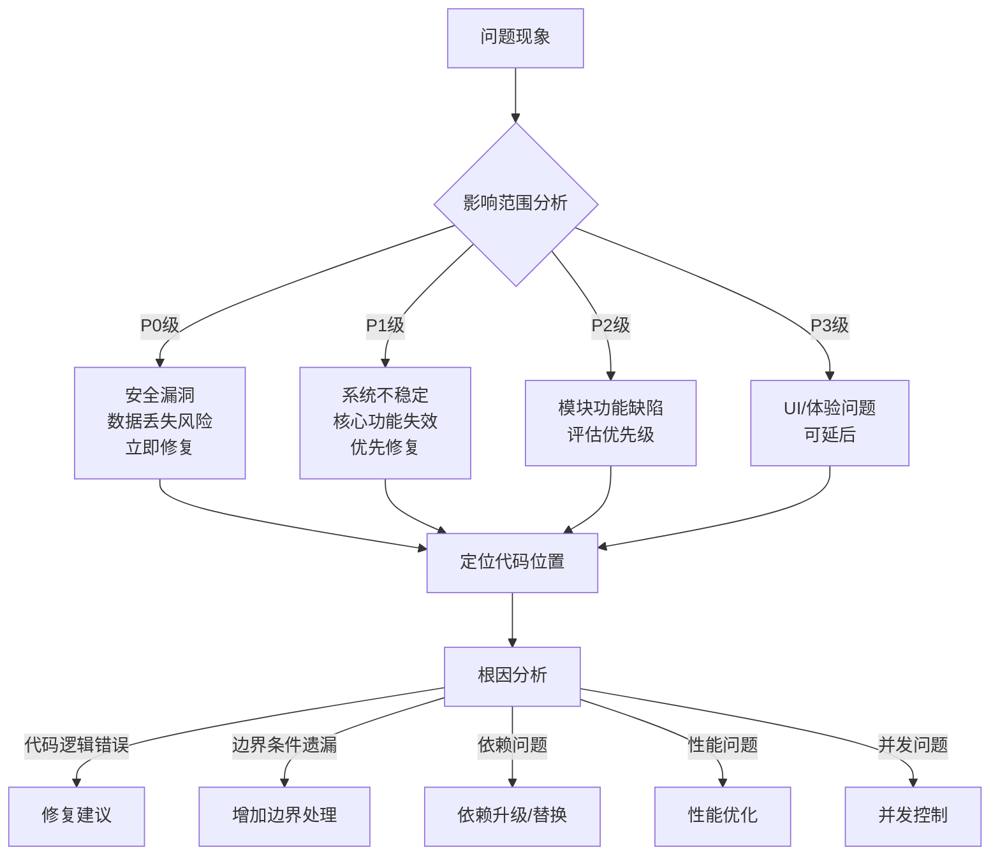

# sop-bug-analysis

## 描述

Bug分析 Skill 负责系统性地分析和定位软件缺陷，包括问题复现、根因分析和影响范围评估。该 Skill 是维护阶段的核心，确保Bug修复有明确的定位和测试保障。

**与约束树的对应**：
- **P0层**：安全相关Bug必须修复，不引入新的安全漏洞
- **P1层**：影响系统稳定性的Bug必须修复
- **P2层**：模块功能缺陷需要评估优先级
- **P3层**：UI/文案等小问题可延后

主要职责：
- 编写失败的测试复现问题
- 定位根本原因
- 评估影响范围
- 生成修复建议

## 使用场景

触发此 Skill 的条件：

1. **Bug报告**：用户或测试报告了软件缺陷
2. **生产问题**：生产环境出现异常行为
3. **测试失败**：CI/CD流程中测试失败
4. **用户反馈**：用户报告功能不符合预期

## 指令

### 步骤 1: 收集问题信息

```yaml
信息收集清单:
  现象描述:
    - 问题是什么？
    - 预期行为是什么？
    - 实际行为是什么？

  复现条件:
    - 在什么环境下发生？
    - 有什么前置条件？
    - 有什么操作步骤？

  影响范围:
    - 影响哪些用户？
    - 影响哪些功能？
    - 影响程度如何？
```

### 步骤 2: 编写复现测试（TDD红阶段）

> **CRITICAL**: 必须先编写失败的测试，验证测试确实复现了问题

1. 根据复现条件创建测试用例
2. 运行测试，验证测试失败（复现问题）
3. 如果测试通过，说明测试用例有问题或问题无法复现
4. 记录测试用例到 `tests/bugs/{bug-id}-test.{ext}`

```markdown
## 测试命名规范

格式: test_bug_{bug-id}_{简短描述}

示例:
- test_bug_20260301_order_cancel_fail
- test_bug_20260302_payment_timeout
```

### 步骤 3: 定位根因



#### 根因分析技术

| 技术 | 适用场景 | 方法 |
|------|----------|------|
| 日志分析 | 运行时问题 | 查看错误日志、调用栈 |
| 代码审查 | 逻辑错误 | 逐行检查相关代码 |
| 数据分析 | 数据问题 | 检查输入输出数据 |
| 环境对比 | 环境问题 | 对比不同环境配置 |
| 二分排查 | 不确定位置 | 逐步缩小范围 |

### 步骤 4: 评估影响范围

```yaml
影响评估维度:
  用户影响:
    - 影响用户数量
    - 影响用户类型（新用户/老用户/VIP）
    - 是否有workaround

  功能影响:
    - 影响的核心功能
    - 是否有替代方案
    - 影响的业务流程

  数据影响:
    - 是否涉及数据丢失
    - 是否涉及数据泄露
    - 数据一致性影响

  系统影响:
    - 是否影响系统稳定性
    - 是否影响性能
    - 是否有连锁反应
```

### 步骤 5: 生成分析报告

生成报告到 `contracts/bug-analysis-{bug-id}.json`：

```json
{
  "bug_id": "BUG-20260301-001",
  "severity": "P1",
  "summary": "订单取消功能在某些情况下失败",
  "reproduction_test": "tests/bugs/BUG-20260301-001-test.ts",
  "root_cause": {
    "type": "逻辑错误",
    "location": "src/order/OrderService.ts:45",
    "description": "未正确处理订单状态为SHIPPED时的取消请求"
  },
  "impact": {
    "user_impact": "已发货订单用户无法正常操作",
    "data_impact": "无",
    "system_impact": "无"
  },
  "fix_suggestion": {
    "approach": "增加订单状态校验",
    "affected_files": ["src/order/OrderService.ts"],
    "estimated_effort": "1小时"
  }
}
```

## 契约

### 输入契约

```yaml
required_inputs:
  - name: "bug_description"
    type: text
    validation: "包含问题现象描述"
    description: "Bug描述，包含预期行为和实际行为"

optional_inputs:
  - name: "error_logs"
    type: file
    description: "错误日志文件"

  - name: "reproduction_steps"
    type: text
    description: "复现步骤"
```

### 输出契约

```yaml
required_outputs:
  - name: "reproduction_test"
    type: file
    path: "tests/bugs/{bug-id}-test.{ext}"
    guarantees:
      - "测试用例能够复现问题"
      - "测试初始状态为失败"

  - name: "bug_analysis_report"
    type: json
    path: "contracts/bug-analysis-{bug-id}.json"
    guarantees:
      - "包含根因定位"
      - "包含影响评估"
      - "包含修复建议"
```

### 行为契约

```yaml
preconditions:
  - "Bug描述清晰"
  - "问题可复现或可定位"

postconditions:
  - "复现测试已创建"
  - "根因已定位"
  - "分析报告已生成"

invariants:
  - "必须先编写失败的测试"
  - "必须定位到具体代码位置"
  - "必须评估影响范围"
```

## Bug严重程度与约束树映射

```yaml
severity_mapping:
  P0_critical:
    description: 安全漏洞、数据丢失、系统崩溃
    constraint_level: P0
    response: 立即修复，阻断发布
    example: "SQL注入漏洞、支付金额篡改"

  P1_high:
    description: 核心功能失效、系统不稳定
    constraint_level: P1
    response: 优先修复，当天完成
    example: "订单无法创建、支付失败"

  P2_medium:
    description: 部分功能异常、体验问题
    constraint_level: P2
    response: 计划修复，一周内完成
    example: "搜索结果不准确、分页异常"

  P3_low:
    description: UI问题、文案错误
    constraint_level: P3
    response: 可延后，随版本迭代
    example: "按钮对齐问题、提示文案错误"
```

## 常见坑

### 坑 1: 未复现直接修复

- **现象**: 没有编写复现测试就直接修改代码，修复后问题仍然存在。
- **原因**: 跳过了TDD红阶段，没有验证问题确实被复现。
- **解决**: **必须先编写失败的测试**，验证测试确实失败后才能进入修复阶段。

### 坑 2: 只修复表面问题

- **现象**: 修复了表面现象，但根因未解决，问题反复出现。
- **原因**: 仅处理了症状，没有进行深入的根本原因分析。
- **解决**: 使用"5 Why"分析法，连续追问"为什么"直到找到根本原因。

### 坑 3: 忽视影响范围

- **现象**: 修复一个Bug引入了新的Bug，或影响了其他功能。
- **原因**: 未评估修复的影响范围，未运行回归测试。
- **解决**: 修复前评估影响范围，修复后运行相关模块的全部测试。

## 示例

### 输入示例

```
Bug报告：
用户反馈无法取消已发货的订单，点击取消按钮后提示"操作失败"。
预期：已发货订单应该提示"已发货订单无法取消"而不是"操作失败"。
复现步骤：
1. 创建订单并完成支付
2. 后台将订单状态改为"已发货"
3. 用户点击"取消订单"按钮
4. 系统提示"操作失败"
```

### 输出示例

**复现测试**：
```typescript
// tests/bugs/BUG-20260301-001-test.ts

describe('Bug: 订单取消失败', () => {
  it('已发货订单取消应提示明确的错误信息', async () => {
    // Given: 创建已发货的订单
    const order = await createOrder({ status: OrderStatus.SHIPPED });

    // When: 尝试取消订单
    const result = await orderService.cancel(order.id);

    // Then: 应该返回明确的错误信息
    expect(result.isErr()).toBe(true);
    expect(result.error.type).toBe('ORDER_ALREADY_SHIPPED');
    // ❌ 当前测试失败：返回的是 'OPERATION_FAILED'
  });
});
```

**分析报告**：
```json
{
  "bug_id": "BUG-20260301-001",
  "severity": "P2",
  "root_cause": {
    "location": "src/order/OrderService.ts:45",
    "description": "取消订单时未检查订单状态，直接执行取消操作导致异常"
  },
  "fix_suggestion": {
    "approach": "在取消操作前增加状态校验",
    "code_change": "在 cancel() 方法开头增加状态检查"
  }
}
```

## 相关文档

- [Skill 索引](../../index.md)
- [代码实现 Skill](../sop-code-implementation/SKILL.md) - Bug修复执行
- [测试实现 Skill](../sop-test-implementation/SKILL.md) - 复现测试编写
- [代码审查 Skill](../sop-code-review/SKILL.md) - 修复后审查