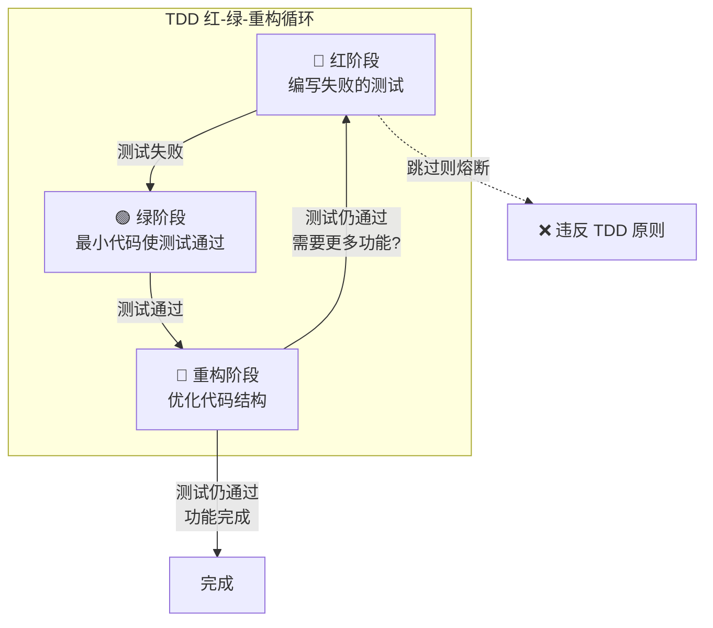

# sop-code-implementation

## 描述

代码实现 Skill 负责将设计文档转换为实际的代码实现。该 Skill 严格遵循 TDD（测试驱动开发）红-绿-重构循环，确保代码质量和测试覆盖率。

**核心原则**：先写失败的测试，再实现最小代码使测试通过，最后重构优化。

主要职责：
- 遵循 TDD 红-绿-重构循环
- 实现类和方法
- 确保代码质量
- 遵循编码规范

## 使用场景

触发此 Skill 的条件：

1. **设计完成**：设计文档已通过审查，可以开始实现
2. **功能开发**：需要实现新的功能模块
3. **Bug 修复**：需要修复代码缺陷（先写失败的测试重现问题）
4. **代码重构**：需要在测试保护下改进现有代码结构

## 指令

### 步骤 1: 准备实现环境

1. 读取设计文档和规范文档
2. 理解实现要求和约束条件
3. 确认技术栈和框架
4. 检查依赖项是否已安装
5. **识别模块依赖关系，确定实现顺序**

**实现顺序原则**：

- **从依赖方到被依赖方**：先实现被其他模块依赖的基础模块，再实现依赖它们的上层模块
- **依赖来源必须准确**：依赖关系应当基于设计文档、架构文档或明确的业务逻辑
- **无法确定依赖时提问**：当无法确定依赖关系或依赖来源不明确时，**必须向用户提问确认**，不得假设

### 步骤 2: TDD 红阶段 - 编写失败的测试

> **CRITICAL**: 必须先编写测试，验证测试失败后才能进入下一阶段

1. 根据设计文档识别要实现的功能点
2. 调用 `sop-test-implementation` Skill 编写测试用例
3. 运行测试，**验证测试失败**（因功能未实现）
4. 记录失败的测试用例

**验证标准**：
- ✅ 测试文件已创建
- ✅ 测试运行失败（预期行为：功能未实现）
- ❌ 如果测试通过，说明功能已存在或测试有误

### 步骤 3: TDD 绿阶段 - 实现最小代码

> **原则**：只编写足以使测试通过的最小代码增量，不要过度实现

1. 创建类文件和基本结构
2. 定义类属性和字段
3. 实现构造函数
4. 实现方法签名和最小逻辑
5. 运行测试，**确保测试通过**

**验证标准**：
- ✅ 所有测试通过
- ✅ 代码是最小实现（无多余功能）

### 步骤 4: TDD 重构阶段 - 优化代码结构

> **原则**：在测试保护下重构，每次重构后运行测试确保不破坏功能

1. 检查代码重复，提取公共方法
2. 优化命名和代码结构
3. 添加必要的错误处理和数据验证
4. 每次重构后运行测试，确保测试仍然通过
5. 添加公共 API 注释

**验证标准**：
- ✅ 所有测试仍然通过
- ✅ 代码无重复
- ✅ 命名清晰
- ✅ 公共 API 有注释

### 步骤 5: 代码质量检查

1. 运行 lint 检查
2. 运行类型检查
3. 运行全部测试
4. 检查测试覆盖率
5. 修复所有问题

### 步骤 6: 提交代码变更

1. 检查代码变更范围
2. 编写提交信息
3. 确保符合 P2/P3 级规范
4. 提交代码

## 契约

### 输入契约

```yaml
required_inputs:
  - name: "design_document"
    type: file
    path: "src/{module}/design.md"
    description: "设计文档"

  - name: "spec_document"
    type: file
    path: "specs/{name}-spec.md"
    description: "规范文档"

optional_inputs:
  - name: "existing_code"
    type: file
    path: "src/{module}/"
    description: "现有代码，用于参考或修改"
```

### 输出契约

```yaml
required_outputs:
  - name: "test_code"
    type: file
    path: "tests/{module}/"
    format: "测试代码，先于实现代码创建"
    guarantees:
      - "测试覆盖所有公共方法"
      - "测试初始失败（红阶段）"

  - name: "code_changes"
    type: git_diff
    path: "git commit"
    format: "符合项目代码规范的代码变更"
    guarantees:
      - "代码符合 P2/P3 级规范"
      - "代码通过 lint 检查"
      - "代码通过类型检查"
      - "所有测试通过（绿阶段）"
      - "测试覆盖率达标"
```

### 行为契约

```yaml
preconditions:
  - "设计文档已通过审查"
  - "规范文档已确认"
  - "技术栈已确定"

postconditions:
  - "测试先于实现代码创建"
  - "所有测试通过"
  - "代码符合 P2/P3 级规范"
  - "代码通过 lint 检查"
  - "代码通过类型检查"
  - "测试覆盖率达标"

invariants:
  - "禁止跳过红阶段（必须先写失败的测试）"
  - "禁止强制解包（unwrap/expect）"
  - "禁止硬编码密钥"
  - "禁止循环依赖"
  - "公共 API 必须注释"
```

## TDD 循环验证



## 常见坑

### 坑 1: 跳过红阶段直接实现

- **现象**: 直接编写实现代码，然后再补测试，或完全不写测试。
- **原因**: 认为先写测试浪费时间，或习惯于"先实现后测试"。
- **解决**: **必须遵循 TDD 流程**。红阶段是强制性的，先编写失败的测试验证测试本身正确，再实现功能。如果测试一开始就通过，说明测试有误或功能已存在。

### 坑 2: 使用强制解包（unwrap/expect）

- **现象**: 代码中使用 `.unwrap()` 或 `.expect()` 处理 Option/Result 类型，运行时出现 panic。
- **原因**: 为了快速实现功能，未进行安全的错误处理。
- **解决**: 使用模式匹配或 `?` 运算符进行安全解包，或返回 Result 类型让调用方处理错误。

### 坑 3: 硬编码敏感信息

- **现象**: 代码中直接写入数据库密码、API 密钥等敏感信息。
- **原因**: 开发时为了方便测试，将配置信息直接写在代码中。
- **解决**: 使用环境变量或配置文件管理敏感信息，禁止在代码中硬编码任何密钥或密码。

### 坑 4: 绿阶段过度实现

- **现象**: 在绿阶段实现了测试之外的额外功能，导致代码复杂度增加。
- **原因**: 想"顺便"把相关功能也实现了。
- **解决**: 严格遵守"最小实现"原则，只编写足以使当前测试通过的代码。额外功能应该通过新的 TDD 循环添加。

## 示例

### TDD 流程示例：实现 Order.addItem 方法

#### 红阶段：编写失败的测试

```typescript
// tests/order/Order.test.ts

describe('Order.addItem', () => {
  it('应该添加商品到订单', () => {
    // Given
    const order = new Order();
    const product = new Product('商品A', 100);

    // When
    order.addItem(product, 2);

    // Then
    expect(order.items.length).toBe(1);
    expect(order.items[0].product).toBe(product);
    expect(order.items[0].quantity).toBe(2);
  });
});

// 运行测试：❌ 失败（Order 类不存在）
```

#### 绿阶段：最小实现

```typescript
// src/order/Order.ts

export class Order {
  items: { product: Product; quantity: number }[] = [];

  addItem(product: Product, quantity: number): void {
    this.items.push({ product, quantity });
  }
}

// 运行测试：✅ 通过
```

#### 重构阶段：优化代码

```typescript
// src/order/Order.ts

export class Order {
  private _items: OrderItem[] = [];

  get items(): ReadonlyArray<OrderItem> {
    return this._items;
  }

  /**
   * 添加商品到订单
   * @param product 商品
   * @param quantity 数量，必须大于 0
   */
  addItem(product: Product, quantity: number): void {
    if (quantity <= 0) {
      throw new Error('数量必须大于 0');
    }

    const existingItem = this._items.find(
      item => item.productId === product.id
    );

    if (existingItem) {
      existingItem.quantity += quantity;
    } else {
      this._items.push(new OrderItem(product, quantity));
    }

    this.calculateTotal();
  }
}

// 运行测试：✅ 仍然通过
```

## 相关文档

- [Skill 索引](../../index.md)
- [测试实现 Skill](../sop-test-implementation/SKILL.md) - TDD 红阶段调用
- [代码审查 Skill](../sop-code-review/SKILL.md)
- [工作流详解](../../_resources/workflow/index.md) - 包含层级 TDD 规范
- [规范分层说明](../../_resources/specifications/index.md)