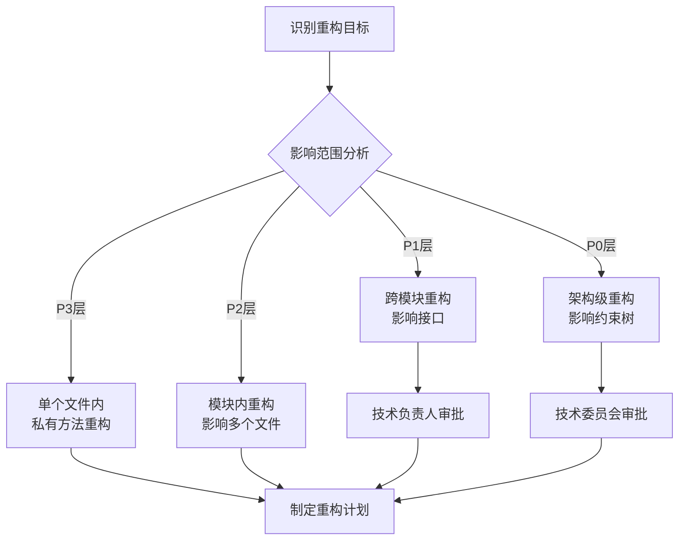
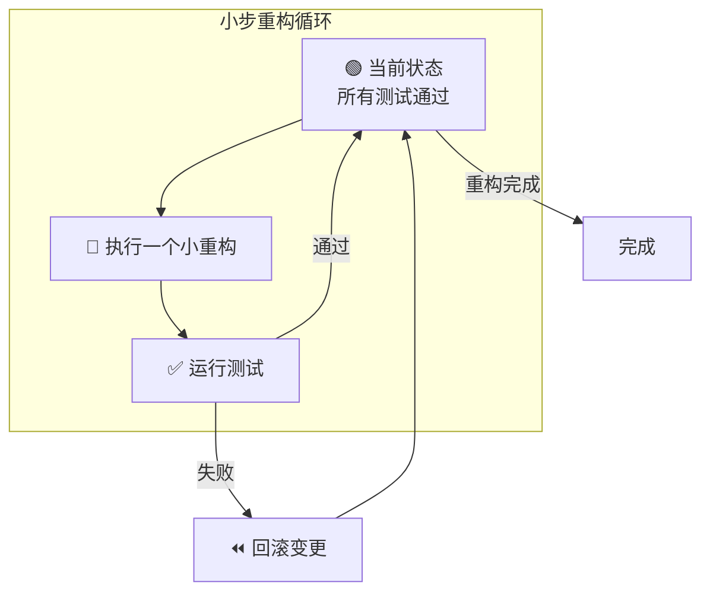

# sop-code-refactor

## 描述

代码重构 Skill 负责在测试保护下安全地改进代码结构。该 Skill 确保重构不改变代码的外部行为，同时提升代码质量和可维护性。

**与约束树的对应**：
- **P0层**：重构不得引入安全漏洞、不得破坏核心功能
- **P1层**：重构后性能不得下降，接口兼容性保持
- **P2层**：重构后代码质量应提升，模块职责更清晰
- **P3层**：遵循编码规范，提升代码可读性

主要职责：
- 识别代码坏味道
- 选择合适的重构手法
- 在测试保护下安全重构
- 验证重构不改变行为

## 使用场景

触发此 Skill 的条件：

1. **代码坏味道**：代码存在重复、过长方法、过大类等问题
2. **架构调整**：需要调整代码结构以适应新架构
3. **可维护性提升**：需要提升代码可读性和可维护性
4. **技术债务偿还**：需要偿还积累的技术债务

## 指令

### 步骤 1: 识别重构目标

#### 代码坏味道清单

```yaml
代码坏味道分类:

  Bloaters（膨胀类）:
    - Long Method: 方法过长（>50行）
    - Large Class: 类过大（>500行）
    - Primitive Obsession: 基本类型偏执
    - Long Parameter List: 参数列表过长（>4个）
    - Data Clumps: 数据泥团

  Object-Orientation Abusers（面向对象滥用）:
    - Switch Statements: switch语句过多
    - Temporary Field: 临时字段
    - Refused Bequest: 被拒绝的遗赠
    - Alternative Classes with Different Interfaces: 异曲同工的类

  Change Preventers（阻碍变化）:
    - Divergent Change: 发散式变化
    - Shotgun Surgery: 霰弹式修改
    - Parallel Inheritance Hierarchies: 平行继承体系

  Dispensables（多余物）:
    - Comments: 过多注释
    - Duplicate Code: 重复代码
    - Lazy Class: 懒惰类
    - Dead Code: 死代码
    - Speculative Generality: 理论性通用

  Couplers（耦合类）:
    - Feature Envy: 依恋情结
    - Inappropriate Intimacy: 不当亲密
    - Message Chains: 消息链
    - Middle Man: 中间人
```

#### 影响范围分析



### 步骤 2: 确保测试覆盖

> **CRITICAL**: 重构前必须确保有足够的测试覆盖

```yaml
测试覆盖检查:
  最小要求:
    - 单元测试覆盖核心逻辑
    - 集成测试覆盖关键路径
    - 所有测试通过

  理想状态:
    - 覆盖率 >= 80%
    - 边界条件测试完整
    - 异常情况测试完整

  缺少测试时:
    1. 先编写测试（调用 sop-test-implementation）
    2. 确保测试通过
    3. 再开始重构
```

### 步骤 3: 选择重构手法

#### 常用重构手法

| 坏味道 | 重构手法 | 约束层级 |
|--------|----------|----------|
| 重复代码 | Extract Method / Pull Up Method | P2 |
| 过长方法 | Extract Method / Replace Temp with Query | P3 |
| 过大类 | Extract Class / Extract Subclass | P2 |
| 过长参数列表 | Introduce Parameter Object / Preserve Whole Object | P3 |
| 发散式变化 | Extract Class | P2 |
| 霰弹式修改 | Move Method / Inline Class | P2 |
| 依恋情结 | Move Method / Extract Method | P3 |
| switch语句 | Replace Conditional with Polymorphism | P2 |

### 步骤 4: 小步重构（TDD保护下）



#### 小步重构原则

```yaml
principles:
  single_change:
    description: 每次只做一个原子性变更
    example: "只重命名一个变量，或只提取一个方法"

  test_after_each:
    description: 每次变更后立即运行测试
    example: "保存后立即运行相关测试"

  commit_after_green:
    description: 测试通过后立即提交
    example: "git commit -m 'refactor: extract calculateTotal method'"

  rollback_on_red:
    description: 测试失败立即回滚
    example: "git checkout -- ."
```

### 步骤 5: 验证重构结果

```yaml
verification_checklist:
  行为不变:
    - 所有测试通过
    - 功能点未改变
    - 接口兼容性保持

  质量提升:
    - 代码更简洁
    - 重复已消除
    - 职责更清晰

  约束满足:
    - P0: 无安全漏洞
    - P1: 性能未下降
    - P2: 模块职责清晰
    - P3: 代码规范遵守
```

## 契约

### 输入契约

```yaml
required_inputs:
  - name: "refactor_target"
    type: text
    description: "重构目标描述，说明要改进什么"

  - name: "code_location"
    type: file | directory
    description: "需要重构的代码位置"

optional_inputs:
  - name: "smell_type"
    type: enum
    values: [Long Method, Large Class, Duplicate Code, Feature Envy, etc.]
    description: "识别的代码坏味道类型"

  - name: "constraint_level"
    type: enum
    values: [P3, P2, P1, P0]
    description: "重构影响范围层级"
```

### 输出契约

```yaml
required_outputs:
  - name: "refactored_code"
    type: code
    guarantees:
      - "所有测试通过"
      - "外部行为不变"

  - name: "refactor_report"
    type: markdown
    path: "contracts/refactor-report-{id}.md"
    format:
      - 重构目标
      - 使用的重构手法
      - 变更文件列表
      - 测试验证结果
```

### 行为契约

```yaml
preconditions:
  - "重构目标明确"
  - "测试覆盖足够"

postconditions:
  - "所有测试通过"
  - "代码质量提升"
  - "外部行为不变"

invariants:
  - "每步重构后运行测试"
  - "测试失败立即回滚"
  - "重构不改变外部行为"
```

## 常见坑

### 坑 1: 大规模重构

- **现象**: 一次性重构大量代码，导致测试失败难以定位问题。
- **原因**: 试图一次解决多个问题，违反小步重构原则。
- **解决**: 将大重构拆分为多个小重构，每步都确保测试通过。

### 坑 2: 缺少测试保护

- **现象**: 重构后发现问题，但无法确定是否是重构引入的。
- **原因**: 重构前未确保测试覆盖，或测试质量不足。
- **解决**: 重构前先补充测试，确保关键行为有测试保护。

### 坑 3: 混合重构与功能变更

- **现象**: 重构的同时修改了功能，难以区分哪些是重构变更。
- **原因**: 趁重构之机顺便修改功能。
- **解决**: 重构和功能变更分开进行。重构只改变结构，不改变行为。

## 示例

### 示例 1: 提取方法（Extract Method）

**重构目标**：Order类中的calculateTotal方法过长

**重构前**：
```typescript
// src/order/Order.ts
class Order {
  calculateTotal(): Money {
    // 50行计算逻辑...
  }
}
```

**重构步骤**：
1. 运行测试，确保通过 ✅
2. 提取折扣计算为 calculateDiscount()
3. 运行测试 ✅
4. 提取税费计算为 calculateTax()
5. 运行测试 ✅
6. 提取运费计算为 calculateShipping()
7. 运行测试 ✅

**重构后**：
```typescript
// src/order/Order.ts
class Order {
  calculateTotal(): Money {
    const subtotal = this.calculateSubtotal();
    const discount = this.calculateDiscount();
    const tax = this.calculateTax();
    const shipping = this.calculateShipping();
    return subtotal.subtract(discount).add(tax).add(shipping);
  }

  private calculateDiscount(): Money { /* ... */ }
  private calculateTax(): Money { /* ... */ }
  private calculateShipping(): Money { /* ... */ }
}
```

### 示例 2: 提取类（Extract Class）

**重构目标**：Order类承担了太多职责

**重构前**：
```typescript
class Order {
  // 订单相关
  items: OrderItem[];
  status: OrderStatus;

  // 支付相关
  paymentMethod: PaymentMethod;
  paymentStatus: PaymentStatus;

  // 配送相关
  shippingAddress: Address;
  trackingNumber: string;
}
```

**重构后**：
```typescript
class Order {
  items: OrderItem[];
  status: OrderStatus;
  payment: Payment;  // 提取的类
  shipment: Shipment; // 提取的类
}

class Payment {
  method: PaymentMethod;
  status: PaymentStatus;
}

class Shipment {
  address: Address;
  trackingNumber: string;
}
```

## 相关文档

- [Skill 索引](../../index.md)
- [测试实现 Skill](../sop-test-implementation/SKILL.md) - 补充测试
- [代码实现 Skill](../sop-code-implementation/SKILL.md) - TDD流程
- [代码审查 Skill](../sop-code-review/SKILL.md) - 重构后审查
- [工作流详解](../../_resources/workflow/index.md)