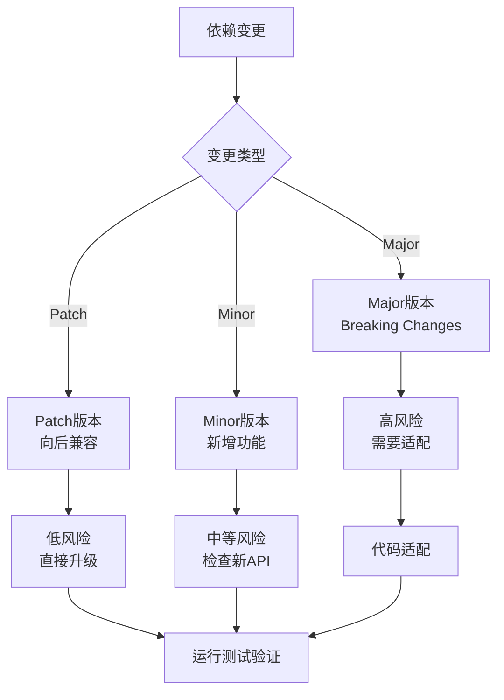

# sop-dependency-manager

## 描述

依赖管理 Skill 负责安全地管理和升级项目依赖。该 Skill 确保依赖升级不影响系统稳定性，同时及时修复安全漏洞。

**与约束树的对应**：
- **P0层**：安全漏洞依赖 → 立即升级
- **P1层**：Breaking Changes影响核心功能 → 评估后升级
- **P2层**：功能改进依赖 → 计划升级
- **P3层**：Patch版本更新 → 自动化升级

主要职责：
- 检查依赖安全漏洞
- 分析升级影响范围
- 执行安全升级
- 验证兼容性

## 使用场景

触发此 Skill 的条件：

1. **安全漏洞**：依赖被发现有安全漏洞
2. **版本过时**：依赖版本过时影响维护
3. **功能需求**：新功能需要更高版本的依赖
4. **定期维护**：定期检查和更新依赖

## 指令

### 步骤 1: 依赖状态分析

```yaml
dependency_analysis:

  安全检查:
    tools: [npm audit, pip-audit, Snyk]
    output:
      - 漏洞列表
      - 严重程度
      - 修复版本

  版本状态:
    tools: [npm outdated, pip list --outdated]
    output:
      - 当前版本
      - 最新版本
      - 变更类型 (major/minor/patch)

  使用情况:
    method: 代码扫描
    output:
      - 直接依赖
      - 间接依赖
      - 未使用依赖
```

### 步骤 2: 影响范围分析



#### Breaking Changes 检查

```yaml
breaking_changes_checklist:
  API变更:
    - 方法签名是否变化
    - 参数类型是否变化
    - 返回值类型是否变化
    - 是否有方法被移除

  行为变更:
    - 默认值是否变化
    - 错误处理是否变化
    - 性能特征是否变化

  配置变更:
    - 配置项是否变化
    - 环境变量是否变化
    - 依赖其他包是否变化
```

### 步骤 3: 升级执行

#### 升级策略

```yaml
upgrade_strategies:

  安全漏洞升级:
    priority: P0
    approach: 立即升级到修复版本
    testing: 运行全量测试
    rollback: 准备回滚方案

  Major版本升级:
    priority: P1
    approach:
      1. 阅读升级指南
      2. 识别Breaking Changes
      3. 分步骤升级（如 1.x → 2.x → 3.x）
      4. 逐步骤测试
    testing: 全面回归测试
    rollback: 版本回退方案

  Minor/Patch升级:
    priority: P2/P3
    approach: 直接升级
    testing: 运行单元测试
    rollback: 版本回退
```

#### 执行步骤

```yaml
execution_steps:
  pre_upgrade:
    - 创建新分支
    - 记录当前依赖版本
    - 运行基准测试

  during_upgrade:
    - 更新依赖版本
    - 处理Breaking Changes
    - 更新相关代码

  post_upgrade:
    - 运行全量测试
    - 检查构建产物
    - 性能对比测试
```

### 步骤 4: 兼容性验证

```yaml
verification_checklist:
  功能验证:
    - 所有测试通过
    - 核心功能正常
    - 边界条件处理正确

  性能验证:
    - 响应时间对比
    - 内存使用对比
    - 启动时间对比

  安全验证:
    - 漏洞已修复
    - 无新安全风险
    - 敏感信息处理正确

  兼容性验证:
    - 浏览器兼容（前端）
    - Node版本兼容（后端）
    - 操作系统兼容
```

### 步骤 5: 生成升级报告

```json
{
  "upgrade_id": "UPG-20260323-001",
  "dependency": "express",
  "from_version": "4.18.0",
  "to_version": "4.19.0",
  "type": "minor",
  "reason": "安全漏洞修复",
  "breaking_changes": [],
  "affected_files": ["package.json", "src/server.ts"],
  "test_result": "passed",
  "performance_impact": "none",
  "recommendation": "可以升级"
}
```

## 契约

### 输入契约

```yaml
required_inputs:
  - name: "dependency_name"
    type: string
    description: "要升级的依赖名称"

  - name: "target_version"
    type: string
    description: "目标版本，如 'latest' 或具体版本号"

optional_inputs:
  - name: "upgrade_reason"
    type: enum
    values: [security, feature, maintenance]
    description: "升级原因"
```

### 输出契约

```yaml
required_outputs:
  - name: "upgrade_report"
    type: json
    path: "contracts/dependency-upgrade-{id}.json"
    guarantees:
      - "包含影响分析"
      - "包含测试结果"
      - "包含升级建议"
```

### 行为契约

```yaml
preconditions:
  - "依赖存在"
  - "目标版本有效"

postconditions:
  - "测试通过"
  - "兼容性验证完成"
  - "报告已生成"

invariants:
  - "安全漏洞依赖必须升级"
  - "Major升级需要全面测试"
  - "升级失败必须可回滚"
```

## 常见坑

### 坑 1: 忽视Breaking Changes

- **现象**: 直接升级Major版本，导致大量功能不可用。
- **原因**: 未阅读升级指南，未检查Breaking Changes。
- **解决**: Major版本升级前必须阅读Changelog，识别Breaking Changes。

### 坑 2: 一次性升级多个依赖

- **现象**: 升级后出现问题，无法定位是哪个依赖导致。
- **原因**: 同时升级多个依赖，增加了问题定位难度。
- **解决**: 逐个升级依赖，每次升级后测试验证。

### 坑 3: 忽视间接依赖

- **现象**: 直接依赖正常，但间接依赖冲突导致问题。
- **原因**: 只关注直接依赖，未检查间接依赖变化。
- **解决**: 升级后检查完整的依赖树变化。

## 示例

### 安全漏洞升级示例

```yaml
场景: lodash 被发现安全漏洞

分析:
  当前版本: 4.17.20
  漏洞版本: < 4.17.21
  修复版本: 4.17.21
  变更类型: patch

影响评估:
  Breaking Changes: 无
  使用位置: 15个文件
  风险级别: 低

执行:
  1. npm install lodash@4.17.21
  2. npm test → 通过 ✅
  3. npm audit → 无漏洞 ✅

结果: 升级成功，安全漏洞已修复
```

## 相关文档

- [Skill 索引](../../index.md)
- [Bug分析 Skill](../sop-bug-analysis/SKILL.md)
- [测试实现 Skill](../sop-test-implementation/SKILL.md)