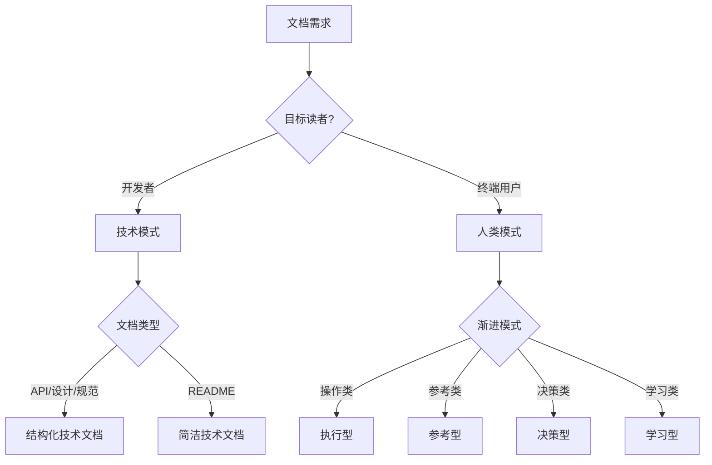

# sop-document-writer

## 描述

文档编写 Skill 负责创建各类文档，支持两种模式：

| 模式 | 目标读者 | 核心原则 | 文档类型 |
|------|----------|----------|----------|
| **技术模式** | 开发者、技术团队 | 结构规范、元数据完整 | API 文档、设计文档、README、规范文档 |
| **人类模式** | 终端用户、非技术人员 | 渐进式披露 | 用户手册、需求文档、合规文档、培训材料 |

主要职责：
- 创建符合最佳实践的文档
- 根据目标读者选择合适模式
- 应用标准模板和渐进式披露
- 验证文档质量

## 使用场景

触发此 Skill 的条件：

1. **技术文档创建**：需要创建 API 文档、设计文档、README 等
2. **用户文档创建**：需要创建用户手册、操作指南等
3. **需求文档编写**：需要编写产品需求、业务规范
4. **文档标准化**：需要将内容整理为规范文档

## 与约束树的对应

文档编写遵循 P2 文档约束：

| 约束层级 | 文档约束要求 | 验证标准 |
|----------|--------------|----------|
| **P0** | 文档不得包含敏感信息 | 安全扫描 |
| **P1** | 系统级文档需技术负责人审批 | 审批流程 |
| **P2** | 模块级文档必须完整、准确 | 文档审查 |
| **P3** | 文档格式符合项目规范 | 格式检查 |

**工作流阶段**：Stage 1 设计输出 / Stage 4 归档

## 文档类型支持

### 技术文档

| 类型 | 触发词 | 目标读者 | 输出路径 |
|------|--------|----------|----------|
| 规范文档 | spec, specification | 开发者 | specs/ |
| 设计文档 | design, architecture | 开发者 | docs/design/ |
| API文档 | api, interface | 开发者 | docs/api/ |
| README | readme, intro | 开发者/用户 | 项目根目录 |
| CHANGELOG | changelog, history | 开发者/用户 | 项目根目录 |

### 人类文档

| 类型 | 触发词 | 目标读者 | 行业规范 |
|------|--------|----------|----------|
| 用户手册 | user guide, 用户手册 | 终端用户 | ISO 26514 |
| 操作指南 | SOP, 操作流程 | 操作人员 | ISO 9001 |
| 需求文档 | requirements, PRD | 产品/开发 | IEEE 830 |
| 合规文档 | compliance, 合规 | 合规官 | ISO 27001 |
| 培训材料 | training, 培训 | 学员 | ADDIE 模型 |

## 渐进式披露原则

**人类模式**文档必须遵循渐进式披露：

```
┌─────────────────────────────────────────────────────────┐
│  第一层：标题 + 一句话摘要（≤30字）                        │
│  ↓ 用户需要时展开                                         │
├─────────────────────────────────────────────────────────┤
│  第二层：核心要点（3-5 条）                               │
│  ↓ 用户需要时展开                                         │
├─────────────────────────────────────────────────────────┤
│  第三层：详细说明                                         │
│  ↓ 用户需要时展开                                         │
├─────────────────────────────────────────────────────────┤
│  第四层：示例、边界情况、参考资料（折叠）                   │
└─────────────────────────────────────────────────────────┘
```

### 渐进式披露模式

| 模式 | 适用场景 | 结构 |
|------|----------|------|
| **执行型** | 操作指南、用户手册 | 目标→步骤→原理→排错 |
| **参考型** | 需求文档、规范文档 | 定义→要点→细节→例外 |
| **决策型** | 技术报告、提案文档 | 决策→理由→方案→计划 |
| **学习型** | 培训材料、教程 | 目标→概念→实践→进阶 |

## 指令

### 步骤 1: 分析文档需求

```yaml
analysis_checklist:
  - 确定文档类型
  - 识别目标读者（开发者 vs 终端用户）
  - 确定文档模式（技术模式 vs 人类模式）
  - 选择渐进式披露模式（如适用）
  - 确定文档范围
  - 收集必要信息
```

### 步骤 2: 选择文档模式



### 步骤 3: 应用模板

#### 技术模式模板结构

```markdown
---
version: v1.0.0
created: [日期]
updated: [日期]
status: draft|review|final
---

# [文档标题]

## 概述
[简要描述]

## 详细内容
[主体内容]

## 参考
[相关链接]
```

#### 人类模式模板结构

```markdown
# [标题]

> **一句话摘要**：[≤30字概括]

---

## 快速了解

- 要点 1
- 要点 2
- 要点 3

---

## 详细内容

### [章节 1]
[详细说明]

<details>
<summary>📖 深入了解</summary>

[可选深度内容]

</details>

---

## 常见问题

<details>
<summary>❓ [问题]</summary>

[答案]

</details>
```

### 步骤 4: 填充内容

1. 根据模板结构填充内容
2. 确保内容完整、准确
3. 人类模式：应用渐进式披露
4. 添加必要的示例和说明
5. 保持语言风格一致

### 步骤 5: 质量检查

```yaml
quality_checklist:
  # 通用检查
  general:
    - 元数据头完整
    - 标题层级正确
    - 内容完整无缺失
    - 描述清晰无歧义
    - 无敏感信息

  # 技术模式检查
  technical:
    - 示例代码可运行
    - 链接有效
    - API 参数完整

  # 人类模式检查
  human_readable:
    - 渐进式披露结构完整
    - 一句话摘要 ≤ 30 字
    - 核心要点 3-5 条
    - 深度内容使用折叠
    - 可读性分数 ≥ 70
```

## 可读性标准

### 人类模式可读性要求

| 指标 | 目标值 |
|------|--------|
| 平均句长 | ≤ 25 字 |
| 最长句子 | ≤ 40 字 |
| 平均段长 | ≤ 5 句 |
| 标题深度 | ≤ 4 级 |

### 技术模式可读性要求

| 指标 | 目标值 |
|------|--------|
| 结构完整 | 元数据 + 概述 + 详情 |
| 示例代码 | 必须有注释 |
| 链接有效 | 无死链 |

## 契约

### 输入契约

```yaml
required_inputs:
  - name: "document_type"
    type: string
    description: "文档类型（api/design/spec/user-guide 等）"

  - name: "content_source"
    type: text|object
    description: "内容来源"

optional_inputs:
  - name: "target_audience"
    type: string
    enum: [developer, user, mixed]
    default: "developer"
    description: "目标读者"

  - name: "progressive_mode"
    type: string
    enum: [execution, reference, decision, learning, none]
    default: "none"
    description: "渐进式披露模式（仅人类模式）"

  - name: "target_path"
    type: string
    description: "目标路径"

  - name: "industry_standard"
    type: string
    description: "需要遵循的行业规范"
```

### 输出契约

```yaml
required_outputs:
  - name: "document_file"
    type: file
    format: "Markdown"
    guarantees:
      - "文档结构完整"
      - "格式规范"
      - "无敏感信息"

  - name: "quality_report"
    type: json
    format:
      mode: "technical|human"
      structure_score: 0-100
      content_score: 0-100
      readability_score: 0-100  # 人类模式必填
      progressive_disclosure:   # 人类模式必填
        layer_1: bool
        layer_2: bool
        layer_3: bool
        layer_4: bool
      issues: []

postconditions:
  - "文档已创建"
  - "质量检查已通过"
  - "人类模式：渐进式披露结构完整"

invariants:
  - "文档必须包含元数据头"
  - "敏感信息不得出现在文档中"
  - "人类模式必须遵循渐进式披露"
```

## 常见坑

| 坑 | 现象 | 解决 |
|---|------|------|
| 模式选择错误 | 用户看不懂技术文档 | 根据目标读者选择模式 |
| 渐进式披露缺失 | 第一层就展示所有内容 | 严格控制第一层字数 |
| 术语堆砌 | 人类文档使用技术术语 | 第一层使用通俗语言 |
| 元数据缺失 | 难以追踪变更 | 始终使用模板创建 |
| 敏感信息泄露 | 包含密钥密码 | 创建前检查脱敏 |

## 相关文档

- [文档模板集合](references/templates.md)
- [文档创建示例](references/examples.md)
- [行业规范参考](references/standards.md)
- [Skill 索引](../../index.md)