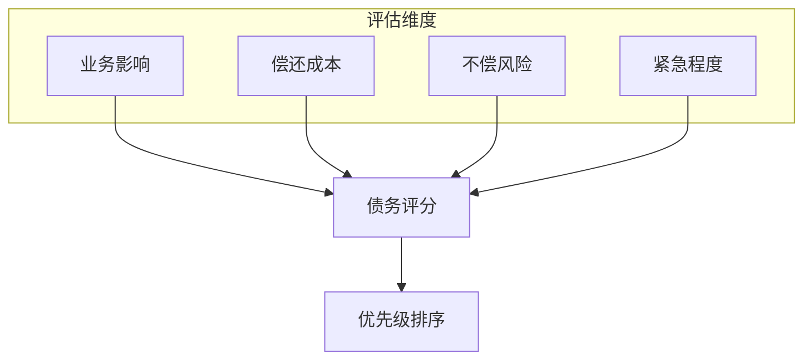

# sop-tech-debt-manager

## 描述

技术债务管理 Skill 负责识别、评估和规划技术债务的偿还。该 Skill 帮助团队平衡新功能开发与技术债务偿还，确保代码库健康可持续发展。

**与约束树的对应**：
- **P0层债务**：安全漏洞、数据风险 → 立即偿还
- **P1层债务**：系统稳定性问题 → 优先偿还
- **P2层债务**：代码质量问题 → 计划偿还
- **P3层债务**：代码风格问题 → 随迭代偿还

主要职责：
- 识别技术债务
- 评估债务影响和成本
- 制定偿还优先级
- 规划迭代偿还计划

## 使用场景

触发此 Skill 的条件：

1. **债务盘点**：需要全面评估项目技术债务
2. **迭代规划**：需要在迭代中安排技术债务偿还
3. **债务警报**：技术债务开始影响开发效率
4. **定期审计**：定期检查代码库健康度

## 指令

### 步骤 1: 技术债务识别

#### 债务分类

```yaml
tech_debt_categories:

  架构债务:
    type: P0/P1
    examples:
      - 缺少分层架构
      - 循环依赖
      - 紧耦合
    impact: 影响系统扩展性和可维护性

  代码债务:
    type: P2/P3
    examples:
      - 重复代码
      - 过长方法
      - 缺少测试
    impact: 影响开发效率和代码质量

  测试债务:
    type: P2
    examples:
      - 测试覆盖率不足
      - 测试不稳定
      - 缺少集成测试
    impact: 影响发布信心

  文档债务:
    type: P3
    examples:
      - 缺少API文档
      - 架构文档过时
      - README不完整
    impact: 影响新人上手和知识传承

  依赖债务:
    type: P1/P2
    examples:
      - 过时依赖
      - 未使用依赖
      - 安全漏洞依赖
    impact: 影响安全性和维护成本

  基础设施债务:
    type: P1/P2
    examples:
      - 缺少CI/CD
      - 手动部署流程
      - 缺少监控告警
    impact: 影响发布效率和系统稳定性
```

#### 识别方法

```yaml
identification_methods:
  静态分析:
    tools: [ESLint, SonarQube, PMD]
    output: 代码坏味道报告

  架构分析:
    tools: [dependency-cruiser, ArchUnit]
    output: 依赖关系报告

  测试覆盖率:
    tools: [Jest, pytest-cov, JaCoCo]
    output: 覆盖率报告

  安全扫描:
    tools: [Snyk, OWASP Dependency-Check]
    output: 安全漏洞报告

  代码审查:
    method: 团队头脑风暴
    output: 债务清单
```

### 步骤 2: 债务评估

#### 评估维度



#### 评分标准

```yaml
scoring_criteria:

  业务影响 (1-5):
    5: 影响核心业务流程
    4: 影响重要功能
    3: 影响一般功能
    2: 影响用户体验
    1: 仅影响开发体验

  偿还成本 (1-5):
    5: 需要架构重构 (>2周)
    4: 大量代码改动 (1-2周)
    3: 中等改动 (2-5天)
    2: 小量改动 (1-2天)
    1: 极小改动 (<1天)

  不偿风险 (1-5):
    5: 安全漏洞/数据风险
    4: 系统稳定性风险
    3: 开发效率持续下降
    2: 维护成本增加
    1: 影响较小

  紧急程度 (1-5):
    5: 立即处理
    4: 本迭代处理
    3: 下迭代处理
    2: 月内处理
    1: 季度内处理
```

### 步骤 3: 优先级排序

```yaml
priority_formula:
  debt_score = 业务影响 * 0.3 + 不偿风险 * 0.3 + 紧急程度 * 0.2 + (6 - 偿还成本) * 0.2

priority_levels:
  P0_immediate:
    score_range: ">= 4.5"
    action: 立即偿还，阻塞新功能
    examples: ["安全漏洞", "数据丢失风险"]

  P1_high:
    score_range: "3.5 - 4.4"
    action: 本迭代偿还
    examples: ["系统稳定性问题", "核心模块缺少测试"]

  P2_medium:
    score_range: "2.5 - 3.4"
    action: 计划偿还，融入迭代
    examples: ["代码重复", "过时依赖"]

  P3_low:
    score_range: "< 2.5"
    action: 有空时偿还
    examples: ["代码风格问题", "文档缺失"]
```

### 步骤 4: 制定偿还计划

```yaml
planning_template:

  iteration_allocation:
    description: 每个迭代分配多少时间偿还债务
    recommendation: "10-20%的迭代容量"
    example:
      total_capacity: "100 故事点"
      debt_capacity: "10-20 故事点"

  debt_item:
    id: "DEBT-001"
    name: "重构订单模块"
    category: "代码债务"
    constraint_level: "P2"
    score: 3.8
    effort: "2周"
    benefit: "提升开发效率30%"
    iteration: "2026-Q2-I3"
    status: "pending"

  repayment_schedule:
    this_iteration: ["DEBT-001", "DEBT-003"]
    next_iteration: ["DEBT-002"]
    backlog: ["DEBT-004", "DEBT-005"]
```

### 步骤 5: 生成债务报告

生成报告到 `contracts/tech-debt-report.json`：

```json
{
  "report_date": "2026-03-23",
  "summary": {
    "total_debt_count": 15,
    "p0_count": 1,
    "p1_count": 3,
    "p2_count": 7,
    "p3_count": 4
  },
  "debt_items": [
    {
      "id": "DEBT-001",
      "name": "订单模块缺少单元测试",
      "category": "测试债务",
      "constraint_level": "P1",
      "score": 4.2,
      "impact": "影响发布信心，回归成本高",
      "effort": "3天",
      "iteration": "2026-Q2-I2"
    }
  ],
  "recommendations": [
    "建议每迭代分配15%容量偿还技术债务",
    "P0/P1债务应在下迭代优先处理"
  ]
}
```

## 契约

### 输入契约

```yaml
required_inputs:
  - name: "codebase"
    type: directory
    description: "代码库目录"

optional_inputs:
  - name: "focus_area"
    type: string
    description: "关注领域，如 'security', 'test', 'architecture'"
```

### 输出契约

```yaml
required_outputs:
  - name: "tech_debt_report"
    type: json
    path: "contracts/tech-debt-report.json"
    guarantees:
      - "包含债务清单"
      - "包含优先级排序"
      - "包含偿还建议"

  - name: "repayment_plan"
    type: markdown
    path: "contracts/tech-debt-plan.md"
    guarantees:
      - "包含迭代分配"
      - "包含时间估算"
```

### 行为契约

```yaml
preconditions:
  - "代码库可访问"

postconditions:
  - "债务清单已生成"
  - "优先级已排序"
  - "偿还计划已制定"

invariants:
  - "P0债务必须标记为立即处理"
  - "评分必须基于客观标准"
```

## 常见坑

### 坑 1: 忽视技术债务积累

- **现象**: 长期不偿还技术债务，开发效率持续下降。
- **原因**: 总是优先做业务功能，不预留债务偿还时间。
- **解决**: 每迭代强制分配10-20%容量偿还债务，形成制度。

### 坑 2: 过度优化

- **现象**: 花费过多时间偿还低优先级债务，影响业务交付。
- **原因**: 追求完美，对所有债务都想立即偿还。
- **解决**: 严格按优先级排序，只偿还高优先级债务。

### 坑 3: 债务记录缺失

- **现象**: 发现技术债务后没有记录，下次仍然重复发现。
- **原因**: 没有建立债务记录机制，依赖个人记忆。
- **解决**: 建立债务登记表，发现即记录，定期评审。

## 示例

### 债务评估示例

```yaml
DEBT-001:
  name: "支付模块缺少单元测试"
  category: 测试债务
  constraint_level: P1

  scoring:
    业务影响: 4  # 支付是核心功能
    偿还成本: 3  # 约需3天
    不偿风险: 4  # 发布信心不足
    紧急程度: 4  # 下次发布需要

  score: 3.8
  priority: P1
  recommendation: 本迭代偿还
```

## 相关文档

- [Skill 索引](../../index.md)
- [代码重构 Skill](../sop-code-refactor/SKILL.md)
- [代码探索 Skill](../sop-code-explorer/SKILL.md)